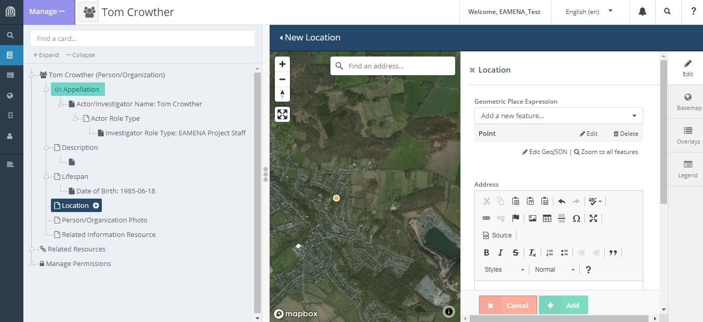
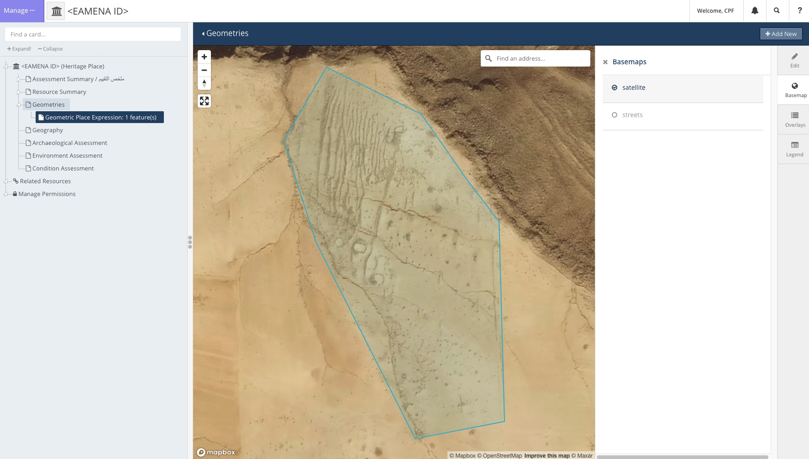
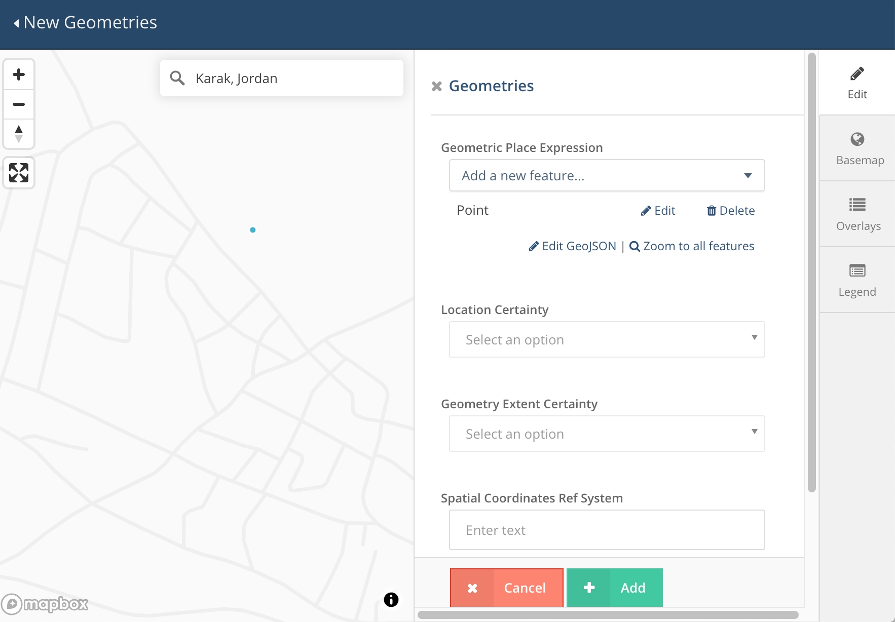
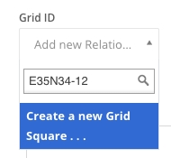
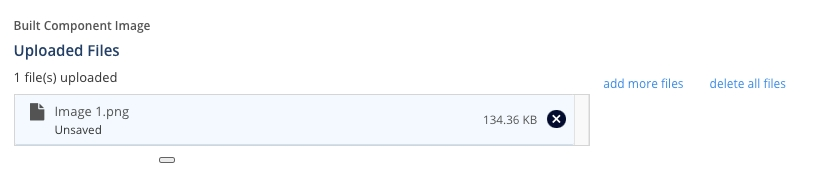
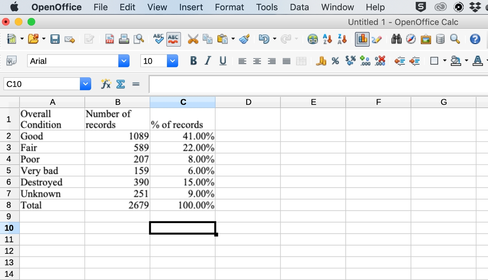
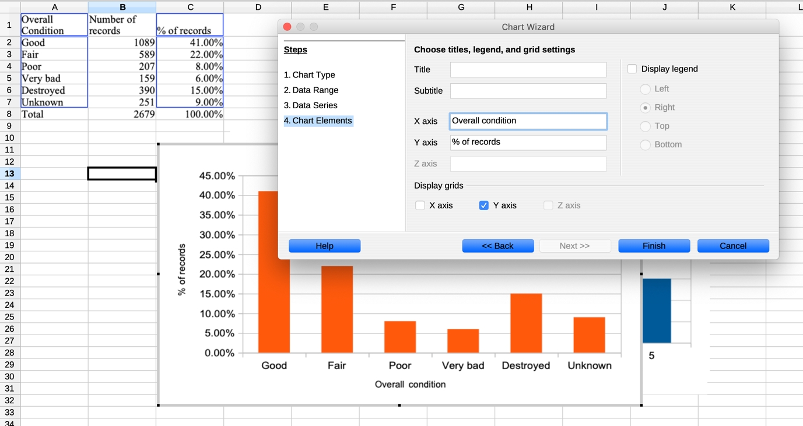

# Introduction to the EAMENA Database v4

## Introduction to EAMENA Database Version 4

The EAMENA Database is an open\-access database designed and customised using the Arches Heritage Platform (https://www.archesproject.org) to record archaeological sites, features, and landscapes from across the MENA region, as well as to record details of the disturbances, threats, and risks that they face\.

Since the EAMENA project began in 2015 we have continually updated and improved our database based on the changing needs of our users and also to keep up with new versions and improvements offered by Arches\. This new version of the database moves us to Arches 7\.0, which offers some significant upgrades to the platform\.

In this tutorial, you find information on accessing and logging into the database, managing your account, and a basic introduction to the types of information that can be recorded in the database, which will be described in more details in other tutorials, and where to find additional resources\.

## Finding the Database

The database is accessible online, using any browser \(though Google Chrome is recommended\), at the following URL: (https://database.eamena.org/)

## Logging In

Logging in is required to access and edit database records\. If you have not already registered, you can sign up for access here (https://database.eamena.org/auth/signup)\. 

- Once your registration has been approved, you will be given a username and temporary password\.

Navigate to the Home Page and click on ‘Sign in’ in the upper right corner to enter your login details: 

## Your Account

After you have signed in for the first time using your temporary password, we advise you to change your password\.

To change your password, click “Welcome, \[your username\]”, in the upper right corner of the home page\.

On the Profile Manager page, click Change Password, and follow the instructions to enter a new password for your account\.

Press ‘Edit’ to add your personal and contact details\.

At the bottom of this page, you may also change your notification settings to your preference\.

To log out of the database, click “Log off” in the upper right corner of the database, or from within the database, click where it says “Welcome, \[username\]” and this will log you out immediately\.

## Changing the Language

The EAMENA Database is currently available to use in English or Arabic\.

To change the language, from any page within the database, click the dropdown menu in the upper right corner where it says ‘English \(en\)’ and choose your preferred language\.

## Home Page

From the landing page, you can choose from two main actions: ‘Search the EAMENA Database’ or ‘Create New Heritage Resources’\.

### Search the EAMENA Database

Click on ‘Search the EAMENA Database’, to go directly to the Search Page\.

To learn more about searching, please refer to [__Tutorial 1: Searching the Database \(Basic\)__](#tutorial-1-searching-the-database-basic)\. 

### Create New Heritage Resources

Click on ‘Create New Heritage Resources’ to go to the Resource Manager page\.

On this page, you can choose to create one of seven different types of resources:

#### Heritage Place

Heritage Place is where you create the main records about archaeological sites, features, buildings, landscapes, seascapes, and urban heritage\.

To learn how to create a Heritage Place resource, please refer to __Tutorials 3 to 9__

#### Geoarchaeology

Geoarchaeology is where you record data on geoarchaeology and palaeolandscapes\.

To learn how to create a Geoarchaeology resource, see __Tutorials 10 and 11__\.

#### Person/Organization

A Person/Organization resource is where you record information about any actor, individual or group, who you would like to link to Heritage Place or any other type of resource\. This primarily includes the creator or editor of individual records, but may also include, for example, the individual person or group who made a specific interpretation, or historic or contemporary figures who are somehow linked to a site or resource\.

To learn how to create a Person/Organization resource, see __Tutorial 2\.__

#### Built Component

A Built Component resource is for the recording of constructed components of buildings or other features, such as individual walls, pavements, doorways, etc\. which have specific characteristics or disturbances which need a separate resource to record\.

To learn how to create a Built Component resource, see __Tutorial 13\.__

#### Information Resource

Information Resources record the source of the information collected to create individual records, such as satellite imagery, photographs, publications, maps, or datasets that have been shared directly with the EAMENA project\.

To learn how to create an Information Resource, see __Tutorial 15__\.

#### Detailed Condition Assessment

In addition to the basic condition assessment completed for Heritage Resources, sometimes it may be necessary or desirable to complete a Detailed Condition Assessment\. This type of record provides a place to record more specific details about the condition of a site, the disturbances, threats, and risks affecting it, and recommendations for its conservation and protection\.

To learn how to create a Detailed Condition Assessment resource, see __Tutorial 14__\.

#### Grid Square

The EAMENA project uses a system of grid squares to divide the region under study into smaller units\. Each Grid Square requires its own record, so that all sites found within that square can be linked to it\. 

In most cases, it is easier and more direct to create a Grid Square resource from within the resource record you are creating\. To learn how to do this from Heritage Place records, see __Tutorial 6, Section 2\.4__\.

## Navigating the Database

From within the database, it is also possible to navigate to the different parts of the database already described above by using the menus along the left side of the screen or in the upper right side of the screen\.

Click on the Arches symbol in the upper left corner of the screen to reveal the full main database menu\.

### Search

To access the Search page, click the Search Icon on the left side of the screen, or in the upper right corner\. 

To learn more about searching, please refer to __Tutorial 1: Searching the Database \(Basic\)__\. 

### Add New Resource

To access the Resource Menu, click “Add New Resource”, or you can choose from one of the seven different types of Resources described in Section 6 to go directly to their pages\.

### Map Layer Manager

The ‘Map Layer Manager’ is not for use by General Users\. It controls the map display settings in different types of records\. Please do not access or change anything in this section\. 

### Arches Collector Manager

The ‘Arches Collector Manager’ is still in development so should not be used for now\. When it is ready, it will be used to customise options for data collection using mobile devices such as smartphones or tablets\.

### Recent Edits

To see a list of your recent activity in the database, click “Recent Edits”\.

### Profile Manager

To access your account and details \(as already discussed in Section 4\), click “Profile Manager”\. 

### Reference Data Manager

To access the Reference Data Manager \(RDM\) click on “Reference Data Manager”\. This page is where we add and edit the terms or ‘concepts’ which appear in the drop\-down menus of the database\. 

The RDM should only be used by someone who has been designated to manage the database\. If you would like to learn more about it, please speak to a member of the EAMENA team\.

### Notifications

Click on the bell icon in the upper right corner of the screen to display any notifications, for example when a download has finished\. Click “Dismiss All” to clear these notifications\.

### Help Section

Click on the question mark to reveal tips on how to use the database and links to Arches documentation\.

## Additional Resources

- Tutorials: available online [https://eamena\.web\.ox\.ac\.uk/cpf\-training](https://eamena.web.ox.ac.uk/cpf-training)
- YouTube videos: For the general EAMENA database videos are available, in English with Arabic subtitles, on the EAMENA YouTube channel:
	- [https://www\.youtube\.com/channel/UC7Gmcwm3FAcU\_C3O9KGETmg](https://www.youtube.com/channel/UC7Gmcwm3FAcU_C3O9KGETmg)

# TUTORIAL 1: Searching the Database \(Basic\) 

In this tutorial, you will learn how to conduct basic searches in the EAMENA Database using the Search Bar and the Map Filter\. Advanced Searches will be covered later in a separate tutorial\.

## Accessing the Search Page

There are several ways to access the search page\. 

From the Home page, click on ‘Search the EAMENA Database’, it will take you directly to the Search Page\.

If you already in another part of the database, you can also access the Search page by clicking the Search Icon on the left side of the screen, or in the upper right corner\.

## The Search Page

The Search Page has several different sections to help you conduct different types of searches\.

On the left side of the screen you will see the Search Bar \(see Section 2\.1\) and a list of the Search Results below \(see Section 2\.2\)\. When you first arrive at the page, this will display all the records currently in the database\. 

On the right, you will see a map, which shows the distribution of the Search Results\. You can also use the Map Filter to search for sites by location \(see Section 3\)\.

### The Search Bar

The simplest and quickest way to search the database is to begin typing in the search bar\. Suggestions will appear below the bar as you type in either of two categories: ‘Concepts’ and ‘Term Matches’\.

- ‘Concepts’ lists instances where your search term matches a term in a dropdown list\.
	- The field where the dropdown entry occurs is listed in brackets to the right of the entry\. E\.g\. Libya *\(Modern Country/Territory\)\.*
- ‘Term Matches’ lists instances where your search term is found in a free\-text entry\.

Click on the suggested term which best matches what you want to search for to create a simple filter based on that term, for example, by a country, or interpretation, time period\. 

You can also search by free\-text by pressing enter once you have typed your search term or clicking on it where it appears underlined in blue, instead of choosing one of the suggestions\. This will return any records which have your term in any field, whether dropdown or free\-text\.

Continue adding terms to filter your results further\.

To exclude a search term, add it to the search bar, then click on it once to change it and a ‘\-‘ sign will appear before it\.

If you are only interested in one type of record, e\.g\. Heritage Places, you can click on ‘Resource Type’ and choose from the record types to limit your search to that particular type of record\.

You may also choose to filter your results by the QA Type\.

- ‘Authoritative’ records are records which have been completed or checked by a member of the EAMENA staff\.
- ‘Provisional’ records are those created by external users which require approval by a member of EAMENA staff\. 

Choose ‘Authoritative’ to include only approved records in your search and exclude those waiting approval\.

### Search Results

The Search Results appear in a list below the Search Bar\.

Click on the Record ID \(e\.g\. EAMENA\-0012345, INFORMATION\-0009876, etc\.\) to view the full Record, which will open in a new browser tab\.

Click on ‘Edit’ to open a new browser tab and go directly to the editing page for a record, which will open in a new browser tab\. Refer to the relevant tutorial on how to edit different types of records\.

Click on ‘Details’ beneath the Record ID to show a summary preview of the information in that record in the ‘Details’ tab to the right\.

Click on ‘Map’ beneath the Record ID to zoom to the location of that record on the map to the right\.

Click on ‘Related Resources’ to show the other records to which an individual record is related in the ‘Related’ pane to the right\. 

The default appearance will be a visual representation of the relationships between records connected by lines\. The related records will also appear in a list on the right\-hand side of the window\.

Click on ‘load more’ below any entry in the list to reveal further relationships, where they exist\.

## Map Filter

The Map Filter window displays the geographic locations of the Search Results\. You can also use it as a search tool to filter sites by their location\. 

The default map type is satellite imagery\. To switch to a streetmap, click on ‘Basemap’ on the right side of the map and choose ‘satellite’\.

Click on ‘Overlays’ on the right side of the window to see a list of the available layers\. You can toggle them on and off by clicking on the switch\. 

Click on ‘Legend’ on the right side of the window to view the map legend\. 

### Navigating the Map

You can navigate the map using your mouse and the controls in the upper left corner\. 

- Click and drag anywhere in the map to move around\. 
- Click the plus and minus signs to zoom in and out, or double\-click anywhere on the map to zoom in\. 
	- You can also scroll up or down on your mouse to zoom in or out\.
- To rotate the map click and hold the compass icon and move your mouse left or right\.
	- You can also rotate and tilt the map by pressing and holding shift on your keyboard, then using the left, right, up, and down arrows\.
- To return the map so that north is up, click the compass icon once\.
- Make the map full screen by clicking the expand icon in the upper left\.

### Searching Using the Map

If you want to search by an address or geographic location, for example, a city or street address, you can type it into the ‘Find an address’ bar in the upper right corner of the map\.

To further refine your search using location, click on ‘Filter’ on the right side of the map, which will open the Map Search options\.

In the ‘Select a filter’ dropdown menu, choose one of the four options to search by location\.

Choose ‘Search by Map Extent’ to display all search results within the area visible in the map window at the level you have zoomed\.

Choose ‘Draw a Marker’ to search by a specific point\. There are two ways to do this:

Method 1:

- Use the navigation tools to find and zoom to the location where you wish to search\. 
- Click your mouse on the map to add a point\.
- Change the buffer distance \(in metres or feet\) to search for sites within that distance of your point in any direction\.

Method 2:

- Alternatively, if you know the specific co\-ordinates of a location follow the steps above and place a point on the map in any random place
- Then, click on ‘Edit GeoJSON’, below\. You now see the GeoJSON code – do not let this put you off, but look for the coordinates and replace these with the correct ones\. 
	- NB the coordinates are in WGS84 decimal degrees, with X/easting/longitude first, then Y/northing/latitude\. 
- Finish by clicking on the green ‘Accept GeoJSON’ button at the bottom and you will see the point move in the map to your specific location\.
- Change the buffer distance \(in metres or feet\) to search for sites within that distance of your point in any direction\.

Choose ‘Draw a Polyline’ or ‘Draw a Polygon’ to search by line or polygon\. Click on the map with your mouse to draw the outline of your polygon or line\. 

- Double\-click to stop drawing, or stop drawing by closing the polygon on the first point \(vertex\) again\. 
- Adjust the buffer distance to include sites within a certain distance around your line or polygon\.

If you have zoomed in or out of the map results and wish to return to a view where all of the search results are displayed on the map, click “Zoom to all features”\.

To clear your map search filters, e\.g\. to start a new search, click “Clear spatial filter”\.

TUTORIAL 1b: Finding Your Records by Searching for your Name

As we have previously mentioned, the EAMENA database v3 has just launched and there are still a few bugs that need to be sorted out\.

One of these, is that it is not possible to find all your records by searching for your name in the Simple Search\. If you type your name in the Simple Search, only some, or none of your records will appear\.

However, you just need to follow a few extra steps in the Advanced Search to find your records\.

## Getting Started

Go to the Search page\.

- From the Home Page, click on ‘Search the EAMENA database’ in the upper right corner\.
- From anywhere else within the database, click on the ‘Search icon’ in the upper left or upper right corner\.

- For more detailed instructions on reaching the Search page, refer to __Tutorial 1: Searching the Database__\.

## Go to Advanced Search

When you arrive at the Search page, click on ‘Advanced’ to access the Advanced Search page\.

In the Advanced Search screen you see a list of cards in the database on the right side of the window\.

Scroll down to the ‘Heritage Place’ section and click on Assessment Summary / ملخص التقييم 

Click on the second, right\-hand field that appears under Assessment Investigator / اسم من قام بالفحص

Type your name into the field, and when it appears in the dropdown, click on it\.

Your search results will appear in a list on the left side\.

You can add further terms in the Simple search bar to narrow your results further, or choose further options in the Advanced Search – Assessment Summary window\.

- We will learn more about the Advanced Search and how to use it for more complex searches in Week 3\.

# TUTORIAL 2: Person/Organization Records

In this tutorial you will learn how create a new ‘Person/Organization’ Record\. This type of record allows you to record details about people or organisations who have contributed to the creation of other types of records or have been an Actor in the history of activity related to another type of record\.

It is also possible to create a basic ‘Person/Organization’ record directly from the Assessment Summary page of other types of records\. Refer to those tutorials for that method\.

## Getting Started

To create a new Person/Organization record navigate to the Resource Manager Page and click on ‘Person/Organization’ or select it from the menu on the left side of the screen\.

This will open a new, blank ‘Person/Organization’ Record\.  The different sections of a record are called ‘Cards’\. To navigate between them, refer to the ‘Card Tree’, on the left side of the screen\.

## Filling in the Record

To fill in your record, work through the individual cards in the Card Tree from top to bottom\.

### Appellation

Click on ‘Appellation’ to begin your record\.

- In the ‘Actor/Investigator Name’ field, enter the name of the person or organization you wish to make a record for\. 
	- Use the format ‘First Last’ or ‘Initial\(s\) Last’, e\.g\. John Smith, or A\. Jones\.
- In ‘Alternate language name’ field, you can enter versions of the name as they appear in other languages, if necessary\.
- Click ‘__Add__’\. 
- Your record will automatically be created and saved\.
- Click ‘Delete this Appellation’ to delete the entry\.

When you have clicked Add, the ‘Actor Role Type’ Card will appear in the Card Tree on the left\. Click on it to add a new role\.

- Choose an option from the ‘Investigator Role Type’ dropdown Menu
- Choose an option from the ‘Actor/Investigator Role’ dropdown Menu
- If known, enter the From and To Dates in the field below describing when the Person or Organization started and ended the role that has been added\.
- Click ‘__Add__’\. 

To add another Role, for example, if a person has multiple roles or has moved roles, click on the plus sign beside Actor Role Type to begin a new entry\.

- Add as many Roles as are necessary\.

### Description

Click on ‘Description’ in the Card Tree on the left side to enter any additional information you feel is important about the Person or Organization you are recording\. This card is optional\.

- Choose the ‘Description Type’ from the dropdown menu\.  
- In the free\-text box, enter the additional information about the Person or Organization you are recording\.
- Click ‘__Add__’\.

### Lifespan

Click on ‘Lifespan’ in the Card Tree on the left side to enter the dates of the person’s life or existence of the organisation\. This card is optional\.

- Under Date of Birth, use the calendar or type the date of the beginning of a person or organisation’s existence, e\.g\. a person’s Date of Birth, or an organisation’s Date of Foundation\.
- Under Date of Death, enter the date of the person’s death, or an organisation’s end date, if it is known and/or applicable\.
- Dates must be entered in YYYY\-MM\-DD format\.
	- If you only have the year and not an exact date, simply enter the year in the field, and it will default to the 1st of January\. 
- If the Person or Organisation you are adding is a historical figure or organisation for which you do not have exact dates of birth or death, but wish to indicate a broad period in which they lived or existed, choose a term from the ‘Cultural Period’ dropdown menu\.
- Click ‘__Add__’\.

### Location

Click on ‘Location’ in the Card Tree on the left side to add geographical information about the person or organisation you are recording, for example, the address or country where they are based\. This card is optional\.

- Draw a point, line, or polygon as appropriate by choosing from the ‘Geometric Place Expression: Add a new feature’ dropdown
	- For more detailed instructions on how to enter geometries, please refer to __Tutorial 5: Heritage Place Geometries__\.
- Enter an address in the free\-text box, if it is known and/or applicable\.
- Select a country from the ‘Country Type’ dropdown menu if it is known and/or applicable\.
- Click ‘__Add__’\.

### Person/Organization Photo

Click on ‘Person/Organization Photo’ in the Card Tree on the left side to add a photograph or image \(e\.g\. a logo\) of the person or organisation you are recording\. This card is optional\.

- To add an image, drag and drop the image into the panel where indicated
- Alternatively, click Select Photographs to open a window and navigate to the image you wish to upload
- The database will only accept \.jpg, \.png, and \.tiff files, which are less than 8MB in size\.

### Related Information Resource

Click on ‘Related Information Resource’ in the Card Tree on the left side to add a relationship between the Person or Organization you have recorded and an Information Resource Record\. If your Person or Organization is not related to any Information Resources, this card is optional

- Use the dropdown to find the Information Resource you are looking for by scrolling to find it or typing its ID number in the dropdown search bar\.
- Choose and click on the resource you wish to add and it will appear below\.
- Click ‘__Add__’\.

To add more relationships, click on ‘Related Information Resource’ in the Card Tree on the left side again, and repeat the process as many times as necessary\.

### Related Resources

To add other types of relationships, click on ‘Related Resources’ in the Card Tree on the left side\.

- The resources that your record is already related to, including Information Resources added in the last section, will appear in a list\.
- Use the Search Bar to find any further resources you wish to relate your person or organisation to\.

### Manage Permissions

The ‘Manage Permissions’ Card is where it is possible to configure access to an individual record\. Please speak to a member of the EAMENA team before accessing or editing any settings in this section to learn more about it\.

# TUTORIAL 3: Assessment Summary

The Assessment Summary part of a Resource records details about the name, role and type of activity of the assessor\. 

## Getting Started

- To create a new site from the Homepage, click on ‘Create New Heritage Resources’ towards the top right of the page\. This will take you to the ‘Resource Manager’ page\.

- Choose ‘Heritage Place’ for a site, feature, or landscape/seascape\. Click on ‘Create Resource’\.

- From within the database, you can also use the menu on the left side of the screen to create a new record\.
- Click on the Arches symbol in the upper left corner of the screen to reveal the full main database menu\.
- Choose from the list beneath ‘Add New Resource’ to start a new one\.

- To edit an existing site, search for your site and click on ‘Edit’ beneath its search result\. For further information on searching and more detailed instructions, please refer to __Tutorial 1: Searching the Database__\.

On the left\-hand side of the screen under ‘New Resource \(Heritage Place\)’ \(or, once you have saved the first information, the EAMENA\-number\) you will see the resource’s ‘Card Tree’\. You can navigate between the different sections of the record by selecting the Cards\.

- We recommend you begin with the first Card, which is the subject of this tutorial: ‘Assessment Summary’\.

## Assessment Summary

### The Assessment Summary card consists of five fields:

### Assessment Investigator \- Actor

In the ‘Assessment Investigator – Actor’ field, find and select the name from the dropdown of the investigator who is making or made the assessment\.

- Often this is your own name, but it can also be the name of the person who did the field\-based assessment and whose records you are entering into the database\.
- To find the Assessor name more easily, type \(part of\) the name\.
- Click on the name to add it\.
- If the name is not in the list, choose ‘Create a new Person/Organization’\. 
	- You can type ‘create’ or ‘new’ to bring up the “Create a new Person/Organization…” option\. 
		- Make sure to double\-check that the name does not already under a different format \(e\.g\. with the last name first or with a different spelling\)\.
	- In the ‘New Person/Organization’ window which will appear, enter the name in the format Firstname \(or Initial\(s\)\) Surname\. Please use the English alphabet for this field\.
		- Add the name in a different language or alphabet, e\.g\. Arabic, where applicable in the ‘Alternate language name’ field\.
		- Click on ‘__Add__’\. 

The new Person/Organization you have now created will appear below the ‘Assessment Investigator – Actor’ field\. 

- Click on the ‘pen’ symbol to edit the ‘Person/Organization’ record you have now created\.  
- If you want to delete the added Assessor name from this record, click on the bin symbol to the left of the name\.
- By clicking on the name, you can edit the type of relationship this Person has with the Heritage Place; however, for the ‘Assessment Investigator – Actor’ field this should be left alone\.
- See __Tutorial 2: Person/Organization Records__ for more information about creating and editing ‘Person/Organization’ records\. 

NB: Only add one Assessor here\. If you choose a different Assessor from the drop\-down, it will automatically overwrite the earlier chosen one\. 

- You will be able add additional Assessors after completing all the fields for the current one and clicking on ‘__Add__’\. See __Section 2\.8__ below\.

### Investigator Role Type

Click on ‘Investigator Role Type’\. Choose from the drop\-down list\. 

- Check the glossary for definitions

### Activity Type

Click on ‘Activity Type’\. Choose from the drop\-down list\. 

- Check the glossary for definitions\.

### Activity Date

- Click on ‘Activity Date’ and enter or choose the date on which the assessment is being/was done\.
	- Dates can be entered by clicking on the date on the calendar pop\-up that appears or by typing the date in yyyy\-mm\-dd format \(e\.g\. 2016\-07\-14 for 14 July 2016\)\. 

### Google Earth Assessment

The Google Earth Assessment switch is a shortcut to indicate that you are basing your assessment on Google Earth imagery without having to add each image separately \(though it is still preferable to also do the latter\)\. 

- If you have used Google Earth imagery for the assessment you are currently adding, click on the switch to toggle it to green\.
	- The Activity Type you chose above should contain the phrase ‘Image Interpretation’\.
	- Make sure the switch is completely green \(to the right\) or blank \(to the left\), do not put it in the middle\.

Click ‘__Add__’\. Once you click Add, your record will be automatically saved and a unique ‘EAMENA\-ID’ will be automatically assigned and appear at the top of the screen instead of “New Resource”\.

Once you have clicked ‘Add’, in the Heritage Place Card Tree on the left side menu, two additional cards / fields have appeared under the Assessment Investigator that you have just added: ‘GE Imagery Acquisition Date’ and ‘Information Resource’

- These fields will allow you to provide further information about the imagery or other resources used specifically for this assessment\.

### GE Imagery Acquisition Date

If you have toggled the ‘Google Earth Assessment’ switch to green \(yes\), you should fill in the dates of the imagery you have used for the assessment in this Card\.

- Enter the first date by navigating to it in the calendar view; make sure the date is in the yyyy\-mm\-dd format\.
- Click on ‘__Add__’\.
- Click on ‘\+ Add New’ on the top right corner of the page to add the next date as above\. 
- You can also navigate back to ‘GE Imagery Acquisition Date’ card in the Heritage Place Card Tree and click on the plus sign beside the card name add the next date as above\. 
- Repeat until you have added all the relevant dates\. 

### Information Resource

If you have used an Information Resource \(imagery, publication, etc\.\) specifically for this assessment, add it in the ‘Information Resource’ Card\. 

- Look up the Resource ID number of the Information Resource that you have used \(see __Tutorial 1: Searching the Database__\)\.
- Type the number in the field and once it appears, click on it\.
- If your Information Resource does not yet exist in the system, you can:
	- Add it here by clicking on ‘Create a new Information Resource’\. Please note that it is __very important__ to add all relevant information to the Information Resource record\. Make sure to do this straight away by navigating to the record \(you can do this by clicking on the ‘pen’ icon\)\.
	- OR add it first separately \(see __Tutorial 15: Information Resources__\)\.
- Add the ‘Information Resource Acquisition Date’, i\.e\. the date the Information Resource was created \(e\.g\. the day a photo was taken\), in yyyy\-mm\-dd format\.
- Click on ‘__Add__’\.
- Add additional ‘Information Resources’ to each Assessment by clicking the plus sign next to the Information Resource Card name in the Card Tree
- If your Information Resource is applicable to the whole Heritage Place and multiple assessments, you should add it through the ‘Related Resources’ card \(see __Tutorial 9: Related Resources __and __Tutorial 15: Information Resources__\)\.

### Adding additional Assessment Summary entries

Enter as many Assessment entries as necessary \(e\.g\. one each for field\-based assessment and desk\-based data entry, or one for each assessor if there are multiple\)\. 

- To add a new entry, using the Card Tree, click on the ‘Assessment Summary’ card and repeat the steps above\. 
- Alternatively, you can also click on ‘\+Add New’ on the top right corner of the page and repeat the steps above\. 
- Each assessment entry will appear under the main Assessment Summary Card in the Card Tree on the left side\.

# TUTORIAL 4: Resource Summary

In this tutorial you will learn how to fill in the Resource Summary page of a Heritage Place record\. The Resource Summary section records details about the name and type of site that is being recorded and its basic characteristics\. This tutorial assumes you have already begun your record and completed the Assessment Summary Card \(see __Tutorial 3: Assessment Summary__\)\. 

## Getting Started

- To navigate between the different sections \(‘cards’\) of the record, use the Card Tree on the left side of the screen\.
- Click on __Resource Summary__ to move to that card\.

## Resource Summary

In the __Resource Summary __Card, you will fill in basic information about the site that you are recording such as its known names, classification, and a general description\. 

### Name

The ‘Name’ section consists of two fields: ‘Resource Name’ and ‘Name Type’\.

- In the ‘Resource Name’ field type in the first known name\.
	- This can be in any language
- Then click on the ‘Name Type’ field and choose the Type of name you have entered from the dropdown\.
	- ‘Toponyms’ refer to place names, e\.g\. ‘Petra’, or ‘Cyrene’
		- If you are recording a specific monument within a larger site, make sure to include the site name, e\.g\. ‘Temple of Apollo, Cyrene’\.
	- ‘Alternative references’ refer to things like identification numbers assigned to a site by a project or survey, e\.g\. ‘Wadi Hasa Survey site 114’ or ‘WHS\-114’
	- ‘Designations’ are official names of sites if they are on an international or national register, e\.g\. the UNESCO World Heritage List or the number assigned by the country’s Department of Antiquities
		- ONLY choose ‘Designation’ if the site is on an international or national register\.
		- If you choose ‘Designation’, you must also fill in the ‘Designation’ field below \(see __Section 2\.3__\)\.

If the site has no known names or designations, you may leave this field blank\.

Click ‘__Add__’\. The name will appear below the field and under the ‘Name’ card in the Card Tree to the left\.

- Repeat as many times as necessary until all of the known names have been entered\.

- You can edit your entry by clicking on it in the editing window or in the Card Tree\.
	- Change as required and click on ‘Save edit’\. 
- To delete an entry, click on it, and then click on ‘Delete this Name’\.
- To navigate back to the Resource Summary card and continue editing the fields, click on ‘Resource Summary’ in the Card Tree on the left side\.
	- Alternatively, you can click on the next section \(‘Heritage Place Type’\) and complete the Resource Summary cards individually\.

### Heritage Place Type

In this field, you will enter the 'Heritage Place Type’ of the site that you are entering\. The different place types mostly refer to the scale \(Landscape, Archaeological Site, or Archaeological Feature/Component\), but also to the type of heritage \(Structural Heritage, Urban Heritage\)\.

- Click on the ‘Heritage Place Type’ field and select the required option from the dropdown menu\.
	- Refer to the Glossary for detailed definitions of different types of classification\. 
	- When there are multiple correct options, choose the most specific one\. When in doubt, use “Archaeological Site”\.
- Click ‘__Add__’\. Your entry will appear below and in the Card Tree on the left\.

### Designation

A Designation should be added when a site is listed on an official list or register, like the UNESCO World Heritage list, or the relevant national heritage register\. If a site does not have a designation, all fields should be left blank\.

- Make sure the Designation name has been recorded in the ‘Resource Name\(s\)’ section above \(__Section 2\.1__\)\.
-  ‘Designation’ consists of three fields: 
	- ‘Designation’ \(dropdown\) 
	- ‘Designation From Date’ \(date\)
	- ‘Designation To Date’ \(date\)\. 
- Click on ‘Designation’ and choose the correct designation from the list\. 
	- If a site is known to be on some form of National Register but no further details are known, you should choose the generic ‘National Register’ entry\. 
- For sites currently on a list enter the date on which it was entered onto the list in the ‘Designation From Date’ field and leave the ‘Designation To Date’ field blank\.
	- If the date is unknown, you may leave this field blank\.
- For sites previously on a list, but since removed, add the date on which it was entered onto the list in the ‘Designation From Date’ field and the date it was removed in the ‘Designation To Date’ field\.
	- Dates can be entered by clicking on the date on the calendar pop\-up that appears or by typing the date in yyyy\-mm\-dd format \(e\.g\. 2016\-07\-14 for 14 July 2016\)\. 
	- If you only know the month, type ‘01’ for the day \(2016\-07\-01 for July 2016\); if you only know the year, type ’01\-01’ for the month and year \(2016\-01\-01 for 2016\)\.
	- If the date is unknown, you may leave this field blank\.
- Click ‘__Add__’\. Your entry will appear below and in the Card Tree on the left\.
- Repeat as many times as necessary until you have listed all of the official lists or registers 	that the site is on\.

### Heritage Place Function Assignment

In this field, you will enter the overall function\(s\) of the site and how certain you are that that function is applicable to the site\. 

- Click on the ‘Heritage Place Function’ field and choose from the Dropdown list\.
	- Refer to the Glossary for detailed definitions\.
- Then click on the ‘Heritage Place Function Certainty’ Field and choose from the Dropdown list\.
	- Refer to the Glossary to help you choose your level of certainty\.
	- Note: you should only choose Definite if the site has been visited on the ground\.
- Click ‘__Add__’\. Your entry will appear below and in the Card Tree on the left\.

A site may have multiple functions, so repeat the steps above as many times as necessary\.

- You should only list multiple functions if they are ALL applicable to the site or feature you are recording\. Do not list multiple possible functions because you are not sure\.
	- For example, a monastery might be considered ‘Religious’ AND ‘Domestic’ because it is a place where people live for a specifically religious purpose\. 
		- Both functions are equally relevant, so in this case, list both\.
	- However, if you are recording a building with an uncertain interpretation, and it could be a temple OR it could be a house, you may choose ‘Religious’ OR ‘Domestic’, but not both\.
		- Choose the one you think is more likely to be correct\. If you are really not sure, choose ‘Unknown’\.

### Description Assignment

In this field you can add a \(brief\) description about the site, information about its significance, architectural details, etc\.  This field is optional and should only be used if the information you are entering cannot be captured properly in the other fields of the database\. It should not be used to repeat information already contained elsewhere in the record\.

- Click on ‘General Description Type’\. A dropdown list will appear\. Choose the ‘Type’ of description you are going to provide below\. 
	- Refer to the Glossary for detailed definitions\.
- Type the description in the free\-text box\.
	- Do NOT copy\-paste text from other sources, because formatting may be pasted along with the text, causing issues with the database\.
- Click ‘__Add__’\. Your entry will appear below and in the Card Tree on the left\.
- Repeat as many times as necessary if you need to enter different types of descriptions or comments\.

# TUTORIAL 5: Geometries

This section records details about the geographic location and extent of the Resource that you are recording\.

## Getting Started

Click on ‘Geometries’ in the Card Tree on the left side to go to that Card\.

## Geometries

### General lay out

When you click on the ‘Geometries’ Card, you will see a map\. There is an extra menu to the right side of the screen with four options to edit and configure the map\. 

- The Card will default to the ‘Edit’ screen where you will enter information into the fields.
- Click ‘Basemap’ to change the basemap you are seeing as a background\. Currently you can choose between ‘satellite’ and ‘street’, but more may be added later\.
- Click ‘Overlays’ to turn different layers of data on and off using the toggle\.
- Click ‘Legend’ to see the map legend\.

### Geometric Place Expression

In the ‘Geometric Place Expression’ field you choose the type of geometry you wish to create to mark the location of the site in the database\. 

- Currently this must be done manually, but the functionality to upload a \.kml or \.geojson file is in development\.

#### Finding the location of your Heritage Place

If you used the previous version of the EAMENA database, you are probably used to finding the location of your Heritage Place by typing in the coordinates or drag\-and\-dropping a kml\-file into the map window\. Unfortunately, these functionalities are still being developed for the new database, and for the time being you will have to use one of the following methods:

1. Zoom in manually to your site location using the ‘\+’ button in the upper left corner or use the scroll on your mouse\.
2. Type in the place name of a nearby modern place in the search bar in the upper right corner of the map, and subsequently move around and zoom towards your Heritage Place\.
3. If you know the coordinates: 
	1. In the ‘Geometric Place Expression’ field, choose ‘Add Point’ and use your mouse to add a point to the map in any random place\.
	2. Then, click on ‘Edit GeoJSON’, below the ‘Geometric Place Expression’ box and the added geometry\. 
	3. You now see the GeoJSON code – do not let this put you off\. Look for the coordinates and replace these with the correct ones\. 
		- NB the coordinates must be entered in WGS84 decimal degrees, with X/easting/longitude first, then Y/northing/latitude\. 
		- If your co\-ordinates are not already in WGS84 decimal degrees, use the EAMENA converter spreadsheet to convert your coordinates or use your preferred tools \(there are many online convertors, or you can look it up in Google Earth by changing your preferences, or use QGIS\)\. 
	4. The point you drew above will automatically move to the correct location\.
	5. Finish by clicking on the green ‘Update Features’ button\.

#### Add a Geometry

Once you have found your location, click on the __‘__Geometric Place Expression__’__ box\. You can choose to draw a point, line, or polygon\. 

- Whenever possible, try to draw a polygon to indicate the extent of a site or feature, even if it is very small or linear\. 
- Choose a point if you do not know the exact location of the site but want to put a placeholder in roughly the right area\.
	- For example, a publication describes a site located in a particular valley but provides no further indication of its exact location\.
- You should only add ONE geometry at a time and complete all of the next fields in the card in relation to that geometry\.
	- Once you have finished all of the data entry for your first geometry, THEN you can add additional ones if necessary \(see __Section 2\.6__\)\.

#### Drawing a polygon \(or line, or point\):

To draw a polygon:

- Find the location of your site using one of the methods in __Section 2\.2\.1__ above\.
- Click the ‘Geometric Place Expression’ field and select ‘Add polygon’\.
- Click on the map with your mouse to draw the outline of your polygon\. 
	- Double\-click to stop drawing or by closing the polygon on the first point \(vertex\) again\. 
	- Click once somewhere on the map outside the polygon to complete it\. It will change colour from orange to blue\.
- If you want to make changes to your polygon, select ‘Edit’ next to the polygon or click on it\. It will turn orange again to show it is in ‘Edit’ mode\.
	- Put your mouse on one of the vertexes\. Click on it once to highlight it and then drag it to where you want\. 
	- Add a new vertex by clicking on the smaller dots in the middle of the line\. 
	- Move the whole polygon to a different place by clicking inside it and dragging\.
- If you want to delete your geometry, click on the ‘bin’ icon next to it\.
	- If you used Method 3 above to find the location of your site, after you have drawn your polygon, delete the original Point you drew\.

### Location Certainty

In this field you will indicate how certain you are that the location that you have entered for the site is accurate\. 

- Ask yourself, how certain are you that have identified the location of the site you are recording correctly?
	- For example, if you have determined the location of the site based on older maps or survey information, you may not be certain what you see on the satellite imagery is the site described\. 
- Click on the field and choose your certainty from the dropdown menu that appears\.
	- Refer to the Glossary for definitions for each of the terms\.
	- Note that ‘Definite’ should only be used for sites that have both been recorded in the field \(e\.g\. with a GPS\) and ideally also positively identified in the satellite imagery\.

### Geometry Extent Certainty

In this field you will indicate how certain you are that the boundaries of the geometry you have drawn are accurate\.

- Ask yourself how sure you are that you have accurately drawn the boundaries of the geometry\.
- Click on the field and choose your certainty from the dropdown menu that appears
	- Refer to the Glossary for definitions for each of the terms\.
	- Note that ‘Definite’ should only be used for sites for which the boundary of the site has been mapped in the field\.
	- If no polygon has been created, because, for example the exact location or boundaries of the site are completely unknown, choose the term ‘Negligible’\.

### Geometry Type

In this field you will identify what kind of information your geometry represents\. For example, is it the perimeter of the site, the modern property boundary, the site datum point, etc\.

- Click on the ‘Geometry Type’ field and select a term from the dropdown menu\.
	- Refer to the Glossary for definitions for each of the terms\.

Once you have filled in all the fields above, click ‘__Add__’ to save the information in this card\. 

### Additional Geometries

The most common Geometry Type you will enter is a ‘Perimeter Polygon’ to indicate the extent of a site or feature\. In most cases, no further geometries will be necessary\.

- If you need to add further geometries, e\.g\. a buffer zone, or modern property boundary, click on ‘\+Add New’ in the top right corner of the window, or click the ‘\+’ sign next to the ‘Geometries’ card in the Card Tree on the left\. 
- Repeat the steps above and it will appear as a new entry under ‘Geometries’ in the Card Tree on the left\.

# TUTORIAL 6: Geography

In this tutorial you will enter information relating to the geography of the Heritage Place\. 

## Getting Started

Click on__ __‘Geography’__ __in the Card Tree to go to that Card\.

- You will see the map window in this Card, but it will not be necessary to use it fill in any specific information\. See __Tutorial 5: Geometries__ for more information about the map window\.

## Geography

### Overall Site Shape Type

In this field you will enter the overall, horizontal shape of the full extent of the site \(as it is known\)\. You may enter only one Shape\.

- Click on the ‘Overall Site Shape Type’ field and choose from the dropdown list\.
	- Refer to the Glossary for detailed definitions of the terms that appear\.
	- Choose the term closest to the actual shape of the Heritage Place rather than how you ended up drawing it\. 
		- For example, if you drew a polygon around a circular Heritage Place because it was too difficult to draw a perfect circle, the shape is ‘Circular’ and not ‘Polygonal’\.

### Resource Orientation

This refers to the orientation of the whole Heritage Place \(the complete site or feature\)\. 

- Click on the ‘Resource Orientation’ field and choose from the dropdown list\.
	- Choose the orientation closest to the actual orientation\.
		- Remember that the orientation should be applicable to the Heritage Place as a whole that you are recording in this record\.
	- Orientation is particularly useful linear features\. For example, if your Heritage Place is a pendant with the head in the north and the tail to the south, the orientation is “North\-South”\. Or you may have a single wall as Heritage Place, running from west to east \(orientation “East\-West”\)\. 
	- It is also sometimes useful to note that certain structures are oriented, i\.e\. facing, in a particular direction\.
- The terms are self\-explanatory, but if in doubt refer to the Glossary for detailed definitions\.
- There are many cases where this field may not be relevant\. When this is the case, choose ‘Not Applicable’\. 

### Country Type

In this field you will record the modern country in which the site is located\.

- Click on the ‘Country Type’ field and choose the modern country or territory where the Heritage Place is currently located from the dropdown menu that appears\.
	- Only countries in the EAMENA database can be entered\.

### Grid ID

In this field you will record the Grid Square that your Heritage Resource falls within\.

First identify which Grid Square you are working in, using Google Earth:

- Locate your site in Google Earth\. 
- Make sure the EAMENA Grid Square layer is turned on\.
- Check the Grid Square number by clicking inside the Grid Square that your site falls within\.
- The Grid Square number might also be the first part of the unique reference number that you gave the site \(e\.g\. __E35N36\-14__\_000001\)\.

To enter the Grid Square:

- Click on the ‘Grid ID’ field\.
- Choose your Grid Square from the dropdown list\. To find it more quickly, start typing your Grid Square number until you see the correct one\.
- If your Grid Square is not in the dropdown list you should create a new one:
	- First, double\-check carefully that you have typed the correct grid number to ensure it does not already exist\. Most EAMENA grid squares have already been entered\.
	- If you are sure it does not already exist, click on ‘Create a new Grid Square’\.
	- Enter the Grid ID in the format ‘ExxNxx\-xx’ \(e\.g\. E35N24\-12\), in the window that appears\.
	- Click ‘__Add__’ to add the new grid square\.
- In most circumstances you should only add one grid square\.
	- There may be rare circumstances where your site overlaps two grid squares\. In this case, choose the square in which the majority of your site falls\.
	- Alternatively, you can choose to add the second Grid Square as a Related Resource\. See __Tutorial 9: Related Resources__ for instructions how to do this\.

### Cadastral Reference

If you have a Cadastral Reference, you can enter it here\. If you do not have this information or it is not relevant, leave this field blank\.

### ‘Add’ and Save

Click ‘__Add__’ to save the information in this card\. It will be appear in the Card Tree on the left below ‘Geography\.

- All of the information within the ‘Geography’ card should be applicable to the entire Heritage Place being recorded\. Do not add additional ‘Geography’ card entries\.

After you click Add, two more cards will also appear in the card tree below your entry: Administrative Division and Address\.

### Administrative Division

In this field you can enter the name of the national or regional division in which your heritage resource falls, e\.g\. the province or governorate\. This card is optional\. 

If this information is not applicable or unknown, leave this card blank\. 

Click on ‘Administrative Division’ in the Card Tree to go to that card\.

- Click ‘New’ to start a new entry\.
- Click in the ‘Administrative Division’ free\-text field and type the name of the administrative division you wish to enter\.
- Click on the ‘Administrative Division Type’ field and choose the type of division you are entering\.
- Click ‘__Add__’\.

### Address

In this field you can enter the exact address of your heritage resource, if it is applicable, e\.g\. you are recording a piece of urban heritage\. This card is optional\. 

If an address is not applicable or unknown, leave this card blank\. 

Click on ‘Address’ in the Card Tree to go to that card\.

- Click ‘New’ to start a new entry\.
- Click in the ‘Address’ free\-text field and enter the full address of the heritage resource you are recording\.
- Click on the ‘Address Type’ field and choose the type of address you are entering\.
- Click ‘__Add__’\.

# TUTORIAL 7: Archaeological Assessment

In this tutorial you will enter more detailed information about the Heritage Place you are recording and a summary of the features that are present\. 

## Getting Started

Click on ‘__Archaeological Assessment’__ in the Card Tree on the left to go to that card\.

## Archaeological Assessment

### Overall Archaeological Certainty

In this field you will indicate how certain you are that the Heritage Place \(site\) you are recording is archaeological \(in contrast to natural or post\-1950\)\.

- Click on the ‘Overall Archaeological Certainty Value’ field and choose from the Dropdown list\.
	- Refer to the Glossary for detailed definitions of the terms that appear\.
	- __Note__: ‘Definite’ should only be used for sites that have been confirmed in person \(field visit; publication of fieldwork\)\.
- Click ‘__Add__’\. 
- You should only record ONE ‘Overall Archaeological Certainty’ per record\.

### Overall Site Morphology Type

In this field, you will identify the overall morphology of the site, i\.e\. whether it is a positive, negative, or surface feature\. A site may have multiple morphologies\.

- Click on the ‘Overall Site Morphology Type’ field and choose from the Dropdown list\.
	- Refer to the Glossary for detailed definitions
- Click ‘__Add__’\.
- Repeat as many times as necessary by clicking on ‘\+Add New’ tab on the top right corner of the page, or clicking on the ‘Overall Site Morphology Type’ card in the Card Tree on the left and repeating the steps above to record all of the morphologies represented at the site\.

### Cultural Period Belief

In this field you will define the cultural period\(s\) that are represented at the site you are recording and how certain you are about each of those periods\.

- Click on ‘Cultural Period Type’ and choose from the Dropdown list to record the broad time\-period and region for your site\. For example, your site may belong to the ‘Neolithic \(Arabia\)’ or ‘Islamic \(North Africa\)’ period\. 
	- You can also begin typing in the field to search for the term you want\.
	- Refer to the Cultural Period Glossary for detailed definitions of the terms that appear, including detailed time ranges for each period\.
- Click on ‘Cultural Period Certainty’ and choose from the Dropdown list\.
	- Refer to the Glossary for detailed definitions\.
	- __Note__: Use ‘Definite’ only when the site material has been analysed and there is no doubt about that time period\.
- Click on ‘Date Inference Making Actor Name’
	- This is the name of the person \(or group\) who has made the assessment, whether it was you or a person or group other than yourself\. 
	- If someone other than you made the observations and/or interpretation, you should enter their name here\. 
		- You might for example be entering data that someone else has recorded in the field, or you might get your information from someone else’s work \(a report, book, etc\.\)\. If the name refers to the author of a published or unpublished work, make sure to also make an Information Resource for this and relate it to the current Heritage Place record\.
- Click ‘__Add__’\.

- After you click ‘Add’, your entry will appear in the Card Tree on the left and a new card, ‘Cultural Sub\-period’ will appear below it\.
- Click on ‘Cultural Sub\-Period’ in the Card Tree\. 
	- In this field you will record the more specific time\-period for your site and region\. For example, ‘Neolithic, Early/Aceramic/Pre\-Pottery A \(Levant/Mesopotamia\)’\.
- Click on the ‘Cultural Subperiod Type’ field and choose from the Dropdown list\.
	- You can also begin typing in the field to search for the term you want\.
	- Refer to the Glossary for detailed definitions of the terms that appear\.
	- Make sure to choose from the same group which corresponds to the Cultural Period you chose above\.
- Click on ‘Cultural Subperiod Certainty’\.
	- A dropdown list will appear \(see the glossary\)
	- __Note__: Use ‘Definite’ only when the site material has been analysed and there is no doubt about that time\-period\.
- Click ‘__Add__’\.

- To add another sub\-period WITHIN the same Cultural Period you have already chosen, click on ‘Cultural Sub\-period’ in the Card Tree on the left \(or the ‘\+ Add New’ tab on the top right corner of the page\)\.
- To add a new Cultural Period, click on ‘Cultural Period Belief’ in the Card Tree and repeat the steps above as many times as necessary to record all of the cultural periods and sub\-periods which are relevant to the site\.

### Absolute Chronology

This field is only relevant when you have exact dates in numerical years, for example from an inscription found at the site, or based on radiocarbon dates\. It should not be used for approximate or estimated dates\. 

- If you do not have exact dates, you should leave these fields blank\.
- Enter the oldest date for the site in the relevant ‘Date From__’ __field as a number, e\.g\. 1745\.
- Enter the youngest date for the site in the relevant ‘Date To’ field as a number, e\.g\. 1850\.
	- Archaeological Date
		- Gregorian calendar
		- Use negative numbers for BC dates and positive numbers for AD dates
	- BP Date
		- Years before present \(i\.e\. before 1950\)\.
	- AH Date
		- Hijri \(Lunar\) calendar
	- SH Date
		- Shamsi Hijri \(Solar\) calendar
- Refer to the Glossary for more detailed descriptions of the fields
- Whatever system you use, make sure to use calibrated dates, never radiocarbon measurements, because the latter are not actual dates\.
- Click ‘__Add__’\.

### Site Features

In this card, you will record the details about the different features which make up the Heritage Place you are recording\. 

- You might only need to enter one if the Heritage Place you are recording is, e\.g\. a single cairn, or you may need to make several for a complex urban site with many features\.
	- Consider how the different types of features you have observed can be grouped together, first based on their physical characteristics and also by their interpretations\.
	- You will create an individual ‘Site Feature’ entry for each type of feature that can be grouped together\.
		- For example, a clustered group of circular structures, or an isolated wall\.
		- If you are recording one or more complex feature\(s\) within your Heritage Place, for example a Temple within your site, and you need to add more data such as location, condition assessment, etc\. to it, you can also create a separate Heritage Place record for your feature and link it to your Heritage Place\. See __Section 2\.5\.3 Heritage Place Resource Instance__ below\. 
- To begin a new Site Feature entry from the main ‘Archaeological Assessment’ card, scroll down to ‘Site Features’ and click ‘__Add__’\. Then click on the ‘Site Features’ line entry which will appear below\.
- Alternatively, click ‘Site Features’ in the Card Tree on the left\.
- Either method will open the ‘Site Features’ card\.

__NOTE__: It is important to complete all of the sections, described below, for each separate ‘Site Feature’ entry, before moving onto adding a new one\.

#### Site Feature Form

In the first section, ‘Site Feature Form’, you will describe the physical characteristics of the individual or group of Site Feature\(s\) that you are recording\. 

- Click on the ‘Site Feature Form Type’ field and choose the first type of feature that you can observe at the site from the Dropdown list\.
	- Refer to the Glossary for detailed definitions of the terms\.
- Click on the ‘Site Feature Form Type Certainty’ field and choose a level of certainty from the dropdown menu\.
	- Ask yourself, ‘How certain are you that you have correctly identified the feature?’\.
	- Refer to the Glossary for detailed definitions of the terms\.
		- Note: you should only choose ‘Definite’ if the identification of the feature has been confirmed on the ground\.
- Click ‘__Add__’\.
	- Your entry will appear in the Card Tree on the left below the ‘Site Feature Form’ Card, with three new cards below it\.

##### Site Feature Shape Type

- Click on ‘Site Feature Shape Type’ in the Card Tree to open that card\.
	- Click on the ‘Site Feature Shape Type’ field that appears and choose the shape of the *individual* feature\(s\) that you are recording from the Dropdown list\.
	- Refer to the Glossary for detailed definitions of the terms\.
	- Click ‘__Add’__\.

##### Site Feature Arrangement Type

- Click on ‘Site Feature Arrangement Type’ in the Card Tree to open that card\.
	- In the field that appears, choose the appropriate term to describe how the feature\(s\) that you are recording are arranged from the Dropdown list\.
		- Remember that the arrangement refers only to the specific features you are recording here, not the arrangement of all the different features at the site\.
	- Refer to the Glossary for detailed definitions of the terms\.
	- Click ‘__Add’__\.

##### Site Feature Number Type

- Click on the ‘Site Feature Number Type’ in the Card Tree to open that card\.
	- Select the appropriate number range from the Dropdown list to describe how many of this Feature Form you can observe\.
		-  It is not necessary to count the exact number of features – estimate and choose the correct range\.
	- Click ‘__Add__’\.

If you are recording a feature that has multiple component forms which are directly related \(i\.e\. they will form a single interpretation\), you can add additional Site Feature Forms by clicking on ‘Site Feature Form’ in the card tree and repeating the steps above\.

- For example, you may record a ‘Structure’ and ‘Pit/Shaft/Tunnel’, because together, these two forms combine to make an interpretation of a ‘Well’\. 

#### Site Feature Interpretation

In this card you will list the known interpretation\(s\) of the feature\(s\) you identified in the ‘Site Feature Form’ section above\.

- Click on your Site Feature entry in the card tree to go back to the Site Feature card you are working on\.  
	- Alternatively, click on ‘Site Feature Interpretation’ in the Card Tree on the left to go directly to that card\.
- Click on the ‘Site Feature Interpretation Type’ field and choose an interpretation which best describes the ‘Site Feature Form’ recorded in the last section\.
	- Refer to the Glossary for detailed definitions of the terms\.
- Click on the ‘Site Feature Interpretation Certainty’ field and choose a level of certainty of the interpretation from the dropdown menu\.
	- Refer to the Glossary for detailed definitions of the terms\.
	- __Note__: you should only choose ‘Definite’ if the interpretation of the feature has been confirmed on the ground\.
- Click on the ‘Site Feature Interpretation Number Type’ field and select the appropriate number range from the Dropdown list to describe the number of this kind of feature
	- __Note__: It is not necessary to count the exact number of features – estimate and choose the correct range\.
- Repeat the above steps as many times as necessary until you have listed all of the known interpretations of the individual feature you are recording\.
	- __Note__: the number of interpretation entries does not necessarily have to match the number of Feature Form entries as multiple Forms may combine to create more or less interpretations\.
- You should only list multiple interpretations if they are ALL applicable to the feature\(s\) you are recording\. Do not list multiple possible interpretations because you are not sure\.
	- For example, if your Feature Form is a group of 2 to 5 clustered circular cairns, you could create interpretations as both 2 to 5 Tomb/Grave/Burial AND 1 Cemetery because both interpretations are equally applicable\. 
		- However, if you are not certain of the interpretation of the cairns, e\.g\. they could be tombs, OR they could be clearance cairns, you should pick the interpretation you think is more likely, but not both\.
		- If you are really not sure, choose ‘Unknown’\.

#### Heritage Place Resource Instance

In this field you can record a relationship between the specific ‘Site Feature’ that you are recording with another Heritage Place\. If there are no relevant relationships of this kind, you may leave this field blank\.

- For example, if your Heritage Place records a site with many different Site Features, e\.g\. a Cemetery, a Temple, many houses etc\., in certain cases, you may create separate Heritage Place records for one or more of those Features, e\.g\. the Temple\. 
	- In this field you would then link the Temple ‘Site Feature’ entry, directly to the separate Heritage Place record you made for it\.
	- This relationship is specifically for this Site Feature group, so it is this specific group that is related to a Heritage Place\. 
	- If you want to relate the whole Heritage Place to another whole Heritage Place you should use the ‘Related Resources’ card \(see __Tutorial 9: Related Resources__\)\. 
- Type in the EAMENA\-number of the Heritage Place you want to add and click on it to add the relationship\.
	- If the record you wish to relate it to does not exist yet, you can choose to create a new Heritage Place here\.
		- To do so click on ‘Create a New Heritage Place’ and fill in the Assessment Summary for this new Heritage Place\. 
		- Remember to come back and complete the record for the new Heritage Place you have created\. You can access the new Heritage Place directly by clicking on the ‘edit’ \(pencil\) icon beside it\. 
- Click ‘__Add__’\.
	- A default relationship type of “\[This site feature\] *contains or confines* \[the related site\]”, and an inverse relationship of “\[The related site\] *is contained or confined by* \[this site feature\]” will be created for your relationship\.
		- For example, if your Site Feature is a ‘Sanctuary’, within the settlement recorded by the Heritage Place, you could relate this to another separate Heritage Place record, which is an individual ‘Temple’ within that Sanctuary\.
			- In this case, you should leave the default relationship, because the ‘Temple,’ is contained within the ‘Sanctuary’\.
	- Sometimes you may need to change this relationship\.
		- For example, if your Heritage Place is a ‘Sanctuary’, and one Site Feature within that Sanctuary is a ‘Temple’, you might wish to relate this Site Feature to another separate Heritage Place record which is for the same ‘Temple’\.
			- In this case, you should change the default relationship to the ‘*is same as*’ relationship, to indicate that the Site Feature and the related Heritage Place are the same thing\.
		- To view or change the type of relationship, click on the bar with the EAMENA\-number \(the ‘relationship value bar’\) to expand the relationship fields\.
		- Click on dropdowns to change the relationships if necessary\.
- Repeat if there are multiple relationships\. 

#### Built Component

In this field you can record a relationship between the specific ‘Site Feature’ with one or more Built Components\. If there are no relevant relationships of this kind, you may leave this field blank\.

A ‘Built Component’ record is for cases when it is necessary to record smaller component parts of features, such as individual walls of a Structure, perhaps because a conservator has studied them, or a detailed condition assessment was made of them in the field\. It would then be relevant to link these Built Component records to the Structure record\. 

IMPORTANT NOTE:

- You should only use this field if the Heritage Place records only ONE feature\. 
	- For example, you have a Heritage Place recording a Settlement \(EAMENA\-0000111\) which includes a Temple, a Cemetery and other Site Features\. You also have created a separate Heritage Place record for the TEMPLE \(EAMENA\-0000222\), which you have related to the relevant Site Feature within the Settlement record, using the method above in Section 2\.5\.3\.
	-  Now you wish to create a Built Component to record a GATEWAY \(COMPONENT\-0000033\) which is part of the TEMPLE\. In this example, you should only relate and use this field from within your TEMPLE record and not the Settlement\. 
	- When you are finished:
		-  EAMENA\-0000111 \(Settlement\) is related to EAMENA\-0000222 \(Temple\)\. 
		- EAMENA\-0000222 \(Temple\) is related to COMPONENT\-0000033 \(Gateway\)\.
		- COMPONENT\-0000033 \(Gateway\) is NOT directly related to EAMENA\-0000111 \(Settlement\)
- If it already exists, type in the COMPONENT\-number of the Built Component you want to add and click on it to add the relationship\.
	- If the record you wish to relate it to does not exist yet, you can choose to create a new Built Component record here\.
		- To do so click on ‘Create a new Built Component…” and fill in the fields in the window that appears for this new component record\. 
		- Remember to come back and complete the record for the new Built Component you have created\. You can access the new record directly by clicking on the ‘edit’ \(pencil\) icon beside it\. 
		- Please see __Tutorial 13: Built Component__, for further instructions on how to fill in these fields, and how to add and complete Built Component records\.
- Click ‘__Add__’\. 
	- A default relationship type of “\[This site feature\] *is composed of* \[the related component\]”, and an inverse relationship of “\[The related component\]* forms part of* \[this site feature\]” will be created for your relationship\.
		- For example, if your Heritage Place is a ‘Temple’, you could relate this to a Component record which records the west wall of that temple\. 
		- With this relationship you are recording that the Temple *is composed of* the West Wall, and conversely that the West Wall *is part of* the Temple\. 
- Repeat if there are multiple relationships\. 

#### Add additional Site Feature entries

To start recording the next feature, add a new ‘Site Feature’ entry, as outlined in __Section 2\.5__\.

- Click on the plus sign beside the Site Feature card in the card tree on the left to create a new, blank ‘Site Feature’ card\.
- Repeat the steps above until you have recorded all of the features present at your Heritage Place\.

### Measurements

In these fields you will enter any measurements that related to the Heritage Place as whole \(*not *for each of the individual features\), one by one\.

- Click on the ‘Measurements’ card in the Card Tree on the left\.
- Click on the ‘Measurement Number’ field and enter the value number\.
- Click on the ‘Measurement Unit’ field and choose the correct unit from the drop\-down list\.
	- Refer to the Glossary for detailed definitions of the terms that appear\.
- Click on the ‘Dimension Type’ field and choose the correct measurement type \(length, area, etc\.\) from the drop\-down list\.
- Click on the ‘Measurement Source Type’ field and choose the correct measurement source\. 
- Click ‘__Add__’\. 
- Repeat for each relevant measurement\. 
	- Make sure to click on either ‘Measurements’ in the menu or on ‘\+Add new’ in the upper right first before adding a new measurement, as otherwise you will be editing the previous one instead\.

### Material

In these fields you can enter the material\(s\) that the features in the Heritage Place are made of, and how they were made\. The materials are not related to individual features here, but only to give a sense of the materials and construction techniques present at the site\.

- Click on the ‘Material’ card in the Card Tree on the left\.
- In the ‘Material Class’ field, choose the raw material that corresponds to the material you are recording from the dropdown menu, e\.g\. Clay, or Stone\.
	- Refer to the Glossary for detailed definitions of the terms that appear\.
- In the ‘Material Type’ field, choose the man\-made material that was used, e\.g\. Brick or Plaster\.
	- Refer to the Glossary for detailed definitions of the terms that appear\.
- In the ‘Construction Technique’ field, choose the technique that was used to build with the above material\.
	- Refer to the Glossary for detailed definitions of the terms that appear\.
- Click ‘__Add__’
- Repeat for each material type and/or construction technique present at the site\.

### Related Geoarchaeology/Palaeolandscape

In this field you can record a relationship between the Heritage Place and a Geoarchaeology Record\. If there are no relevant relationships of this kind, you may leave this field blank\.

- If you the record already exists, establish and type the GEOARCH\-number into the ‘Geoarchaeology & Palaeolandscapes’ field and click on it to add the relationship\. 
- If the Geoarchaeology Record does not already exist, you can create a new one by clicking on ‘Create a New Geoarchaeology…’ and fill in the Assessment Summary card which appears\. 
	- Remember to come back and complete the record for this Geoarchaeology record too; you can access and the new Geoarchaeology Record directly by clicking on the ‘edit’ \(pencil\) icon\.
	- Please see __Tutorials 10 and 11: Geoarchaeology__ for further instructions on how to fill in these fields, and how to add and complete Geoarchaeology records\. 
- Click ‘__Add__’\.
	- A default relationship type of “\[This site\] *falls within* \[the related Geoarchaeology record\]”, and an inverse relationship of “\[The related Geoarchaeology record\] *contains* \[this site\]” will be created for your relationship\.
	- To view or change the type of relationship, click on the bar with the GEOARCH\-number \(the ‘relationship value bar’\)\. However, it should not normally be necessary to change this relationship type in this case\.
- Repeat if there are relationships with multiple Geoarchaeology Records\. 

# TUTORIAL 8: Environment Assessment

This Card records details about the environmental setting of the Heritage Resource that you are recording\.

## Getting Started

Click on ‘Environment Assessment’ in the Card Tree to access that Card\.

## Environment Assessment

### Topography Type

In this field you will record the topography of the area where the site is located\.

- Click on the ‘Topography Type’ field and choose the appropriate topography from the dropdown menu that appears
	- Refer to the Glossary which provides definitions for each of the terms
- Click ‘__Add__’\.
- If you feel that your site exists within more than one topographical setting, you can add more than one term\.
	- For example, if you have a site on a cliff next to a sea, you can choose ‘Ocean/Sea shore’ and click ‘__Add__’, and then you can also choose ‘Precipice/Edge’ and click ‘__Add__’\.

### Land Cover

In this field you will record the type of vegetation or other cover that exists in the area where the site is located\.

- Click on the ‘Land Cover Type’ field and choose the appropriate term from the dropdown menu that appears\.
	- Refer to the Glossary which provides definitions for each of the terms
- Click on the ‘Land Cover Assessment Date’ field and enter or choose the date on which the assessment was done in person or the date of the imagery used to make the assessment\.
	- Dates can be entered by clicking on the date on the calendar pop\-up that appears or by typing the date in yyyy\-mm\-dd format \(e\.g\. 2016\-07\-14 for 14 July 2016\)\. 
- Click ‘__Add__’\.
- Multiple Land Cover Assessments can be added if they are applicable or if it has changed over time, by repeating the steps above\.

### Geology

In this field you will record the present\-day geology of the area in which the site is located\. 

- Scroll down to the Geology section and Click ‘__Add__'\.
- __Geology__ will appear \(in blue text\) under ‘Add’__ __\. 
	- Click it to proceed to the Geology window\.
- Alternatively, you can click on ‘Geology’ in the Card Tree on the left to proceed directly to the Geology window\.

The Geology Card has two sections:

- __Surficial Geology__: This refers to the unconsolidated sediment at the ground or seabed surface at which the site is located and has two fields\.  
	- In the ‘Surficial Geology Type’__ __field you will record the sediment type\. 
		- Choose the appropriate term from the dropdown menu that appears\. 
		- If needed, consult the Glossary for definitions\.
	- In the ‘Depositional Process’ field you will identify the depositional process responsible for the depositing the previously entered sediment
		- Choose the appropriate term from the dropdown menu that appears\. 
		- If needed, consult the Glossary for definitions\.
	- Click ‘__Add__’\.

- __Bedrock Geology__: This refers to the bedrock at the location of the site being documented\.  
	- In the ‘Bedrock Geology Type’ field you will record the bedrock type\. 
		- Choose the appropriate term from the dropdown menu that appears\. 
		- If needed, consult the Glossary for definitions\.
	- Click ‘__Add__’ to enter the Bedrock Geology information\. 

Your information will appear in blue text below the ‘Add’ buttons in blue text\.

- Click on your entry to edit or delete the information\.

If you feel that your site exists within more than one geological setting, you can add more than one term\.

- For example, if the surficial sediment at your site includes sand as well as organic\-rich soil, you can choose ‘’Sand’ and click __‘Add’__, and then you can also choose ‘organic/soil/sediment/deposit’ and click ‘__Add’\.__

### Marine Environment

In this card you will record basic information on the physical processes operating in the marine environment in which the site is located

- Click on ‘Marine Environment’ in the Card Tree to go directly to that window or click on ‘Environment Assessment’ to go back to the full card and scroll down to that section\. 

It is advised to complete these fields for sites located under the sea and on the coast\. 

- If this is not applicable to the Heritage Place you are recording, you may leave this section blank\.

There are three fields in the ‘Marine Environment’ card:

- In the ‘Fetch Type’__ __field you will record the fetch, i\.e\. that distance of open water over which wind and waves can travel, in proximity to the site\. 
	- Choose the appropriate term from the dropdown menu that appears\. 
	- If needed, consult the Glossary for definitions\.
- In the ‘Wave Climate’ field you will identify, in general terms, the wave regime of the area at or around the site\.
	- Choose the appropriate term from the dropdown menu that appears\. 
	- If needed, consult the Glossary for definitions\.
- In the ‘Tidal Energy’ field, you will identify, in general terms, the tidal regime of the area at or around the site\.
	- Choose the appropriate term from the dropdown menu that appears\. 
	- If needed, consult the Glossary for definitions\.
- Click ‘__Add__’\.

Your information will appear in blue text below the ‘Add’ button in blue text\.

- Click on your entry to edit or delete the information\.

If necessary, multiple entries can be added by repeating the steps above\. 

- However, in reality, it is highly unlikely that this will ever be needed \(e\.g\. coasts lie within one particular type of tidal regime\)\. 
- Therefore, in most cases you should try to stick to using only one of the each of the above terms when documenting the Marine Environment of a site\. 

### Depth/Elevation

In this card you will record basic information on the general depth/elevation of the site\. 

- Click on ‘Depth/Elevation’ in the Card Tree to go directly to that window or click on ‘Environment Assessment’ to go back to the full card and scroll down to that section\. 

There are four fields in the ‘Depth/Elevation’ card:

- The ‘Minimum Depth/Max Elevation \(m\)’__ __field refers to the highest part of a site\. 
	- Note that for underwater sites, this equates to the shallowest part of a site, hence the term ‘minimum depth’\. 
	- This is a free text field\. Enter a numerical value in metres: e\.g\. 50\. Use a minus to denote values which lie below the datum used \(e\.g\. \-10\) 
- The ‘Maximum depth/Min elevation \(m\)’ field refers to the lowest part of a site\. 
	- Note that for underwater sites, this equates to the deepest part of a site, hence the term ‘maximum depth’\. 
	- This is a free text field\. Enter a numerical value in metres: e\.g\. 50\. Use a minus to denote values which lie below the datum used \(e\.g\. \-10\)
- The ‘Datum Type’ field__ __refers to the vertical datum to which the previously entered depths/elevations are measured\. 
	- Choose appropriate term from the dropdown menu\.
	- If needed, consult the Glossary for definitions\.
- Use the ‘Datum Description/EPSG code’__ __field to provide additional information \(if required\) on the previously entered datum\. 
	- Enter data as free text\. For example, if a local datum was used this can be written out in full or as an EPSG code – Ordnance Datum \(Newlyn\) or EPSG 5101
- Click ‘__Add__’\.

Your information will appear in blue text below the ‘Add’ button in blue text\.

- Click on your entry to edit or delete the information\.

# TUTORIAL 9: Related Resources

In this tutorial you learn how to add relationships between your Heritage Place Record and other records, such as other Heritage Place records, Information Resources, Person/Organization records, or Detailed Condition Assessment records\.

## Getting Started

Click on__ ‘__Related Resources’__ __in the card tree to access the Related Resources card\.

- The ‘Related Resources’ is only accessible once the record has been saved and has an EAMENA\-number\.

In the Related Resources card, you will see an overview of the related resources that have already been added to this record in the Assessment Summary, Archaeological Assessment, and/or Condition Assessment\. In the example shown, you can see there are already three related resources\.

You can use this section to add any other resources that are related to the Heritage Place, not already recorded in other sections, especially imagery or publications that you have used to create the record, i\.e\. Information Resources, as it is necessary to cite all of your sources\.

## Adding Related Resources 

Click in the ‘Related Resources’ field and start typing the Resource ID number \(e\.g\. EAMENA\-0012345, INFORMATION\-0009876, etc\.\) or the name of the Person/Organization resource\. 

- When it appears in the dropdown, click on it to add it to the list\.
	- If you don’t know the number, open the search in a different browser tab, and look it up \(see __Tutorial 1: Searching the Database__\)\.
- Click ‘__Add__’\.

A default relationship type is automatically assigned based on the type of resource you have linked to\. 

- If you would like to view or change the relationship type, click on the Resource ID number or name in the list\.
- Each relationship has two fields that should be defined, describing each direction of the relationship\. 
	- In the example shown, you can see that the first part indicates that the record EAMENA\-0000002 is the subject of INFORMATION\-0000002, which in this case is a book\.
	- In the second part, you see that it describes the inverse relationship, that INFORMATION\-0000002 is \(a book\) about the site recorded by EAMENA\-0000002\.
- Repeat until you have added all the resources that are related to the Heritage Place\.
	- Click on the ‘pencil’ \(edit\) symbol next to the Related Resource name to go directly to its editing page\.

# TUTORIAL 10: Introduction to the Geoarchaeology Resource Model

The purpose of the Geoarchaeological Resource Model is to document geological and geomorphological evidence of past environments and landscapes\. This Resource Model has been developed for the EAMENA database in collaboration with the [Maritime Endangered Archaeology \(MarEA\) Project](https://marea.soton.ac.uk/)\. 

Geoarchaeological evidence is important for archaeologists because it can provide information about past environmental changes that may have affected past human activities and settlement patterns, and thus help in our interpretation of the archaeological record\. For example, on many coastlines, sediment deposited by waves and tides can cause harbours to silt up and stop working\. Understanding these processes allows us to interpret the human response\. In some cases, harbours and settlements were simply abandoned, in other cases people responded by dredging the harbour or altering its construction\. 

This can also be very useful for heritage management because geological and geomorphological evidence can identify where remnants of the past landscape are located\. This is particularly useful in places where these landscape remnants are not obvious because they are buried below the ground surface or submerged underwater\. In addition, the location of particular types of palaeo\-landscapes can determine where particular archaeological site types are located, and in some cases the likely nature of preservation\. For example, all coastal areas have experienced sea\-level change over the past 2 million years\. Sometimes sea\-level was lower than present, sometimes it was higher than present\. Consequently, in some places, evidence of past shorelines can be found preserved inland and elevated by a few metres or even tens of meters above the modern shoreline\. In other cases, this evidence is located on the seabed some metres or tens of metres below the sea surface\. For archaeologists and heritage managers, this means that evidence of maritime and coastal archaeological sites can be found far inland and also submerged on the seabed\. 

The type of evidence preserved can also give us clues about taphonomic processes and thus the state of archaeological preservation\. For example, gravel and boulder beds indicate high energy conditions \(e\.g\. strong waves, fast water flow\) and thus a low likelihood of in situ preservation\. On the other hand, fine grained silts and clays with organic material could suggest that there is a strong possibility that archaeological material, including organic artefacts, could be preserved in situ\. Together, this allows heritage managers and archaeological researchers to make an assessment of the archaeological potential of a given area even when little to no archaeological survey has taken place\. 

We recognize that many users of the EAMENA database are not Earth scientists, geologists or geoarchaeologists\. Therefore, we have tried to keep the model structure as similar as possible to the existing EAMENA database to make it familiar and straightforward to use\. As shown below, many of the individual elements \(cards and fields\) within the Geoarchaeology Resource Model are identical, or only slightly different to the standard Heritage Place Resource Model\. Some of the terminology though, particularly pertaining to geology, geomorphology and environmental change, may also be unfamiliar to many users\. If so, definitions for these terms can be found in the Glossary\.

## Getting Started

After logging into the database, go to __‘Create New Heritage Resources’\. 

Access the Geoarchaeology Resource Model by EITHER:

- Going to the left\-hand sidebar and choosing __Add New Resource>Geoarchaeology OR
- Clicking on the blue __Geoarchaeology __icon in the main window

You will see the same setup as the standard Heritage Place Resource Model with a Card Tree on the left side showing 7 cards which can be filled in\.

A full Geoarchaeological record will have information entered into all of these Cards\. Some of these Cards are identical to those used in the Heritage Place Resource Model, whereas other have slight differences required for documenting a Geoarchaeological feature\. Please refer to the relevant tutorials for instructions on how to fill in these sections\. The key area of difference is the Geoarchaeology Assessment Card where the bulk of the relevant geological or geomorphological data is entered, and has its own separate tutorial\.  

Card

Notes

Refer to Heritage Place tutorial:

Assessment Summary

Identical to Heritage Place

Tutorial 3: Assessment Summary

Resource Summary

Minor difference from Heritage Place\. See __Section 2\.1__ below\.

Tutorial 4: Resource Summary

Geometry

Identical to Heritage Place

Tutorial 5: Geometries

Geography

Minor difference from Heritage Place\. See __Section 2\.2__ below\.

Tutorial 6: Geography’

Environment Assessment

Identical to Heritage Place

Tutorial 8: Environment Assessment

Geoarchaeological Assessment

Does not exist in Heritage Place

Tutorial 11: Geoarchaeology Assessment

Condition Assessment

Identical to Heritage Place

Tutorial 12: Condition Assessment

## Geoarchaeology Resource: Cards with minor differences to Heritage Place

### \(Geoarchaeological\) Resource Summary

Differences to Heritage Place:

- Does not have ‘Heritage Place Type’ field\.
- Does not have ‘Heritage Place Function’ field\.
- Has extra mandatory field ‘__Process Indicator/Evidence of’
	- This field is used to provide a quick overall explanation of the significance of the documented geoarchaeological evidence\. This is aimed at an archaeological audience and/or heritage managers who are not specialists, or have limited knowledge of geoarchaeology, geology or environmental change\. 
	- Click on the ‘Process Indicator of/Evidence of Type’ field and choose the most appropriate term from the dropdown\. 
		- Refer to the Glossary for definitions of these terms\.
	- Click on the ‘Process Indicator Certainty’ field and choose the most appropriate certainty\.
		- Refer to the Glossary for definitions of these terms\.
	- Click __‘Add’__

- Repeat the steps above to add multiple terms where necessary\.

### \(Geoarchaeological\) Geography

Differences to Heritage Place:

- Does not have ‘Overall Site Shape’ field\.
- Does not have ‘Resource Orientation’ field\.
- Does not have ‘Address’ fields\.
- Does not have ‘Administrative Division’ fields\.
- Does not have ‘Cadastral Reference’ field\.
- Has extra mandatory field ‘Maritime Region Type’__
	- This field is used to document the general location of the documented feature according to the maritime zones defined by the United Nations Conference on the Law of the Sea \(UNCLOS\)\. It is only required for features located offshore or seaward of low water\. 
	- Click on the ‘Maritime Region Type’ field and__ __choose the most appropriate term from the dropdown\.
		- Refer to the Glossary for definitions of the terms\.
- Has extra mandatory field ‘Overall Location Type’
	- This field is used to indicate how the mapped extent of the feature being recorded has been defined\. For example, whether the extent is based directly on the observed boundary of the geoarchaeological feature, has been interpolated from scattered evidence or reflects only the extent of the available data rather than the true limits of the feature under consideration\.
	- Click on the ‘Overall Location Type’__ __field and choose the most appropriate term from the dropdown\. 
		- Refer to the Glossary for definitions of these terms\. 

# TUTORIAL 11: Geoarchaeology Assessment

In this tutorial you will enter geological and geomorphological information relating to a Geoarchaeology feature\.

## Getting Started

Click on__ __‘Geoarchaeology Assessment’ in the Card Tree on the left to go to that card\.

## Geoarchaeology Assessment

### Geoarchaeology Certainty Observation

In this field you will enter your overall certainty as to whether the site/feature you are describing contains evidence of a past environment, landscape or environmental change\. 

- Think of it as being like the overall certainty explanation for Heritage Place\. 
- Click the ‘Overall Geoarchaeological Certainty Value__’__ field and choose from the dropdown list\.
	- See the Glossary for definitions of the terms\.
- Click ‘__Add__’\.

### Source of Evidence

This field is used to record the technique or approach that was used to obtain the geoarchaeological evidence being documented\. It is useful to understand how the evidence and interpretation have been derived, and thus its likely accuracy\. 

- Click on the ‘Source of Evidence Type’ field and choose from the dropdown list\. 
	- If you are unfamiliar with the terms that appear, refer to the Glossary for detailed definitions\.

- Use the ‘Related Information Resource’ field to link to the item from which you have obtained this evidence, for example, an academic paper, a report, or a dataset – i\.e\. any of the items you would normally use as an Information Resource\.
	- Look up the INFORMATION\-number of the Information Resource that you have used \(see __Tutorial 1: Searching the Database__\)\.
	- Type the INFORMATION\-number in the field and once it appears, click on it and it will appear in a line below\.
	- If your Information Resource does not yet exist in the system, you can:
		- Add it here by clicking on ‘Create a new Information Resource…’ and filling in the fields in the window that appears\.
		- Please note that it is __very important__ to add all relevant information to the rest of Information Resource record\. Make sure to do this straight away by navigating to the record \(you can do this by clicking on the ‘pencil’ icon\) and completing the other fields\.
		- Alternatively, you can create the Information Resource first separately \(see __Tutorial 15: Information Resources__\), and then link it\.
	- A default relationship type of “\[This Geoarchaeology Assessment\] *is the subject of* \[the related Information Resource\]”, and an inverse relationship of “\[The related Information Resource\] *is about* \[this Geoarchaeology Assessment\]” will be created for your relationship\.
		- To view or change the type of relationship, click on the bar with the INFORMATION\-number \(the ‘relationship value bar’\)\. However, it should not normally be necessary to change this relationship type in this case\.

### General Date

This card is used to record the age of the feature or site being described through general periods rather than numerical ages\. Effectively, it works like the Cultural Periods field used for Heritage Places but using geological periods\.  

- To add a date, click __‘Add__’, then click on the entry which appears in blue text below the ‘Add’ button to go to the ‘General Date’ Card\.
- Alternatively, you can click on ‘General Date’ in the Card Tree on the left to go directly to the card\.

- In the new ‘General Date’ Card, there are two sections\. You can fill in either section, or both\.  
	- __Quaternary Divisions:__ this uses only the broadest agreed\-upon categories from the International Commission on Stratigraphy \(ICS\) Submission on Quaternary Stratigraphy \(SQS\)\. More information on these can be found on the SQS webpage [http://quaternary\.stratigraphy\.org/major\-divisions/](http://quaternary.stratigraphy.org/major-divisions/)\. We have chosen to use only the broadest categories because as there are many local and regional variants with no agreed correlation\. 
		- Click on the ‘Quaternary Divisions’ field and choose the appropriate term from the dropdown
			- Refer to the Glossary for detailed definitions of the terms
		- Click on the ‘Quaternary Date Certainty’ field and choose the appropriate level of certainty\.
		- Click ‘__Add’__\.
	- __Marine Isotope Stage:__* *MIS are standard divisions based on oxygen isotope fluctuations recorded in deep sea sediments\. They are widely used as standard in most modern Quaternary environmental change literature\. Note that the definitions will include the chronological boundaries of each stage\. 
		- Click on the ‘Marine Isotope Stage’ field and choose the appropriate term from the dropdown
			- Refer to the Glossary for detailed definitions of the terms
		- Click on the ‘Marine Isotope Stage Certainty’ field and choose the appropriate level of certainty\.
		- Click ‘__Add’__\.
- Your entries will appear in blue below the ‘Add’ button\.
	- Click on them to edit or delete an entry\.

- Some sites span long periods of geological time and can fall within multiple MIS or Quaternary divisions\. Therefore, you can add multiple dates for a given site\. There are different ways to do this depending on how you are recording:
	- If you are recording multiple ages for a single feature \(e\.g\. a sediment deposit which spans MIS1 and MIS2\) then stay on the ‘General Date’ window and repeat the steps above to add more dates as you did before\. E\.g\.
		- MIS1>High Certainty>Add
		- MIS2>High Certainty>Add

	- If you are recording multiple features with different ages within the same record, then, click ‘Geoarchaeology Assessment’ in the Card Tree to return to the main Geoarchaeology Assessment Card\. 
		- Scroll down to the ‘General Date’ section and click ‘__Add__’ to create a new entry and repeat the steps above__\.__

### Geoarchaeological Timespace

This field is optional\. It is used to record a numerical age for the site being described, if absolute dates are available\. This can be used together with the General Age describe above to refine the chronology of a site\. For example, a site may fall within MIS1, but also have radiocarbon dates which place it between 6000\-7000 cal BP\. To add a numerical age:

- Scroll to the ‘Geoarchaeological Timespace’ section in the main ‘Geoarchaeology Assessment’ window or click on it in the Card Tree on the left to go directly to its card\.
- Enter the oldest date for the site in the relevant ‘Date From__’ __field as a number, e\.g\. 1745\.
- Enter the youngest date for the site in the relevant ‘Date To’ field as a number, e\.g\. 1850\.
	- Archaeological Date
		- Gregorian calendar
		- Use negative numbers for BC dates and positive numbers for AD dates
	- BP Date
		- Years before present \(i\.e\. before 1950\)\.
	- AH Date
		- Hijri \(Lunar\) calendar
	- SH Date
		- Shamsi Hijri \(Solar\) calendar
- Refer to the Glossary more detailed descriptions of the fields
- Whatever system you use, make sure to use calibrated dates, never radiocarbon measurements, because the latter are not actual dates\.
- Click ‘__Add__’\.
- To enter multiple ages, from the main ‘Geoarchaeology Assessment’ window click ‘Add’ to add another entry, or click the plus sign beside ‘Geoarchaeological Timespace’ in the Card Tree, and repeat the steps above\.

### Geoarchaeology Feature Assessment

This is the core of the Geoarchaeology Assessment\. It contains multiple fields which are used to describe and interpret the geological/geomorphological evidence being recorded\.  You can think of it as being like the Feature Assessment for a Heritage Place\. The assessment is sub\-divided into 4 main components: 

- __Feature Sediment: __this is a descriptive category which records the characteristics of the sediment\(s\) composing the geoarchaeological feature being documented\. Sediment is particulate matter \(e\.g\. sand, silt, gravel\) naturally created, transported and deposited on the Earth’s surface by various processes\.
- __Feature Landform__: this is a descriptive category which records the physical characteristics of the landform\(s\) composing the geoarchaeological feature being recorded\. Landforms are geomorphological features which form as a result of various Earth surface processes, and can be found on, or buried under the Earth’s surface\.
- __Feature Interpretation__: this is an interpretive category which records an interpretation of the descriptive sediment and landform evidence in terms of the past landscape or environment\. 
- __Related Geoarchaeology/Palaeolandscape__: in this card you can create a relationship between the specific Geoarchaeology Feature you are recording and other Geoarchaeology Records\.

It is possible to use either, or both of the descriptive sediment or landform categories depending on the nature of the geological/geomorphological evidence being documented\. This reflects different geoscientific approaches and techniques which result in different types of evidence being gathered\. For example: 

- Satellite images, Digital Elevation Models or seismic profiles can show landforms but not the sediment they are made of\.
- Sediment samples from surface observations, cores, grabs or boreholes show sediment type, and only sometimes given an indication of landforms\.
- Integrated approaches \(e\.g\. seismic profile combined with core sampling\), or features like open face sections can allow both types of evidence to be gathered\. 

The choice of which to use, and the level of detail which can be entered are therefore dependent on the evidence under consideration\. 

- To start a new ‘Geoarchaeology Feature Assessment’, click __‘Add__’, then click on the entry which appears in blue text below the ‘Add’ button to go to the card\.
	-  You will see several new cards appear below it in the Card Tree on the left\.
- Alternatively, you can click on ‘Geoarchaeology Feature Assessment’ in the Card Tree on the left to go directly to the card\.

__NOTE__: It is important to complete all of the sections, described below, for each separate ‘Geoarchaeology Feature Assessment’ entry, before moving onto adding a new one\.

#### Feature Sediment Belief

In this card you will record the sediment characteristics\. Choose appropriate terms from the dropdown menus\. 

- Click on the ‘Feature Sediment Type’ field and choose from the dropdown to describe the type of sediment
- Click on the ‘Feature Sediment Transition’ field and choose from the dropdown to__ __describe the nature of the boundary between the sediment layer being documented and the next one to be documented, if a stratigraphic sequence is being recorded\.__  __
- Click on the ‘Feature Sediment Type Certainty’ field and choose the appropriate certainty value of the information entered in preceding sediment fields from the dropdown\. 
	- Consult the Glossary for detailed definitions of the terms in these fields\.
- Click ‘__Add__’\.
	- Your entry will appear as a line of blue text below the ‘Add’ button\. If you wish to edit or delete the information, click the blue text\. 
- Repeat the steps above to add multiple entries if they are applicable to the Geoarchaeology Feature you are recording\.

#### Feature Landform Belief

The fields in this card are used to record landform characteristics\. 

- Click on the ‘Feature Landform Type’ field and choose from the dropdown to record the type of landform in terms of its morphology
- Click on the ‘Feature Landform Number Type’ field to enter__ __the approximate number of the previously entered landforms\. 
- Click on the ‘Feature Landform Arrangement Type’ field and choose the term which best describes how the previously entered landforms are arranged spatially relative to each other\. 
- Click on the ‘Feature Landform Type Certainty’ field and choose the appropriate certainty value of the information entered in the preceding landform fields\. 
	- Consult the Glossary for detailed definitions of the terms in these fields\.
- Click ‘__Add__’\.
	- Your entry will appear as a line of blue text below the ‘Add’ button\. If you wish to edit or delete the information, click the blue text\. 
- Repeat the steps above to add multiple entries if they are applicable to the Geoarchaeology Feature you are recording\.

#### Feature Interpretation Belief

The fields in this card record the interpretation of the above sediment and landform evidence\. 

- Click on the ‘Feature Interpretation Type’ field and choose the appropriate interpretation for the above sediment/landform evidence in terms of a former landscape feature 
- Click on the ‘Feature Interpretation Type Certainty’ field and choose the appropriate__ __certainty value of the information entered in preceding fields\. 
	- Consult the Glossary for detailed definitions of the terms in these fields\.
- Click ‘__Add__’\.
	- Your entry will appear as a line of blue text below the ‘Add’ button\. If you wish to edit or delete the information, click the blue text\. 
- Repeat the steps above to add multiple entries if they are applicable to the Geoarchaeology Feature you are recording\.

For each of the fields in the last three sections of the ‘Geoarchaeology Feature Assessment’ card, it is possible to add multiple entries for the specific Geoarchaeology Feature that you are recording\. This allows you to record for example:

- A sediment sequence from a core, borehole or open face section
- Multiple landforms of different type which together compose a relict landscape\. 

__NOTE__: if recording sediment sequences, the Resource Model does not record stratigraphic position \(e\.g\. which unit lies above/below which unit\)\. If stratigraphic order is important to you then be consistent in the way you record\. We therefore recommend that when entering data in a stratigraphic sequence to start with the top unit first and proceed in descending order\. 

#### Related Geoarchaeology/Palaeolandscape

This card is used to link the feature being described to another \(related\) geoarchaeological feature in the database\. If there are no related geoarchaeological features, you may leave this card blank\.

- Type in the GEOARCH\-number of the Geoarchaeology Record you want to add and click on it to add the relationship\.
	- If the record you wish to relate it to does not exist yet, you can choose to create a new Geoarchaeology Record here\.
	- To do so click on ‘Create a New Geoarchaeology…’ and fill in the Assessment Summary for this new record\. 
	- Remember to come back and complete the rest of the record for the new Geoarchaeology Record you have created\. You can access the new record directly by clicking on the ‘edit’ \(pencil\) icon beside it in the line below\. 
- Click ‘__Add__’\.
	- A default relationship type of “\[This Geoarchaeology Feature\] *contains or confines* \[the related Geoarchaeology record\]”, and an inverse relationship of “\[The related Geoarchaeology record\] *is contained or confined by* \[this Geoarchaeology Feature\]” will be created for your relationship\.
		- To view or change the type of relationship, click on the bar with the GEOARCH\-number \(the ‘relationship value bar’\)\. 
- Repeat if there are multiple relationships for the specific Geoarchaeology Feature you are recording\. 

#### Add additional Geoarchaeology Features

To start recording the next feature, you must add a new ‘Geoarchaeology Feature’ entry

- Click on ‘Geoarchaeology Assessment’ in the Card Tree to return to the main card\.
- Scroll down to ‘Geoarchaeology Feature Assessment’ and click ‘__Add__’\.
- A new line in blue with appear below the ‘Add’ button, and you will see a new, blank ‘Geoarchaeology Feature Assessment’ card appear in the Card Tree\.
- Click on either of these, to access the new, blank card, and repeat the steps above\.
- Continue to add Geoarchaeology Features until you have recorded all of the features relevant for your record\.

### Related Heritage Place

In this field you can record a relationship between your Geoarchaeology Record and a Heritage Place Record\. If there are no relevant relationships of this kind, you may leave this field blank\.

- If the record already exists, type the EAMENA\-number into the ‘Related Heritage Place’ field and click on it to add the relationship\. 
- If the Heritage Place Record does not already exist, you can create a new one by clicking on ‘Create a New Heritage Place…’ and fill in the Assessment Summary card which appears\. 
	- Remember to come back and complete the record for this Heritage Place record too; you can access and the new Heritage Place Record directly by clicking on the ‘edit’ \(pencil\) icon\.
	- Please see Heritage Place tutorials for further instructions on how to fill in these fields 
- Click ‘__Add__’\.
	- A default relationship type of “\[This Geoarchaeology record\] *contains or confines* \[the related Heritage Place\]”, and an inverse relationship of “\[The related Heritage Place\] *is contained or confined by* \[this Geoarchaeology record\]” will be created for your relationship\.
		- To view or change the type of relationship, click on the bar with the EAMENA\-number \(the ‘relationship value bar’\)\. 
- Repeat if there are relationships with multiple Heritage Place Records\. 

# TUTORIAL 12: Condition Assessment

In this tutorial you will learn how to enter information about the overall condition of a site and features you are recording\. For example, what condition is the archaeology in? Has anything disturbed it? How extensive is the disturbance? This card is used to add data mainly coming from remote assessment of sites using satellite imagery, aerial photos, reports, etc\. and/or sometimes rapid field assessment\.

For adding detailed information about the condition of a site or parts of a site, you should use the ‘Detailed Condition Assessment’ Resource Model\. Refer to the __Tutorial 14: Detailed Condition Assessment__ for instruction on how to create one of these records and fill in the fields\.

## Getting Started

Click on the ‘Condition Assessment’__ __card in the Card Tree on the left side to go to that section\.

- This will open a new and blank ‘Condition Assessment’ page\. You can scroll down the page and see the data entry fields in this section\.
	- You can start entering data directly into the fields from this page\.
- Another way to access the data entry fields and cards is by clicking the ‘\+’ button next to the Condition Assessment card\.

- This will expand all the data entry cards for this section\. Choosing and clicking on each card, will open the relevant page with the specific fields for that card\. 
	- For example, clicking on ‘Overall Site Condition’ will open the page with the ‘Overall Site Condition’ field\.

## Condition Assessment

Click on the ‘\+’ button next to the Condition Assessment card in the Card Tree \(if you haven’t already\) to expand this section’s cards\. To navigate between different cards of the record, use the Card Tree on the left side of the screen\.

- You can always return to the main overview card by click ‘Condition Assessment’ in the Card Tree\.

### Overall Site Condition 

The ‘Overall Site Condition’ specifies the current state of the Heritage Place being recorded, also taking into account whether a site is experiencing any active deterioration\. Ask yourself, ‘what does the most up to date imagery and other sources of information tell you about the stability and overall state of the site’?

- Click on ‘Overall Site Condition’ in the Card Tree on the left side to go to that card\.
- Click on the ‘Overall Site Condition’ field and choose the appropriate term from the Dropdown list
	- Refer to the Glossary for detailed definitions of the terms\.
	- __Note__: You should only record one ‘Overall Site Condition’, summarizing the condition of the whole site\. If part of the site is in very bad condition and part in good condition, you might, for example, choose ‘Poor’ for the site overall\.
- Click ‘__Add__’\.

### Extent of Damage

This card records the approximate extent \(i\.e\. size\) of the site affected by disturbances\. If using remote sensing, the extent is the horizontal extent of the site, i\.e\. as seen from above\. Ask yourself, ‘how much of the site has been visibly affected and damaged?’ 

- Click on ‘Extent of Damage’ in the Card Tree on the left side to go to that card\.
- Click on the ‘Damage Extent’ field and choose the appropriate term from the Dropdown list\.
	- Refer to the Glossary for detailed definitions of the terms\.
		- For example, a site which is approximately half destroyed will be ‘31\-60 %’ disturbed\.
		- ‘Unknown’ can be used when the available imagery/information is too poor to make an assessment or, for example, when there is cloud obscuring the location\.
		- ‘No Visible/Known’ should be used when there are no identifiable or known disturbances\.
	- Note: You should only record one ‘Disturbance Extent’\.
- Click ‘__Add__’\.
- Note that a Heritage place can still be in ‘Good’ condition but be ‘91\-100 %’ disturbed\. For example:
	- A site is submerged under a lake/dam but is otherwise stable and well\-preserved\. In this case, the disturbance extent would be ‘91\-100 %’, and the condition ‘Good’*\.*
	- A building that we know was originally covered by a roof that is now gone\. The horizontal ‘Disturbance Extent’ is ‘91\-100 %’ because 100 % of the horizontal area of the building has been affected by the collapse\. As the building is otherwise stable and the walls still standing it could be recorded as in ‘Good’ or ‘Fair’__* *__condition\.

### Disturbances

In this card and its fields, you will be identifying and recording the cause\(s\) and effect\(s\) of disturbances\. Disturbances are defined as detectable events that have affected the site by human or natural forces and activities\. 

- These are not restricted to negative impacts\. Anything that has affected the site, including archaeological excavations or conservation activities is also recorded here\. 
- To identify Disturbances, identify any changes based on comparing information compiled using imagery \(e\.g\. using the ‘Time slider’ in Google Earth\), any existing photos, reports, during a ground visit, etc\. 

To start, in the Card Tree on the left side click on ‘Disturbances’\. 

#### Category

In this field you will record the broader category of the disturbance cause\. Ask yourself if you can identify the broad reason why a particular disturbance has occurred\.

- For example, if you are recording an instance of ‘Clearance \(Bulldozing/Levelling\)’ ask yourself why this was done, e\.g\. if the clearance was to enable a road the category would be ‘Infrastructure/Transport’, or if it was for a new field to be created you would enter ‘Agricultural/Pastoral’\.
- Click on the ‘Category’ field and choose an option from the Dropdown list\.
	- Refer to the Glossary for detailed definitions of the terms\.
	- If the ‘Disturbance Cause’ is *No Visible/Known*, leave this field blank\. 
- Click ‘__Add__’\.
	- After you click ‘Add’, your entry will appear below in blue text, and in the Card Tree on the left side, below the Disturbances Card\.
	- In addition, the ‘Cause’ card will appear in the Card Tree below your ‘Category’\. 

#### Cause 

Disturbance Causes are the specific factors or phenomena which cause deterioration or have other impacts on sites and features, the effects of which will be recorded in the ‘Effects’ card below\. 

- For example, ‘Water Action’ at a site might cause ‘Erosion’\. 
- Identifying and recording causes of disturbances will help to identify recommendations and type of conservation and preservation activities that will be necessary \(See __Section 2\.5 Recommendation Plan__\)\.

For each ‘Category’ recorded at the previous step, you can record multiple ‘Causes’ \(and relevant Effects\) which fall into that same category\.

To start a new ‘Cause’ card, click ‘Cause’ in the Card Tree on the left\.

##### Cause 

- Click on the ‘Cause’ field and choose an option from the Dropdown list\.
	- Refer to the Glossary for detailed definitions of the terms\.
	- ‘Unknown’ should be selected when you cannot identify a specific Disturbance Cause, but you can identify the disturbance effects \(see below\)\.
	- ‘No Visible/Known’ should be selected when there are NO identifiable or known disturbances\. 

##### Cause Certainty

- Click on the ‘Cause Certainty’ field and choose from the Dropdown list\. 
- Ask yourself ‘how certain am I that the identified cause is the reason for the disturbance and its observed effect on the Heritage Place?’
	- Refer to the Glossary for detailed definitions of the terms\.
	- Note: When selecting ‘No/Visible Known’ or ‘Unknown’ for the Disturbance Cause you should always record the Cause Certainty as ‘Not Applicable*’*\.
	- Note: You should only choose ‘Definite’ if your observation has been made or confirmed in the field\.

##### Date Fields

In in this section you will define when the disturbance you have recorded above occurred \(if known\)\. Choose the appropriate date field \(Date On, Before, or Date From/To\) based on the definitions below\. 

- Use the ‘Disturbance Date Occurred On’ field if you know the specific, single day on which a disturbance occurred\. 
	- For example, the assessor saw looters in action during a field visit on 18 November 2018, so they know the exact date\.
- Use the ‘Disturbance Date From’ and ‘Disturbance Date To’ fields to record a disturbance that has taken place at an unknown point or period between two known calendar dates OR if the disturbance occurred continuously between those two dates\. 
	- For example, a satellite image dated to 17 March 2015 shows no disturbances, but when you visited the site in 2019, you found that a bulldozer had destroyed part of the site, but you don’t know when in that period it occurred\.
- Use the ‘Disturbance Date Occurred Before’ field to record a disturbance that has taken place prior to the earliest source of information \(this is the most common\)\. 
	- For example, you know the disturbance took place at some point before your visit to the site, but not when\.
- Use the calendar pop\-up or type the dates in the date fields in yyyy\-mm\-dd \(year\-month\-day\) format\. Use “__\-__”as a separator\. 
	- Note that the date format in Google Earth is mm\-dd\-yyyy \(month\-day\-year, American version\)\. Take care to enter the date correctly, and preferably use the calendar view to navigate to the correct date\.
	- If a date is entered incorrectly, the database will ignore the incorrectly entered date and revert back to today’s date\. 

##### Disturbance Cause Assignment Assessor Name

In this field you will record the name of the person/organisation or group or project who has made the assessment, whether it was you, or a person or group other than yourself\. 

- If someone other than you made the assessment, you should add the name of the person and/or project or organisation\. You might for example be entering data that someone else has recorded in the field, or you might get your information from someone else’s work \(a report, book, etc\.\) and enter the author\. 
	- If your information is from another source, remember to create and Information Resource record and relate it to the Heritage Place\.
- Click on ‘Disturbance Cause Assignment Assessor Name’ and type the name\. 
	- If you are adding a name of an individual, use the format ‘Firstname \[or Initial\(s\)\] Lastname, e\.g\. Simon Jones, or S\.R\. Jones\.

##### Add

Once you have finished entering all of the ‘Disturbance Cause’ data, click ‘__Add__’\.

- After you click ‘Add’, your entry will appear in the Card Tree on the left side, below Cause Card\.
- In addition, the ‘Effect’ card will appear in the Card Tree below your ‘Category’\. 

#### 

#### Effect

Disturbance Effects are the visible effects or impacts of the Disturbance Causes on the Heritage Place\. Ask yourself, ‘what effect\(s\) have the Causes I just recorded had on the archaeology?’\.

It is possible to know the Disturbance Effect but not the Disturbance Cause\. For example, when you observe erosion \(Effect is “Erosion”\) or structural damage \(Effect is “Collapse/Structural Damage”\), but you do not know what caused it\. In these cases, Disturbance Cause should be entered as ‘Unknown’\.

- Click on ‘Effect’ in the Card Tree to go to that card\. 

##### Effect Type

- Click on the ‘Effect Type’ field and choose the appropriate option from the Dropdown list 
	- Refer to the Glossary for detailed definitions of the terms\.
	- If you cannot identify any ‘Effect’ for a particular Cause, enter ‘Unknown’\.
	- If you entered ‘No Visible/Known’ for the ‘Disturbance Cause’, you should choose ‘Not Applicable’ in this field\.

##### Effect Certainty 

- Click on the ‘Effect Certainty’ field and choose the appropriate level of certainty from the Dropdown list\. 
	- Refer to the Glossary for detailed definitions of the terms\.
	- If you chose ‘Unknown’ or ‘Not Applicable’ as your Effect, enter ‘Not Applicable’ for the Certainty\.

##### Add

- Once you have finished entering your data above, click ‘__Add__’\.
- Repeat as many times as necessary by clicking on “\+ Add New” tab on the top right corner of the window to add multiple Effects for the same Disturbance Cause\. 
- You can also click on ‘Effect’ in the Card Tree to create a new entry\.

#### Add further Disturbance Category and Disturbance Cause Entries

To add more than one Disturbance Cause to the same category, click on ‘Cause’ card below the Category you have already recorded to open a new, blank ‘Cause’ card\.

- Repeat the steps in __Sections 2\.3\.2__ and __2\.3\.3__ as many times as necessary until you have entered all of the Causes and their relevant Effect\(s\) that you have observed at the site that fall within that same category\. 

To add other ‘Disturbance Category’, click on ‘Disturbance’ in the Card Tree to open a new, blank ‘Category’ card\.

- Repeat the steps above starting with __Section 2\.3\.1__ and filling in all of the Category, Cause, and Effect information\.

Repeat these steps as many times as necessary to record all of the Disturbances affecting the Heritage Place you are recording

### Threats

In this section, you will record any potential future disturbances, i\.e\. threats, whether natural or anthropogenic\. For the purpose of this section’s rapid and remote assessment in the EAMENA database, we usually think of the threat\(s\) that may impact the site in the next 3 to 5 years\. 

- Threat identification should be based on any evidence of possible future impacts such as Google Earth Pro ‘Time Filter’, photographs, reports, news, planning applications, etc\.  
- Click on ‘Threats’ in the Card Tree on the left side to start a new Threat entry\.

#### Threat Category

In this field you will record the broad category of threat that your entry belongs to\. 

- For example, if you are recording the planned construction of a new road, the ‘Category’ would be ‘Infrastructure/Transport’\.
- Click on the ‘Threat Category’ field and choose the appropriate term from the Dropdown list\.
	- Refer to the Glossary for detailed definitions of the terms\.

#### Threat Type

Ask yourself, ‘what specific factors or potential activities can I identify that could cause a disturbance to the archaeology in the future’\. 

- Click on the ‘Threat Type’ field and choose an option from the Dropdown list\.
	- Refer to the Glossary for detailed definitions of the terms\.
	- Note: A threat can be also an activity or issue that is already causing an ongoing disturbance to a site\. 
		- For example, Ploughing might be a Disturbance Cause\. If the assessor thinks that the site is at risk of continued and further damage by ploughing, it should also be recorded as a threat\.

#### Threat Probability

Ask yourself, ‘what is the likelihood that this threat will become a disturbance?’\. 

- For example, do you know of a planned construction project?  In this is the case, you would select ‘Construction’ as a ‘Threat Type’ and ‘Planned’ as the ‘Threat Probability’\. 
- Click on ‘Threat Probability’ and choose the appropriate term from the Dropdown list
	- Refer to the Glossary for detailed definitions of the terms\.

#### Threat Inference Making Assessor Name

In this field you will record the name of the person or group or project who has made the assessment, whether it was you or a person or group other than yourself\. 

- If someone other than you made the assessment, you should add the name of the person and/or project or organisation\. You might for example be entering data that someone else has recorded in the field, or you might get your information from someone else’s work \(a report, book, etc\.\) and enter the author\. 
	- If your information is from another source, remember to create and Information Resource record and relate it to the Heritage Place\.
- Click on ‘Threat Inference Making Assessor Name’ and type the name\. 
	- If you are adding a name of an individual, use the format ‘Firstname \[or Initial\(s\)\] Lastname, e\.g\. Simon Jones, or S\.R\. Jones\.

#### Add

Once you have finished entering threat data, click ‘__Add__’\.

- Click on ‘\+ Add New’ box on the top right corner of the window to add a new threat\.
- Another way to add a new threat is from the Card Tree on the left side menu\. Click on ‘Threats \+’ to access a new, blank Threat card\.  
- Repeat the above steps as many times as necessary until you have entered all of the threats that you have identified for the site\.

### Recommendation Plan

In this card you will record any recommended actions and interventions that can be taken and applied to mitigate the Disturbances and Threats recorded above, as well as the priority with which that activity should be undertaken to better protect and preserve the Heritage Place  

- Click on ‘Recommendation Plan’ on the Card Tree on the left side to start a new entry\.

#### Intervention and Recommendation

In the ‘Intervention Activity’ field, you will identify the category of the type of recommendation you are making\.

- Click on the ‘Intervention Activity Type’ field and choose an option from the Dropdown list\. 
	- Refer to Glossary for detailed definitions for these terms\.

In the ‘Recommendation Type’ field you will record the specific of activity\(s\), you are recommending that should be undertaken to mitigate disturbances and threats, or to protect and/or restore the affected heritage\.

- Click on the ‘Recommendation Type’__ __field and choose the appropriate term from the Dropdown list\. 
	- Refer to Glossary for detailed definitions for these terms\.
	- These activities are usually recommended and selected based on identified causes of disturbance\. 
		- For example, if a protected site is expecting or already being damaged by a large number of visitors, the recommendation might be to manage visitors better, improve signage or fencing, etc\. to mitigate and prevent further damage\.
- Click ‘__Add__’\.
- Repeat the steps above to add as many Recommendations as necessary\. 

#### Priority Assignment

The ‘Priority Assignment’ refers to the urgency with which the Recommendations made in the last section should be implemented, based on the Disturbances and Threats recorded above\. 

- Click on the ‘Priority Type’ field and choose one appropriate term from the Dropdown list\. 
	- Refer to the Glossary for detailed definitions of the terms\.
	- The priority assignment you choose should be relevant to the Heritage Place that you are recording as a whole\. If some features or parts of the site require more urgent action than others, you may wish to consider making a Detailed Condition Assessment for that particular area or feature\. See __Tutorial 14: Detailed Condition Assessment__ for more information\.
- Click ‘__Add__’\. 

### Detailed Condition Assessment 

If you wish to add a Detailed Condition Assessment for your Heritage Place, you may create or relate one here\. Please read __Tutorial 14: Detailed Condition Assessment__ for more information before deciding whether you need to add a Detailed Condition Assessment\.

For most rapid and remote condition assessments, this will not be necessary and you may leave this field blank\.

If you do decide to add a Detailed Condition Assessment:

- Click on the ‘Detailed Condition Assessment’ field and type ‘create’ or ‘new’ to bring up the ‘Create a new Detailed Condition Assessment…’ option and click on it\. 
- Click on it and fill in the Assessment Summary information in the window that appears\.
- Fill out the ‘Investigator Name’, Investigator Role Type’, and ‘Activity Type’, and ‘Activity Date’ fields, following the instructions in __Tutorial 3: Assessment Summary__\. 
- Leave the ‘Heritage Place/Site of Assessment’ field blank\.
- Leave the ‘Built Component Assessed’ field blank\.
- You can leave the ‘Comments on Relationship to Heritage Place/Built Component’ field empty or you can use this text box to add any information or notes for the Assessment Summary you just made\. 
- Click ‘__Add__’\.
	- A unique CONDITION\-number will be assigned to the record you just made and it will appear in the light blue table below this field\. 
		- Make sure to then complete the rest of the DCA record\. Click on the ‘edit’ \(pencil\) icon to access the new DCA and follow the steps detailed in __Tutorial 14: Detailed Condition Assessment\.__  
		- You can also use this number to search for and edit the DCA later, but we recommend doing it as soon as possible after its creation\. 

# TUTORIAL 13: Built Component 

Archaeological Features and Structures are made of different structural and architectural components, such as walls, doors and windows, courtyards, decorative elements, etc\. In the EAMENA database, these individual parts that make up structures are named Built Components\. 

In the EAMENA v3 database, it is now possible to create individual records for each of these components, if they have specific characteristics which you feel it is important to record and is not captured well enough in a normal Heritage Place record\. This is also particularly useful and important because sometimes, you may then wish to do a Detailed Condition Assessment of a just one component of a feature of structure which does not necessarily affect the entire site, feature, structure, recorded by the Heritage Place record, for example, if just one wall of a structure is suffering water damage, or the decorative architectural elements are degrading\.

In this tutorial you will learn how to create a new Built Component record or edit an existing one\. It is very important to relate the Built Component to its corresponding Heritage Place record and there are two methods that should be highlighted here\. For example, if you need to record a Gate \(I\.e\. Built Component\) of a Castle \(I\.e\. Heritage Place\):

- Method 1: You can create and relate the Built Component record for the Gate directly from within the Heritage Place for the Castle, specifically from the Site Feature card which records the Castle, and then use the instructions in this tutorial to edit and add more information about the Built Component\. See __Section 2\.5\.4__ of __Tutorial 7: Archaeological Assessment__ for instructions how to add a Built Component record from a Heritage Place record\.
	- Method 1 is the recommended and preferred method\.
- Method 2: You can create a new Built Component record for the Gate and then relate that record to the Heritage Place which records the Castle from the Assessment Summary Card\. See Section 6\.2 below for instructions on how to do this\.
	- You should only use this method, however, when the Heritage Place in question records ONLY the feature, i\.e\. the Castle in this example\. as opposed to where the Castle is being recorded as just one ‘Site Feature’ of another record, which records for example an entire settlement\. 

## Getting Started

To create a new Built Component record, click on the ‘Resource Manager’ button on the left side of the screen to go to the Resource Manager page\.

- Then click on ‘Create Resource’ under ‘Built Component’\.
- Alternatively, you can go directly to a new Built Component record by hovering over the Resource Manager icon on the left side, then choosing ‘Built Component’ from the list that appears\. 

To add information to an existing Built Component, search for it in the database and click on ‘Edit’ below its COMPONENT\-number in the search results\.

- Refer to __Tutorial 1: Searching the Database – Basic__, for detailed instructions about searching\.

When the new or existing record opens, on the left side of the page you will see the resource’s Card Tree\. You can navigate between different sections of the record by selecting a card \(for example Built Component Observation card or Material card\)\. 

## Built Component Observation 

In this card you will enter information about the type and orientation of the Built Component\(s\) you are recording\. Images and descriptive texts also could be added using this card\.  

- Click on ‘Built Component Observation’ in the Card Tree to go to that card

### Built Component Type

In this field you will enter the type of Built Component that you are recording\. For example, structural components such as floor and roof, openings such as door and windows, etc\. can be recorded here\. 

- Click on the field and select the appropriate term from the dropdown list\.
- Refer to the Glossary for detailed definitions of different types of components\. 
	- You can record some parts of the building’s components together if the purpose is to assess them together, for example all exterior \(or interior\) components of a structure together \(as opposed to individually\)\. 

### Built Component Orientation 

This field is used to record the geographical orientation of the Built Component that is being recorded and assessed\. For example, for a Built Component Type recorded as a ‘Wall’, if it is the north wall of the structure, you would select ‘North’\. 

- Click on the ‘Built Component Orientation’ field and choose from the dropdown list\. 
	- Note that not all components have orientations\. For example, if you are recording a whole ceiling, choose Not Applicable\.

### Built Component Comments 

In this field you can add any comments about the Built Component, e\.g\. about its significance, architectural details, etc\.  if you cannot capture that information in the other fields of the record\.

- Type the Comment in the free\-text box\.
	- Note, do not use copy\-paste from other documents or the internet, because this can affect the database\.
- If you have no other comments, leave this field blank\.

### Built Component Image 

You can use this field to upload images to the Built Component record, or any other relevant documents \(written reports, videos, etc\.\)\. 

- Drag and drop the document onto this panel to upload it or click ‘Select Files” and navigate to the file you would like to upload from your computer\. Choose the file and it will be uploaded and appear in a list below\.
- Click on the X beside the file name to delete the selected file or click on ‘delete all files’ to delete all uploaded files\.
- Click on ‘add more files’ to navigate to your folders on the computer and choose another document to upload for the built component\.  
	- Note that your document is not saved on the database until you click the ‘Add” button\. 
	- You may upload as many documents as you need; however, the maximum size of any single file is 200MB\. 

### Add 

Once you have finished entering your data for this card, click ‘__Add’__ at the bottom of the page to save\.  

- If you are adding a new Built Component, once you have clicked on Add, your record will be automatically saved and a unique COMPONENT\-number will be automatically assigned to your record\. This number will appear on top left corner of the page in place of ‘New Resource’ 

## Measurements

In this card you will enter the measurements of the Built Component\. This card is used when the measurements are known, usually from a site visit\. Each known dimension, e\.g\. length, area, etc\. should be entered separately\. If you do not have any measurements, you can leave this card blank\.

- Click on ‘Measurements’ in the Card Tree\.
- Click on the ‘Measurement Number’ field and enter the number\.
- Click on the ‘Measurement Unit’ field and choose the correct unit from the drop\-down list\.
	- Refer to the Glossary for detailed definitions of the terms that appear\.
- Click on the ‘Dimension Type” field and choose the correct measurement type \(length, area, etc\.\) from the drop\-down list\.
- Click on the ‘Measurement Source Type’ field and choose the correct source of the measurement\.
- Click ‘__Add__’\. 
	- The measurement entry will appear in the Card Tree below the 'Measurements’ Card\.
- Repeat the steps above for each known measurement\.
	- Click on either ‘\+Add new’ on top right corner of the page or click on the ‘Measurements’ in the Card Tree to add a new measurement\.

## Material

In this card you will enter information about the materials and building construction techniques used in Built Component\. 

- Click on ‘Material’ in the Card Tree to go to that card\.  

### Material Class 

In this field you will record the raw material used in the construction of the Built Component\.  

- Click on the ‘Material Class’ field and choose from the drop\-down list\.
	- Refer to the Glossary for detailed definitions of the terms that appear\.
	- For example, of the component is made of backed bricks, you should choose Clay for the raw material\. 
	- Choose ‘Mixed’ if more than one raw material were used for the Material Type that you are recording\. 

### Material Type

In this field you record the man\-made material of the Class that you have selected in the previous field\. For example, if you have selected ‘Clay’ in the previous field, here you can record ‘Baked Brick’ as the man\-made material used in the construction of the component\. 

- Click on the ‘Material Type’ field and choose from the drop\-down list\.
	- Refer to the Glossary for detailed definitions of the terms that appear\.

### Construction Technique 

In this field you will select the Construction Technique used in the construction of the Built Component\. For example, in the Baked Brick example, the technique could be Brick\-laid\. 

- Click on the ‘Construction Technique’ field and choose from the drop\-down list\.
	- Refer to the Glossary for detailed definitions of the terms that appear\.

### Save and Add Further Entries

Once you have filled in the fields above, click ‘__Add__’ to save\. 

- You can add as many construction materials and techniques as needed\. 
- Click on ‘\+Add New’ on the top right corner of the blue banner or the ‘Material’ card in the Card Tree and repeat the steps above\. 
- Each recorded material will appear as an entry in the Card Tree below the ‘Material’ card

## Geometry 

This card records details about the geographic location of the Built Component that you are recording\. The Heritage Place that your Built Component will normally also have its geographic location recorded\. If you want and need to record the specific location of the Built Component, normally, this will be recorded using GPS coordinates taken during a field survey\. 

- Click on ‘Geometry’ in the Card Tree to go to that card\. 
- For more detailed instructions about this card and instructions on how to add a ‘Geometric Place Expression’, please refer to __Tutorial 5: Geometries__, Sections 2\.1 and 2\.2\.

### Geometric Place Expression 

In this field you will enter the location of the Built Component into the database\. 

- To help you find the location, you can change the Basemap \(background map\) 
- To do this, click on ‘Basemap’ on the right side of the screen, and choose between satellite or streets to change the type of map that appears\. 

  

If you know the coordinates of the Built Component:

- In the ‘Geometric Place Expression’ field, choose ‘Add Point’ and use your mouse to add a point to the map in any random place\.
- Then, click on ‘Edit GeoJSON’, below the ‘Geometric Place Expression’ box and the added geometry\. 
- You now see the GeoJSON code – do not let this put you off\. Look for the coordinates and replace these with the correct ones\. 
	- NB the coordinates must be entered in WGS84 decimal degrees, with X/easting/longitude first, then Y/northing/latitude\. 
	- If your co\-ordinates are not already in WGS84 decimal degrees, use the EAMENA converter spreadsheet to convert your coordinates or use your preferred tools \(there are many online convertors, or you can look it up in Google Earth by changing your preferences, or use QGIS\)\. 
- The point you drew above will automatically move to the correct location\.
- Finish by clicking on the green ‘Update Features’ button\.

 

### Location Certainty 

In this field you will indicate how certain you are that the location that you have entered for the site is accurate\.  

- Click on the field and choose your certainty from the dropdown menu that appears\. 
- Refer to the Glossary for definitions for each of the terms\. 
	- Only choose Definite if the location was recorded, e\.g\. by GPS, in the field \(which will often be the case for Built Components\)\.

### Add and Save 

Click ‘__Add__ at the bottom of the page to save the geometry\. 

- The entry will appear in the Card Tree below the 'Geometry’ Card\.

## Assessment Summary

The Assessment Summary card records details about the Investigator or Assessor who made the record\. This is also where the Relationships between the Built Component and its Heritage Place/Feature and related Detailed Condition Assessment activities can be defined \(or created if not already in the database\)\.   

- Click on ‘Assessment Summary’ in the Card Tree to go to that card\. 

### Investigator Role Type, Assessment Investigator, Assessment Type and Date

The first four fields in this card are the same as for Heritage Place\. Refer to __Tutorial 3: Assessment Summary__ for more detailed instructions on how to fill in these fields\.

In Summary: 

- Click on ‘Investigator Role Type’ field\. Choose from the drop\-down list\.
- Click on the ‘Assessment Investigator – Actor’ field\. Choose from the drop\-down list\.
	- Often this is your own name, but it can also be the name of the person who did the field\-based assessment and whose records you are entering into the database
	- If the person does not already exist, you can choose ‘Create a new Person/Organization…’ and fill in the fields in the window that appears to create a new record\.
	- Make sure to double\-check that the name does not already under a different format \(e\.g\. with the last name first or with a different spelling\)\.
- Click on the 'Assessment Activity Type’ field and choose an option from the drop\-down list\. 
- Click on the ‘Assessment Activity Type’ field and enter or choose the date on which the assessment is being/was done\.
	- Dates can be entered by clicking on the date on the calendar pop\-up that appears or by typing the date in yyyy\-mm\-dd format \(2016\-07\-14 for 14 July 2016\)\. 

### Heritage Place 

If the relationship has already been created through Heritage Place Resource Model, you should leave this field blank\. This is the preferred method\.

- You can check to see if your relationship already exists, by clicking on ‘Related Resources’ in the Card Tree \(see Section 7 below\) and checking that the EAMENA\-number of the Heritage Place is already in the list\.
- The standard relationships added by default between the Component and Heritage Place are :
	- The component ‘forms part of’ the Heritage Place
	- The Heritage Place ‘is composed of’ the Component\.
- Only in rare cases will you need to change this relationship, click the EAMENA\-number to expand the relationship fields\.
	- Click on dropdowns to change the relationships if necessary\.

If the relationship between the Built Component and Heritage Place does not already exist, type in the EAMENA\-number of the Heritage Place you want to relate your component to\. Click to select it to add the relationship\.

- You should only use this method to relate the Built Component to the specific Heritage Place it forms a part of\.
	- For example, you have created the following records:
		- EAMENA\-0000001 – A Heritage Place recording a settlement, which includes several Site Features, including a temple, some houses and some cairns\.
		- EAMENA\-0000002 – A Heritage Place recording the TEMPLE within that settlement
		- COMPONENT\-0000003 – A Built Component recording a WALL which is part of the Temple EAMENA\-0000002\.
	- You should therefore relate COMPONENT\-0000003 to EAMENA\-0000002, the Heritage Place recording the Temple, not to the Settlement record\.

If you are recording the component before creating the Heritage Place record for it \(not recommended\), you can choose the ‘Create a New Heritage Place…’ option here\. 

- To create a new Heritage Place, type ‘create’ or ‘new’ to bring up the “Create a new Heritage Place…” option\.  
- Click on it and fill in the Assessment Summary information for this new Heritage Place in the window that appears and click ‘Add’\. 
- Click on the edit \(pencil\) icon beside its name in the list to go to that Heritage Place and finish completing the record\.

### Detailed Condition Assessment 

One of the main reasons you might create a Built Component record is so that you can complete a Detailed Condition Assessment \(DCA\) for it\.

- Use this field to create and relate a new Detailed Condition Assessment record to your Built Component, then refer to __Tutorial 14: Detailed Condition Assessment __to learn more about completing the DCA\.

Click on the ‘Detailed Condition Assessment’ field and type ‘create’ or ‘new’ to bring up the ‘Create a new Detailed Condition Assessment…’ option and click on it\. 

- Click on it and fill in the Assessment Summary information in the window that appears\.  

Fill out the ‘Investigator Name’, Investigator Role Type’, and ‘Activity Type’, and ‘Activity Date’ fields, following the instructions in Section 6\.1 above\. 

- Leave the ‘Heritage Place/Site of Assessment’ field blank\.
- Leave the ‘Built Component Assessed’ field blank\.
- You can leave the ‘Comments on Relationship to Heritage Place/Built Component’ field empty or you can use this text box to add any information or notes for the Assessment Summary you just made\. 
- Click ‘__Add__’\.
	- A unique CONDITION\-number will be assigned to the record you just made and it will appear in the light blue table below this field\. 
		- Make sure to then complete the rest of the DCA record\. Click on the ‘edit’ \(pencil\) icon to access the new DCA and follow the steps detailed in __Tutorial 14: Detailed Condition Assessment\.__  
		- You can also use this number to search for and edit the DCA later, but we recommend doing it as soon as possible after its creation\. 

### Add and Save

Click ‘__Add__’ at the end of the page\. 

- The entry will appear in the Card Tree below the 'Assessment Summary’ Card\.
- Click on ‘\+ Add New’ or on ‘Assessment Summary’ in the Card Tree to add further assessment summaries if and when necessary\.

## Related Resources

Click on ‘Related Resources’ in the Card Tree to view a list of the relationships that already exist between your Built Component and other records, whether made previously, or in the ‘Assessment Summary’ card above\. 

- Note that this card is only available once the record has been saved\.

As mentioned in Section 6\.2 above, check here to make sure that all of the necessary relationships have been added to the Built Component record\.

- In the example shown, you can see there is one Person/Organization, one Heritage Place and one DCA\.

If there are any relations missing, you can add them here using the ‘Search for Resources’ dropdown\. In particular, this might include Information Resources, such as imagery or publications, that you used to create the record\. 

- For detailed instructions on how to add Related Resources using this card, refer to __Tutorial 9: Related Resources__\. 

# TUTORIAL 14: Detailed Condition Assessment

The Detailed Condition Assessment \(DCA\) Resource Model is used to add more in\-depth damage and risk assessment data to heritage recorded in the database in order to assess the condition and prioritise conservation and preservation activities\. 

A Detailed Condition Assessment is normally used to record detailed field\-based condition assessment data, normally for individual features, buildings or components\. A DCA record has more fields, which record more detailed assessment than the standard Condition Assessment found in a Heritage Place record\. Most Heritage Places recorded using remote sensing or rapid assessments do not need a DCA\.

In this tutorial you will learn how to create a new DCA record or edit an existing one\. It is very important to relate the DCA to its corresponding Heritage Place or Built Component record and there are two methods that should be highlighted here\.

- Method 1: You can create and relate the DCA record directly from within the relevant Heritage Place or Built Component record, and then use the instructions in this tutorial to edit and add more information to the Detailed Condition Assessment\. 
	- See __Tutorial 12: Condition Assessment__, __Section 2\.6__ for instructions how to add a DCA record from a Heritage Place record\.
	- See __Tutorial 13: Built Component, Section 6\.3__ for instructions how to add a DCA record from a Built Component record\.
	- Method 1 is the recommended and preferred method\.
- Method 2: You can create a new DCA record and then relate that record to the Heritage Place or Built Component from the Assessment Summary Card\. See __Section 2__ below for instructions on how to do this\.
	- You should only use this method for Heritage Places when the Heritage Place in question records ONLY the one feature that the DCA is for; not if it is for just one ‘Site Feature’ within a larger site\. For example, if you have a Temple within a Settlement site and you have recorded them as a Heritage Place, you can only use this method if you have a separate record \(i\.e\. Heritage Place\) for the Temple\. 

## Getting Started

You should always create a Heritage Place or Built Component record that you want to make the Detailed Condition Assessment for, BEFORE, creating the DCA record\. 

- Our recommended method is to then create the DCA from within the Heritage Place or Built Component Resource\. Once the new DCA is created, you can edit the DCA record to add the detailed assessment information using this tutorial\.  

To add information to an existing DCA:

- Click on the ‘edit’ \(pencil\) icon beside its CONDITION\-number in any record that it is related to and the DCA record will open in a new tab\.
- Or search for it in the database and click on ‘Edit’ below its CONDITION\-number in the search results\.
- Refer to __Tutorial 1: Searching the Database – Basic__, for detailed instructions about searching\.

When the new or existing record opens, on the left side of the page you will see the resource’s Card Tree\. You can navigate between different sections of the record by clicking on the individual cards, for example Assessment Summary or Damage Assessment\.

In some cases you may create a new DCA record from scratch\. To create a new DCA record, click on the ‘Resource Manager’ button on the left side of the screen to go to the Resource Manager page\.

- Choose ‘Detailed Condition Assessment’ and click on ‘Create Resource’\. 
- Alternatively, you can go directly to a new DCA record by hovering over the Resource Manager icon on the left side, then choosing ‘Detailed Condition Assessment’ from the list that appears\. 

 

## Assessment Summary

The Assessment Summary card, records details about the Investigator or Assessor who made the record\. This is also where the Relationships between the Detailed Condition Assessment \(DCA\) and the relevant Heritage Place/Feature and/or Built Components can be made\.  

- Click on ‘Assessment Summary’ in the Card Tree to go to that card\.

### Investigator and Activity Fields

The first four fields in this card are the same as for Heritage Place\. Refer to __Tutorial 3: Assessment Summary__ for more detailed instructions on how to fill in these fields\.

In Summary: 

- Click on ‘Investigator Role Type’ field\. Choose from the drop\-down list\.
- Click on the ‘Assessment Investigator – Actor’ field\. Choose from the drop\-down list\.
	- Often this is your own name, but it can also be the name of the person who did the field\-based assessment and whose records you are entering into the database
	- If the person does not already exist, you can choose ‘Create a new Person/Organization…’ and fill in the fields in the window that appears to create a new record\.
	- Make sure to double\-check that the name does not already under a different format \(e\.g\. with the last name first or with a different spelling\)\.
- Click on the 'Assessment Activity Type’ field and choose an option from the drop\-down list\. 
- Click on the ‘Assessment Activity Type’ field and enter or choose the date on which the assessment is being/was done\.
	- Dates can be entered by clicking on the date on the calendar pop\-up that appears or by typing the date in yyyy\-mm\-dd format \(2016\-07\-14 for 14 July 2016\)\. 

### Heritage Place/Site of Assessment

If the relationship has already been created through the Heritage Place, which is the preferred method, you should leave this field blank\. 

- You can check to see if your relationship already exists, by clicking on ‘Related Resources’ in the Card Tree \(see Section 11 below\) and checking that the EAMENA\-number of the Heritage Place is already in the list\.

If the relationship does not already exist, click on ‘Heritage Place/Site of Assessment’ field and select the EAMENA\-number of the Heritage Place you are adding the DCA to\. 

### Built Component Assessed

If the relationship has already been created through the Built Component, which is the preferred method, you should leave this field blank\. 

- You can check to see if your relationship already exists, by clicking on ‘Related Resources’ in the Card Tree \(see Section 11 below\) and checking that the COMPONENT\-number of the Built Component is already in the list\.

If the relationship does not already exist, click on ‘Built Component Assessed’ field and select the COMPONENT\-number of the Built Component you are adding the DCA to\. 

### Comments on Relationship to Heritage Place/Built Component

Click in the ‘Comments on relationship to Heritage Place/Built Component’ free\-text box to add any comments necessary to explain the relationship between the DCA and Heritage Place or Built Component it is related to, if that information is not clear from the rest of the record\.

- Do not copy and paste text from other documents or the web as this can create an error in the database\.
- You may leave this field blank if you have no comments\.

### Add and Save

Click ‘__Add__’ at the end of the page\. 

- The entry will appear in the Card Tree below the 'Assessment Summary’ Card\.
- Click on ‘\+ Add New’ or on ‘Assessment Summary’ in the Card Tree to add further assessment summaries if and when necessary\.

## Measurements

This card records information about measurements that have been taken as part of the Detailed Condition Assessment which are specifically relevant to the condition of the heritage or component being assessed\.

Click on ‘Measurements’ in the Card Tree to go to that card and fill in the fields

- Refer to __Tutorial 7: Archaeological Assessment, Section 2\.6__ for more detailed instructions how to fill in this card
- Click ‘__Add__’\.

## Location 

This card records details about the geographic location of the area assessed in the Detailed Condition Assessment, only if it is different from the location already recorded in the Heritage Place or Built Component record that it is related to\. If this information is needed, normally, this should be recorded using GPS coordinates taken during a field assessment to record location of damage\. 

- If the area assessed is not different from the Geographic location recorded in the Built Component or Heritage Place, you may leave this card blank\.
- Click on ‘Location’ in the Card Tree to go to that card\.  
- For more detailed instructions about this card and instructions on how to add a ‘Geometric Place Expression’, please refer to __Tutorial 5: Geometries__, Sections 2\.1 and 2\.2\.

### Geometric Place Expression 

To add the coordinates:

- In the ‘Geometric Place Expression’ field, choose ‘Add Point’ and use your mouse to add a point to the map in any random place\.
- Then, click on ‘Edit GeoJSON’, below the ‘Geometric Place Expression’ box and the added geometry\. 
- You now see the GeoJSON code – do not let this put you off\. Look for the coordinates and replace these with the correct ones\. 
	- NB the coordinates must be entered in WGS84 decimal degrees, with X/easting/longitude first, then Y/northing/latitude\. 
- The point you drew above will automatically move to the correct location\.
- Finish by clicking on the green ‘Update Features’ button\.

### Location Certainty 

In this field you will indicate how certain you are that the location that you have entered for the DCA is accurate\.  

- Click on the field and choose your certainty from the dropdown menu that appears\. 
- Refer to the Glossary for definitions for each of the terms\. 
	- Only choose Definite if the location was recorded, e\.g\. by GPS, in the field \(which should normally be the case for Detailed Condition Assessment\)\.

### Resource Orientation Type

This field is used to record the geographical orientation of the part of the Heritage Place or Built Component that requires a Detailed Condition Assessment\. This field is optional and may be left blank if it is not relevant\. 

- Click on the ‘Resource Orientation Type’ field and choose from the dropdown list\.

### Add and Save

Click ‘__Add__’ at the end of the page\. 

- The entry will appear in the Card Tree below the ‘Location’ Card\.
- If multiple Locations needs to be added in order to record location of damage to different parts of the assessed area, click on ‘\+ Add New’ or on ‘Location’ in the Card Tree and repeat the above steps to add further geometries\.

## Modification and Construction

In this card you will record information about Modification and Construction activities which have taken place at the site as part of conservation, restoration, or reconstruction efforts\.

- Click on ‘Modification and Construction’ in the Card Tree to go to that card\. 

### Modification 

In the ‘Modification’ fields, you will add information about any previous conservation, restoration, reconstruction work to the heritage\.

- Click on the ‘Modification Type’ field and choose from the drop\-down list\.
	- Refer to the Glossary for detailed definitions of the terms that appear\.
- Click on the ‘Modification Description’ free\-text field to enter any additional information you might have about the selected modification work\.
	- Leave it blank if you do not have any further information\. 
- Click on the ‘Modification Date’ field to choose the date the modification was done\. 
	- Dates can be entered by clicking on the date on the calendar pop\-up that appears or by typing the date in yyyy\-mm\-dd format \(2016\-07\-14 for 14 July 2016\)\. 
	- If the date is unknown, leave this field blank\.
- Click ‘__Add__’\. 
	- Your entry will appear below the ‘Add’ button and below ‘Modification’ in the Card Tree\.
- Repeat the steps above to add further entries\.

### Construction Technique Type

In the ‘Construction Technique Type’ fields, you will enter information about the techniques and materials used in any recorded modification, conservation and restoration activities which have taken place\.

- Click on the ‘Material Class’ field and choose the raw material used in the construction activity from the dropdown list\.
	- Refer to the Glossary for detailed definitions of the terms that appear\.
- Click on the ‘Material Type” field and choose the man\-made material used in the construction activity from the drop\-down list\.
	- Refer to the Glossary for detailed definitions of the terms that appear\.
- Click on the ‘Construction Technique Type’ field and choose from the dropdown\.
	- Refer to the Glossary for detailed definitions of the terms that appear\.
- Click on the ‘Construction Note’ free\-text field to enter any additional information you might have about the selected construction activity\.
	- Leave it blank if you do not have any further information\. 
- Click ‘__Add__’\. 
	- Your entry will appear below the ‘Add’ button and below ‘Construction Technique Type’ in the Card Tree\.
- Repeat the steps above to add further entries\.

## Damage Assessment 

In this card you will record information about disturbances and damage that are affecting the heritage\.

Click on ‘Damage Assessment’ in the Card Tree to go directly to a blank card to begin your data entry, or click on ‘\+’ beside it to expand the nested cards: Disturbance, Recommendation Plan, and Damage Assessor\.

- You can begin your data entry from the main ‘Damage Assessment’ window or by clicking on each card individually\.

### Disturbance 

Disturbances are defined as current detectable events that have affected the site by human or natural forces and activities\. You can identify disturbances by looking for changes to a site or feature based on comparing information from field visits with previous imagery, photographs, reports, etc\.  

Begin filling in the ‘Disturbance’ fields in the main Damage Assessment window, or click on ‘Disturbance’ in the Card tree to go directly to that card\.

__Note__: You need to complete all sections described below for each identified Disturbance with its associated effects, BEFORE adding a new Disturbance\. 

#### Disturbance Cause Category Type

In this field you will record the broader category of the disturbance cause\. Ask yourself if you can identify the broad reason why a particular disturbance has occurred\.

- For example, if you are recording an instance of ‘Clearance \(Bulldozing/Levelling\)’ ask yourself why this was done, e\.g\. if the clearance was to enable a road the category would be ‘Infrastructure/Transport’, or if it was for a new field to be created you would enter ‘Agricultural/Pastoral’\.
- Click on the ‘Disturbance Cause Category Type’ field and choose an option from the Dropdown list\.
	- Refer to the Glossary for detailed definitions of the terms\.
	- If the ‘Disturbance Cause’ \(below\) is ‘No Visible/Known’, you should enter ‘Not Applicable’ in this field\. 
- If you do not know the Category of the disturbance, you should choose ‘Unknown’\.

#### Disturbance Cause Type 

Disturbance causes are the specific factors or phenomena causing deterioration and impacting heritage\. For example, ‘Water Action’ at a site might cause ‘Erosion’\. 

Identifying and recording causes of disturbances will help to identify recommendations and type of conservation and preservation activities that will be necessary \(See __Section 6\.2 Recommendation Plan__, below\)\.

- Click on the ‘Disturbance Cause Type’ field and choose the appropriate term from the Dropdown list\.
	- Refer to the Glossary for detailed definitions of the terms\.
	- ‘Unknown’ should be selected when you cannot identify a specific Disturbance Cause, but you can identify the disturbance effects \(see below\)\. 
	- ‘No Visible/Known’ should be selected when there are NO identifiable or known disturbances\. 

#### Disturbance Cause Certainty 

- Click on the ‘Disturbance Cause Certainty’ field and choose from the Dropdown list\. 
- Ask yourself ‘how certain am I that the identified cause is the reason for the disturbance and its observed effect on the Heritage Place?’
	- Refer to the Glossary for detailed definitions of the terms\.
	- Note: When selecting ‘No/Visible Known’ or ‘Unknown’ for the Disturbance Cause you should always record the Cause Certainty as ‘Not Applicable*’*\.

#### Disturbance Date

In in this section you will define when the disturbance you have recorded above occurred \(if known\)\. Choose the appropriate date field \(Date On, Before, or Date From/To\) based on the definitions below\. 

- Use the ‘Disturbance Date Occurred On’ field if you know the specific, single day on which a disturbance occurred\. 
	- For example, the assessor saw looters in action during a field visit on 18 November 2018, so they know the exact date\.
- Use the ‘Disturbance Date From’ and ‘Disturbance Date To’ fields to record a disturbance that has taken place at an unknown point or period between two known calendar dates OR if the disturbance occurred continuously between those two dates\. 
	- For example, a satellite image dated to 17 March 2015 shows no disturbances, but when you visited the site in 2019, you found that a bulldozer had destroyed part of the site, but you don’t know when in that period it occurred\.
- Use the ‘Disturbance Date Occurred Before’ field to record a disturbance that has taken place prior to the earliest source of information \(this is the most common\)\. 
	- For example, you know the disturbance took place at some point before your visit to the site, but not when\.
- Use the calendar pop\-up or type the dates in the date fields in yyyy\-mm\-dd \(year\-month\-day\) format\. Use “__\-__”as a separator\. 
	- Note that the date format in Google Earth is mm\-dd\-yyyy \(month\-day\-year, American version\)\. Take care to enter the date correctly, and preferably use the calendar view to navigate to the correct date\.
	- If a date is entered incorrectly, the database will ignore the incorrectly entered date and revert back to today’s date\. 

#### Add and Save

Click ‘__Add__’\.

The entry will appear in the Card Tree below the ‘Disturbance’ Card\.

- The ‘Damage Observation’ card will also appear below your entry\.

#### Damage Observation

In this Card you will record the effects, severity, extent, and trend of the disturbance that you have just recorded above\.

It is possible to know the Disturbance Effect but not the Disturbance Cause\. For example, when you observe erosion \(Effect is “Erosion”\) or structural damage \(Effect is “Collapse/Structural Damage”\), but you do not know what caused it\. In these cases, Disturbance Cause should be entered as ‘Unknown’\.

If there is no evidence of disturbance and damage to heritage, you should choose ‘Not Applicable’ for both ‘Disturbance Effect’ and ‘Disturbance Effect Certainty’ and ‘No Visible/Known’ for the Disturbance Cause\. 

- Click on ‘Damage Observation’ in the Card Tree on the left to go to that Card\.

##### Effect Type

Here you will record the visible effects or impacts of the Disturbance Causes on the heritage you are recording\. 

- Click on the ‘Effect Type’ field and choose the appropriate option from the Dropdown list 
	- Refer to the Glossary for detailed definitions of the terms\.
	- If you entered ‘No Visible/Known’ for the ‘Disturbance Cause’, you should choose ‘Not Applicable’ in this field\.

##### Effect Certainty 

- Click on the ‘Effect Certainty’ field and choose the appropriate level of certainty from the Dropdown list\. 
	- Refer to the Glossary for detailed definitions of the terms\.
	- If you chose ‘Not Applicable’ as your Effect, enter ‘Not Applicable’ for the Certainty\.

##### Severity Type

In this field you will record the severity of the observed effect on the heritage, i\.e\., the strength and intensity of the damage\.

- Click on the ‘Severity Type’ field and choose the appropriate term from the Dropdown list\. 
	- Refer to the Glossary for detailed definitions of the terms\.

##### Extent Type

In this field you record the approximate extent of the site or heritage place which is affected by the damage you have recorded\. 

- Ask yourself how, ‘much of the site has been affected/damaged?’\.
- Click on the ‘Extent Type’ field and choose the appropriate term from the Dropdown list\. 
	- Refer to the Glossary for detailed definitions of the terms\.

##### Damage Trend Type  

In monitoring condition of sites and structures, it is important to know whether a disturbance effect \(i\.e\. damage\) is new or has been recorded before, and if it has been recorded before, whether the condition is getting worse or better\. 

- Click on the ‘Damage Trend Type’ field and choose the appropriate term from the Dropdown list\. 
	- Refer to the Glossary for detailed definitions of the terms\.

##### Add and Save 

Click ‘__Add__’ to save your information\.

The entry will appear in the Card Tree below the ‘Damage Observation’ Card\.

- Click ‘Damage Observation’ in the Card Tree or ‘\+Add New’ in the top right corner of the screen to add further Damage Observation entries for the Disturbance you are recording and repeat the steps above\.

####  Add Other Disturbances 

Once you have completed all of the fields above, you can add further Disturbance entries\.

- To start a new Disturbance entry, click on ‘Disturbance’ in the Card Tree on the left side to open a new, blank Disturbance page, or the ‘\+’ sign beside it to immediately view the nested cards\.
- You can also start a new Disturbance entry from an existing recorded Disturbance card, and by click ‘\+Add New’ in the upper right corner\.
- Repeat the steps above starting with Section 6\.1\.

### Recommendation Plan

In this card you will record the recommended actions that can be taken to better preserve the heritage and resolve or mitigate the Disturbance\(s\) and Damage recorded above and the priority with which that activity should be undertaken\. 

Click on ‘Recommendation Plan’ in the Card Tree to go to that card\.

- Click on the ‘Intervention Activity Type’ field and choose an option from the Dropdown list\. 
	- Refer to the Glossary for detailed definitions for these terms\.
- Click on the ‘Priority Type’ and choose the level of urgency and the priority with which the activity should be undertaken 
	- Refer to the Glossary for detailed definitions of the terms
- Click on the ‘Recommendation Type’ field and choose the type of recommendation that needs to be carried out for the better preservation and management of the heritage 
	- Refer to the Glossary for detailed definitions of the terms
- Click ‘__Add’__
	- Your entry will appear in the Card Tree below ‘Recommendation Plan’\.
	- You can add as many Recommendation Plans as are appropriate and necessary 
	- Click on ‘\+ Add New’ in the top right corner or on ‘Recommendation Plan’ in the Card Tree to start a new entry\.

### Damage Assessor 

In this field you will record the name of the person/organisation or group or project who has made the assessment, whether it was you or a person or group other than yourself\.  

Click on ‘Damage Assessment’ to return to the main Damage Assessment window and scroll down to the ‘Damage Assessor’ section\.

- Alternatively, you can click on ‘Damage Assessor’ in the Card Tree to go to that card\.
- Click on the ‘Damage Assessment Assessor’ field and type the name\. 
	- If someone other than you made the assessment / observation, you should add the name of the person and/or project or organisation\. You might for example be entering data that someone else has recorded in the field\.  
	- If you are adding a name of a person, use the format Firstname \(or Initial\(s\)\) Lastname\. 
- Click ‘__Add__’\.
	- The entry will appear in the Card Tree under ‘Damage Assessor’\.
- To add additional Damage Assessors, you must return to the main Damage Assessment window
	- Scroll down to the ‘Damage Assessor’ section and repeat the steps above\.

## Threat and Risk Assessment 

In this card you will record information about potential threats and future risks to the heritage being recorded\. Risks are the \(negative\) result of threats and can be defined as the probability that a certain kind of damage or disturbance could happen in the future\. 

Click on ‘Threat and Risk Assessment’ in the Card Tree to go directly to a blank card to begin your data entry, or click on ‘\+’ beside it to expand the nested cards: Threat Event, Recommendation and Priority, and Threat and Risk Assessor\.

### Threat Event 

Threats can be defined as phenomena, whether natural forces or human activities, that could damage heritage sites or features in the future\. Threats \(or sometimes called hazards\) are potential sources of harm that may or may not be significant to the heritage\. Whether a threat has a significant negative impact on a heritage recourse, will depend on other factors such as Exposure and Vulnerability of the heritage \(as defined below\)\.  If some areas of the site are vulnerable and exposed to an identified threat, only then, that threat would have a significant negative effect on that area of the site\. 

- For example, a flood is a significantly greater threat to a mudbrick structure located on a slope than it is to a stone structure located on top of a mound\. 

Click on ‘Threat Event’ in the Card Tree on the left side to go to that card\.

__Note__: You need to complete all sections described below for each identified Threat before adding a new entry\.

#### Threat Type

In this field you will record the probable cause of potential damage, i\.e\. the type of threat, that presents a risk to the heritage being recorded\.

- Click on the ‘Threat Type’ field and choose the appropriate option from the Dropdown list\.
	- Refer to the Glossary for detailed definitions of the terms\.

#### Probability 

In this field you will record the probability that the threat identified above will occur in the future, or in the case of continuous and gradual threats how likely it is that it will result in damage in the near future\.

- For example, for sudden or disastrous threat events, such as flooding, you should ask yourself if and how often this has occurred in the past and based on that knowledge record here how likely it is to happen in the future\.
- For continuous or gradual threats such as pollution, while it happens every day, any physical effect will take longer to be noticeable and you should record here the probability that it will result in noticeable damage within the next 3\-5 years\.  
- Click on the ‘Probability’ field and choose an appropriate option from the Dropdown list\.
	- Refer to the Glossary for detailed definitions of the terms\.

#### Percentage of Site Affected 

In this field you will record an estimate of how much of the assessed area would be affected by the threat recorded above\. 

- Click on the ‘Percentage of Site Affected’ field and choose from the Dropdown list\.
	- Refer to the Glossary for detailed definitions of the terms\.

#### Severity 

This field records the magnitude and severity of the possible negative effect which can lead to loss or decrease of the value of heritage\. Ask yourself ‘How badly would this threat affect the physical elements and value of the heritage being recorded?’\. 

- Click on ‘Severity’ field and choose an option from the Dropdown list\.
	- Refer to the Glossary for detailed definitions of the terms\.

#### Vulnerability 

In this field you will identify the ways in which the heritage being recorded is vulnerable to the threat that you are recording because this will affect the level of risk that such a threat presents\. 

- Some vulnerabilities are inherent to the heritage being recorded\.
	- For example, if there is a threat of flooding to a mudbrick structure, you would choose ‘Construction Material’, because mudbrick is very vulnerable to water damage, in a way that stone is not\.
- Other vulnerabilities are a result of external factors\.
	- For example, a structure built on a slope is more vulnerable to flood than an identical structure located on top of a mound, and therefore you would choose ‘Location’\. 
- Click on the ‘Vulnerability’ field and choose an option from the Dropdown list\.
	- Refer to the Glossary for detailed definitions of the terms\.
	- You can only choose one ‘Vulnerability’ for each Threat Event that you record, so choose the greatest vulnerability\.

#### Exposure 

In this field you can record specifically what part of the heritage being recorded may be exposed and affected by the identified threat, if it is not the entire site or feature\. 

- For example, if a site has structures made from different materials, areas of the site where mud brick is used, are exposed to the threat of flood\. 
- Click on the ‘Exposure’ free\-text field and enter details about the exposure, if known\.

#### Add

Click ‘__Add__’\.

The entry will appear in the Card Tree below the ‘Threat Event’ Card\.

- The ‘Potential Impact Type’, ‘Secondary Threat Type’, and ‘Risk Level Belief’ cards will also appear below your entry\.

- You can also access these cards by clicking on ‘Add New’ that will appear on top of the page\.

##### Risk Level Belief

This field records the level of risk this threat presents, based on the factors recorded in the fields above\.

- Click on ‘Risk Level Belief’ in the Card Tree to go to that card\.
- Click on ‘Risk Level Belief’ field and choose one option from the Dropdown list 
	- Refer to the Glossary for detailed definitions of the terms\.
	- Note that only one level of risk can be added\. 

##### Secondary Threat Type

In some scenarios, certain threats, if they occur, may lead to or trigger additional, secondary threats\. For example, following a flood, electrical equipment could malfunction and cause a fire\. 

- Click on ‘Secondary Threat Type’ in the Card Tree to go to that card\.
- Click on ‘Secondary Threat Type’ field and choose an option from the Dropdown list\.  
	- Refer to the Glossary for detailed definitions of the terms\.
- Click ‘__Add__’\. 
	- Add further entries by clicking on ‘\+ Add New’ in the upper right or on ‘Secondary Threat Type’ in the Card Tree and repeating the steps above\.
	- Add as many as necessary which are relevant to the threat you are recording\.

##### Potential Impact Type

In this field you will record information about any potential effects that the threat you recorded above might have on the site\. 

- Click on ‘Potential Impact Type’ in the Card Tree to go to that card\.
- Click on the ‘Potential Impact Type’ field and choose an option from the Dropdown list 
	- Refer to the Glossary for detailed definitions of the terms\.
- Click ‘__Add__’\. 
	- Add further entries by clicking on ‘\+ Add New’ in the upper right or on ‘Potential Impact Type’ in the Card Tree and repeating the steps above\.
	- Add as many as necessary\.

####  Add Other Threat Events  

Once you have completed all of the fields above, you can add further Threat entries\.

- To start a new Threat entry, click on ‘Threat Event’ in the Card Tree on the left side to open a new, blank Threat Event page, or the ‘\+’ sign beside it to immediately view the nested cards\.
- You can also start a new Threat entry from an existing card, by click ‘\+Add New’ in the upper right corner\.
- Repeat the steps above starting with Section 7\.1\.

### Recommendation and Priority 

In this card you will record the recommended mitigation strategies and actions that can be taken to better preserve the heritage and mitigate the Threat\(s\) and/or the Potential Impact\(s\) recorded above and the priority with which that activity should be undertaken\. 

Click on ‘Recommendation and Priority’ in the Card Tree to go to that card\.

- Click on the ‘Mitigation Activity Type’ field and choose type of recommended activity that needs to be carried out for the better preservation and management of the heritage 
	- Refer to the Glossary for detailed definitions of the terms
- Click on the ‘Mitigation Strategy’ field and choose type of mitigation that needs to be carried out from the Dropdown list\. 
	- Refer to the Glossary for detailed definitions for these terms\.
- Click on the ‘Priority the Undertake Mitigation’ field and choose the level of urgency and the priority with which the activity should be undertaken 
	- Refer to the Glossary for detailed definitions of the terms
- Click ‘__Add’__
	- Your entry will appear in the Card Tree below ‘Recommendation and Priority’\. 
	- You can add as many Recommendation and Priority entries as are appropriate and necessary 
	- Click on ‘\+ Add New’ in the top right corner or on ‘Recommendation Plan’ in the Card Tree to start a new entry\.

### Threat and Risk Assessor 

In this field you will record the name of the person/organisation or group or project who has made the assessment, whether it was you or a person or group other than yourself\.  

Click on ‘Threat and Risk Assessor’ in the Card Tree to go to that card\.

- Alternatively, you can click on ‘Threat and Risk Assessment’ to return to the main Threat and Risk Assessment window and scroll down to the ‘Threat and Risk Assessor’ section\.
- Click on the ‘Threat and Risk Assessor’ field and type the name\. 
	- If someone other than you made the assessment / observation, you should add the name of the person and/or project or organisation\. You might for example be entering data that someone else has recorded in the field\.  
	- If you are adding a name of a person, use the format Firstname \(or Initial\(s\)\) Lastname\. 
- Click ‘__Add__’\.
	- The entry will appear in the Card Tree under ‘Threat and Risk Assessor’\.
	- To add additional Threat and Risk Assessors, click on ‘\+Add New’ in the upper right corner or click on ‘Threat and Risk Assessor’ in the Card Tree and repeat the steps above\.

## Overall Condition Assessment 

In this card you will record details about the Overall Condition of the heritage being recorded based on the information you have recorded in the previous sections\.

- Click on ‘Overall Condition Assessment’ in the Card Tree to go to that card\. 

### Overall Condition 

Make an assessment of the overall condition of the heritage that you are recording the Detailed Condition Assessment for based on the information entered in the Damage Assessment and Threat and Risk Assessment sections above\.

- Click on ‘Overall Condition Type’ and choose from the drop\-down list\. 
	- Refer to the Glossary for detailed definitions of the terms
	- Only one overall condition type can be chosen for each DCA record\.
- Click ‘__Add__’\.

### Condition Remarks 

In this section you can add further information about the condition of the archaeological and/or heritage element you are assessing which is not already recorded in other parts of the record\.

The aim is to help other people to understand important \(and missing elements\) from your assessment\. In particular, you may want to add further explanation if the Overall Priority to Implement Actions has been marked as very high\. 

- Click on the ‘Overall Condition Remarks’ free\-text field and type your comments\.
- Click on the ‘Overall Condition Remarks Type’ field, to categorise the nature of the remarks \(i\.e\. whether it is about the overall condition or the priority that was assigned, etc\.\)\. 
- Click ‘__Add__’\.
	- Repeat the steps above to add further comments where necessary\.

### Date of Next Assessment 

In this card you should enter the timeframe in which the condition of the heritage should be monitored and re\-assessed\.

- Click on the ‘Recommended Date of Next Assessment’ field and choose from the drop\-down list\. 
	- Refer to the Glossary for detailed definitions of the terms
	- Only one ‘Recommended Date of Next Assessment’ should be added\.

## File Upload 

You may wish to upload files, such as photographs, or scans of reports and drawings which are related to your Detailed Condition Assessment\. 

- Click on ‘File Upload’ in the Card Tree\.
- Drag and drop the document onto the panel to upload it or click ‘Select Files” and navigate to the file you would like to upload from your computer\. Choose the file and it will be uploaded and appear in the Card Tree below ‘File Upload’\.

- Your image will appear on the window\.
- Click on ‘Manage’ in the top right corner of the page to access the file options\.
	- Click on your file in the list to select it\.
	- Click on ‘Delete Selected’ to delete your image\.
	- Click on ‘Download Selected’ to download the image\.
	- Click on the ‘Loader’ field to choose the appropriate File Renderer based on whether your file is an image or pdf and click ‘Apply to Selected Files’ to change it\.

To add more files you can:

- Click on ‘\+Add New’ in the upper right corner or click on ‘File Upload’ in the Card Tree to go back to the Drag and Drop panel
- Or click on ‘add files’ in the ‘Manage’ window to select a file from your computer\.

For more information about this card, how to search and delete files, and a note on photographs copyright, please refer to __Tutorial 15: Information Resource__, __Section 10__\.

## Related Information Resources 

If you have used an Information Resource \(imagery, publication, etc\.\) to create the Detailed Condition Assessment, you should create a relationship with the ‘Information Resource’ record in this card\.

- Click on ‘Related Information Resources’ in the Card Tree to open that card\.
- Look up the INFORMATION\-number of the Information Resource that you have used \(see __Tutorial 1: Searching the Database__\)\.
- Click on the ‘Information Resource’ field and type in the number\. Once it appears, click on it to add it and it will appear in the 
- If your Information Resource does not yet exist in the system, you can:
	- Add it here by clicking on ‘Create a new Information Resource’\. Please note that it is __very important__ to add all relevant information to the Information Resource record\. Make sure to do this straight away by navigating to the record \(you can do this by clicking on the ‘pen’ icon\)\.
	- OR add it first separately \(see __Tutorial 15: Information Resources__\)\.
- Enter the ‘dates’ that the Information Resource is relevant to \(e\.g\. if a written report covers only a certain period of time or the day a photo was taken\) in the ‘Relationship from Date’ and ‘Relationship to Date’ fields\.
	- If they are not applicable you may leave these fields blank\.
- Enter any additional comments about the Information Resource if necessary in the ‘Relationship Comments’ free\-text box\.
- Click ‘__Add__’\.
- Click on ‘\+Add New’ in the upper right or on ‘Related Information Resources’ in the Card Tree and repeat the steps above to add further Information Resources\.

## Related Resources 

Click on ‘Related Resources’ in the Card Tree to view a list of the relationships that already exist between your DCA and other records, whether made previously, or in other fields above\.

- Note that this card is only available once the record has been saved\.

Check here to make sure that all of the necessary relationships have been added to the Detailed Condition Assessment record\.

- In the example shown, you can see there is one Person/Organization, one Heritage Place and one Information Resource\.

If there are any relations missing, you can add them here using the ‘Search for Resources’ dropdown\. 

- For detailed instructions on how to add Related Resources using this card, refer to __Tutorial 9: Related Resources__\. 

# TUTORIAL 15: Information Resources

Information Resources are used to record the __sources__ \(imagery, books, etc\.\) from which we acquired the data used to create our Heritage Places and other records\. This guide will teach you how to create and edit Information Resource records\.

There are several different types of Information Resources that the project uses, and this guide will provide basic guidance and several examples\. Each unique data source needs only to be entered once, and then it can related to as many Heritage Resources as needed\.

- Before you create a new Information Resource, please make every effort to ensure that the source you are entering does not already exist in the system \(see __*Tutorial 2: Searching the Database*__\)\.
- Every Information Resource MUST be linked to at least one Heritage Place, Geoarchaeology, Built Component, or Detailed Condition Assessment resource\. 
- The primary purpose of Information Resources is to record what specific sources have been used in the creation of records in the EAMENA database, so if it has not been used to contribute to the creation of a record\. 
	- Exceptions to this rule can, for example, be georeferenced aerial photographs covering larger areas, but even then, it is best to link them to one or more sites\. 

## Getting Started

There are two ways to create a new Information Resource:

Method 1: Create a new record from the Resource Manager page, and then relate it to your Heritage Resource \(or other type of record\)\.

- To create a new Information Resource from the Homepage, click on ‘Create New Heritage Resources’ towards the top right of the page\. This will take you to the ‘Resource Manager’ page\.
- In the Resource Manager, go to ‘Information Resource’ and click on ‘Create Resource’\.

Method 2: Create a new record from within another type of record, such as Heritage Place, Geoarchaeology, Built Component, or Detailed Condition Assessment\. See the relevant tutorials for those records for further details\.

- After creating a new Information Resource in a Heritage Place or other resource, always make sure to navigate to the Information Resource and complete the record by following the rest of the instructions below\.

On the left\-hand side of the screen under ‘New Resource \(Information Resource\)’ \(or, once you have saved the first information, the INFORMATION\-number\) you will see the resource’s ‘Card Tree’\. 

- You can navigate between the different sections of the record by selecting the Cards\.

## Resource Type 

In this card, you will record the basic information about the type of Information Resource that you are entering\. The type of Information Resource defines which other cards you will have to fill in\.

This Tab MUST be completed for EVERY Information Resource\.

Click on ‘Resource Type’ in the Card Tree on the left side of the screen\.

### Resource Type

This field records the type of resource from which the data you are using has come\. e\.g\. a published book, a map, a satellite image, etc\.

- This field MUST be filled in\.
- Only ONE entry should be added\.
- Click on the ‘Resource Type’ field and choose from the dropdown list\.
	- The dropdown list is divided into 4 sections to reflect the four most common categories of resources used:
		- Bibliography
		- Imagery
		- Cartography
		- Shared Data
- Click ‘__Add__’\.
	- Your entry will appear in the Card Tree below Resource Type, and a new card ‘Information Carrier’ will appear below it\.

IMPORTANT: Remember the category of the ‘Resource Type’ you have entered\. You will then fill in the information for the ‘Card’ of the same name\.

### Format Type / Information Carrier

In this field you will record the format of the resource that you used/consulted – e\.g\. digital, hard\-copy, etc\. 

- Click on ‘Information Carrier’ in the Card Tree\.
- Click on the ‘Format Type’ field and choose from the dropdown
- Click ‘__Add__’\.
- Repeat if relevant\.
	- It is possible to add multiple Formats, for example if you are adding exactly the same book that you have used in both its physical and digital form\.

## Choose which Card to fill in

For your next step, you will determine which Card you need to fill in: Bibliography, Imagery, Cartography, or Shared Data, based on what type of Resource you are recording\.

Only one of these four cards should be filled in per record\. Leave the others blank\.

- For Bibliography Resource Types, such as books or articles, go to Section 4\.
- For Imagery Resource Types, such as satellite images or photographs, go to Section 5\.
- For Cartography Resource Types such as maps or plan drawings, go to Section 6\.
- For Shared Data Resource Types, go to Section 7\.

## Bibliography 

Use this card for sources such as books, articles, reports, databases, websites, ancient texts, etc\. For previously studied sites, publications can give useful information about an archaeological site, for example on dating, which you may want to enter into the database\. It is important to acknowledge the source of your information, by recording the Information Resource used and linking it to the Heritage Place or other type of database record\.

- You should only complete this card if the Resource Type you chose in Section 2\.1 came from the BIBLIOGRAPHY category\. If not, leave this card BLANK\.

Click on ‘Bibliography’ in the Card Tree to go directly to that card\.

- You can do your data entry directly in this window for all fields or click on the ‘\+’ beside ‘Bibliography’ in the Card Tree to expand the nested fields\.
- You can click on each field the fill them in one by one\.

### Author\(s\) 

Enter the name of the Author\(s\)\. This field is mandatory\.

- Click on the ‘Author Name’ field and begin typing the name into the field and click on the name when it appears\.
	- Click ‘__Add__’\.
- If the name is not in the list, choose ‘Create a new Person/Organization’\. 
	- You can type ‘create’ or ‘new’ to bring up the “Create a new Person/Organization…” option\. 
		- Make sure to double\-check that the name does not already under a different format \(e\.g\. with the last name first or with a different spelling\)\.
	- In the ‘New Person/Organization’ window which will appear, enter the name\.
		- For people use the format Firstname \(or Initial\(s\)\) Surname\. Please use the English alphabet for this field\.
		- For institutions, copy the full name as listed \(for example: UNESCO\)\.
		- Add the name in a different language or alphabet, e\.g\. Arabic, where applicable in the ‘Alternate language name’ field\.
		- Click ‘__Add__’\. 
		- Then click ‘__Add__’ again to save your entry\.
	- After you click ‘Add’, your entry will appear below the field and in the Card Tree on the left\.
- If the resource has multiple authors, repeat the steps above for each individual author\.
	- Make sure you have clicked ‘__Add__’ after each entry before starting a new one, or you will only edit your existing entry instead of adding a new one\.

### Publication Date

Enter the date of publication of the resource\. If it is unknown, leave the field blank\.

- Click on the ‘Date of Publication’ field and enter or choose the date when the resource was published\.
- Dates can be entered by clicking on the date on the calendar pop\-up that appears or by typing the date in yyyy\-mm\-dd format \(e\.g\. 2016\-07\-14 for 14 July 2016\)\. 
- If only the year is known, enter the year and choose 1 January for the date\. Similarly, if only the year and month is known, enter the date as the 1st of the appropriate month, for example 2020\-05\-01 for May 2020\.

### Publication Title

Enter the title of the publication\. This field is mandatory\.

- Click on the ‘Title’ free\-text field and type in the title of the resource exactly as it appears\.
- Click ‘__Add__’\.

### Editor\(s\)

Enter the names of the editor of a volume, where applicable, if it is different from the author of the resource\. If there are no editors, leave this field blank\.

- If you are recording an edited volume, you should record the main editor’s name in the ‘Author’ field as described in Section 4\.1 above\.

Click in the ‘Editor Appellation’ field and type in the name of the editor using the format Firstname \(or Initial\(s\)\) Lastname\.

- Click ‘__Add__’\.
- Repeat if there are additional editors\.

### Source

Enter the source of the resource, such as the journal name for articles, or the series of books\. If this is not applicable, leave this field blank\.

- Click on the ‘Source Appellation’ field and type in the name of the source\.
- Click ‘__Add__’\.

### Place\(s\) of publication

Enter the full, unabbreviated name of the city and/or country where the Information Resource was published or from where it originates\. If this is unknown or not applicable, leave this field blank\.

- Click on the ‘Place of Publication’ field and type in the place in the format City, Country, e\.g\. Amman, Jordan\.
- Click ‘__Add__’\.
- Repeat if there are additional places\.

### Publisher

Enter the full, unabbreviated name of the publisher of the resource\. If this is unknown or not applicable, leave this field blank\.

- Click on the ‘Publisher’ field and type in the name of the publisher
- Click ‘__Add__’\.
- Repeat if there are additional publishers\.

### Volume

Enter the volume number and/or name for periodicals or multi\-volume publications where applicable\. If this is not applicable, leave this field blank\.

- Click on the ‘Volume’ field and enter the volume number\.
	- For periodicals such as journals, ALWAYS use Arabic Numerals rather than Roman Numerals\. e\.g\. JRA XX = Journal of Roman Archaeology 20\.
	- For multi\-volume books, always enter a NEW RECORD for each volume where the pagination of volumes is not continuous across volumes and volumes have individual identifiers\.
		- Each record will have the same Title, but the Volume name will be different, and each volume’s pagination starts at ‘1’\.
		- Conform to the format on the title page of the book, copying the full volume name\. e\.g\. Volume Two: Gazetteer and Pottery\.
- Click ‘__Add__’\.

### Issue

Enter the issue number and/or name for periodicals, or the edition number for publications in later editions, where applicable\. If this field is not applicable, leave this field blank\.

- Click on the ‘Issue/Edition’ field and enter the issue or edition number\.
	- For periodicals such as journals, ALWAYS use Arabic Numerals rather than Roman Numerals\. 
- Click ‘__Add__’\.

### Page\(s\)

Enter the full, unabbreviated page range for the Information Resource, where applicable\. If this is unknown or not applicable, leave this field blank\.

Note: this field is not to record the page number\(s\) from which the information for an individual Heritage Resource was sourced, but should reflect the full page range of an article, chapter, etc\. 

- To indicate the specific page on which a particular heritage resource is referenced, you will enter the page numbers using the Related Resource Function \(see Section 12\)\.
- Click on the ‘Page Number\(s\)’ field and enter the page numbers
	- Use the following format, with a single hyphen between numbers, or comma between non\-continuous pages or page ranges:
		- e\.g\. 201\-202 \(NOT 201\-2\)
		- e\.g\. 55\-57 \(NOT 55\-7\)
		- e\.g\. 380\-395 \(NOT 380\-95\)
		- e\.g\. 124, 130\-135
		- e\.g\. 152\-156, 180\-190
- Click ‘__Add__’\.

### Figure\(s\)

Enter the full, unabbreviated figure number or letter\. If this information is not applicable, leave this field blank\.

Note: This field should only be used if the figure in question stands alone as its own source of information, and, for example, you would give it its own bibliographic entry in a publication, separate from the book, article, etc\. of which it forms a part\. 

- Click on the ‘Figure Number\(s\)’ field and enter the figure number or letter\.
- Click ‘__Add__’\.

## Imagery

Use this card for sources of information that capture images of physical landscapes, structures, objects, etc\. such as satellite imagery, all types of photographs, and drawings/reconstructions \(but NOT including site plans, or section/elevation drawings which come under Cartography\)\.

- You should only complete this Card if your RESOURCE TYPE came from the IMAGERY category\. If not, leave this Card BLANK\.

In some cases, it may be necessary/more useful to record full collections of images, or ‘runs’ of images in a single Information Resource, rather than individual images\. In these cases, the individual image reference numbers should be listed in the relationship with individual Heritage Places \(in the same way that one would list individual page numbers of a book\)\. 

- This should only be done when the collection forms a coherent whole for which the necessary referencing information entered into the Information Resource record can be applied equally to each image, i\.e\. the creator, date, camera, etc\. are all the same for every image in the group\.

Depending on the type of image being recorded, especially satellite images as opposed to traditional photographs, the type of information recorded in each field may be slightly different\. Where necessary, the dropdown lists have been separated into different categories – satellite imagery and photography to make things clearer\.

Click on ‘Imagery’ in the Card Tree to go directly to that card\.

- You can do your data entry directly in this window for all fields or click on the ‘\+’ beside ‘Imagery’ in the Card Tree to expand the nested fields\.
- You can click on each field the fill them in one by one\.

### Checking if the imagery has already been entered in the database

This is important for all information resources, but especially relevant for Google Earth imagery\. Because Google Earth imagery covers a large amount of ground and is used all the time in the EAMENA methodology, there is a high chance the imagery has already been entered in the database\. It is therefore even more important to check if the imagery is not already in the database\.

To do this:

- From the Search Page, filter your Search by Resource Type to ‘Information Resources’\.
- Use the Advanced Search to search by known details of the imagery, especially ‘Date of Acquisition’ or ‘Date of Creation’\.
- Check any results which come back to see whether they match the imagery you want to create a record for\.

See Tutorial 1: Searching the Database \(Basic\) and Tutorial 17: Searching the Database \(Advanced\) for more details on how to conduct searches\.

### Catalogue ID

Enter the original source identifier for the image, e\.g\. the file name, the catalogue number, etc\. If this information is unknown, leave this field blank\.

If you have multiple photographs, for example from your own collection, it is worth considering setting up a unique, systematic catalogue numbering system\. For example, in EAMENA we might use the system ‘EAMENA\_PhotographerInitials\_Site\_Date\_Number’, e\.g\. EAMENA\_ PF\_Petra\_20180426\_0001, for the first photograph taken by Pascal Flohr at Petra on 26 April 2018

- Click on the ‘Catalogue ID’ field and enter the identifier\.
- Click ‘__Add__’\.

### Source

Choose the source company/institution/collection from which the imagery was purchased/sourced and with whom the copyright for the imagery may rest\. E\.g\. Harris/Mapmart, or Google Earth\. If this is unknown, choose ‘Unknown’\.

An image may have more than one source, if necessary: e\.g\. a single photograph may be part of the ‘Ward\-Perkins Collection’, which is held at the ‘British School at Rome Library and Archives Digital Collection’\. 

- Click on the ‘Source Appellation’ field and select an option from the dropdown list
- Click ‘__Add__’\.
- Repeat if applicable\.

If the source for your image does not appear in the dropdown, contact a member of the EAMENA staff about whether it can be added to the list\.

### Creator\(s\)/Owner\(s\)

Enter the name of the Creator\(s\) and/or Owner\(s\) of the image\. If this information is unknown, this field may be left blank, but make sure to adhere to copyright regulation by adding this field whenever it is known\.

- Click on the ‘Creator’ field and begin typing the name into the field and click on the name when it appears\.
	- Click ‘__Add__’\.
- If the name is not in the list, choose ‘Create a new Person/Organization’\. 
	- Follow the instructions for ‘Author\(s\)’ in Section 4\.1 above\.
- Repeat as many times as necessary\.

### Image Details 

The following five fields are linked together\. This field is mandatory\. If the information is unknown, then choose ‘Unknown’\.

- For imagery viewed online or using Google Earth, the information in these fields will almost always be ‘Unknown’, but it is important to still enter this information\.

#### Imagery Platform Type

Enter the platform or vehicle from which the image was taken or that operated the camera/sensor\.

- Click on the ‘Imagery Platform Type’ field and choose from the dropdown\.
	- For satellite imagery \(but not Google Earth\):
		- Choose the specific satellite, e\.g\. ‘Pléiades 1’\.
	- For other images:
		- Choose the vehicle/method used to obtain the photograph\. E\.g\. “Hand\-operated \(Ground\)”\.
	- For Google Earth:
		- Choose ‘Unknown’\.

#### Imagery Sensor Type

Enter the specific name/model of the camera or sensor used to capture the image\.

- Click on the ‘Imagery Sensor Type’ field and choose from the dropdown\.
	- For satellite imagery \(but not Google Earth\):
		- Choose the specific sensor, e\.g\. ‘MSS \(Multispectral Scanner\)’\.
	- For other photographic images:
		- Choose the camera model used to obtain the photograph\. 
	- For Google Earth:
		- Choose “Unknown”\.

#### Imagery Bands Type

Enter the type of image that is captured, in terms of the bands/colours that are visible in the image\. 

- Click on the ‘Imagery Bands Type’ field and choose from the dropdown\.
	- For satellite imagery \(but not Google Earth\):
		- Choose the bands, e\.g\. ‘Multispectral’ or ‘Panchromatic’\.
	- For other photographic images:
		- Choose the type of colour in which the original photograph was produced, e\.g\. ‘Colour’, ‘black or white’\. 
	- For Google Earth:
		- Choose ‘Unknown’\.

#### Imagery Camera Sensor Type

Enter the type/category of camera or sensor, in terms of how the image is collected/how the camera/sensor operates\. E\.g\. “Camera – Digital”\.

- Click on the ‘Imagery Camera Sensor Type’ field and choose from the dropdown\.
	- For satellite imagery \(but not Google Earth\):
		- Choose the type of sensor used, e\.g\. ‘Pushbroom’ or ‘Stereo Panoramic’\.
	- For other photographic images:
		- Choose the category of camera used, e\.g\. ‘Digital’ or ‘Film’\. 
	- For Google Earth:
		- Choose ‘Unknown’\.

#### Imagery Camera Sensor Resolution Type

Enter the resolution of the image at the time of its acquisition\.

- Click on the ‘Imagery Camera Sensor Resolution Type’ field and choose from the dropdown\.
	- For satellite imagery \(but not Google Earth\):
		- Choose the resolution in metric or imperial
	- For Google Earth:
		- Choose ‘Unknown’\.

#### Add

Click ‘__Add__’ to save the information entered above\.

- You may only add one Image Details entry for each Information Resource\.

### Imagery Sample Resolution Type: Post\-Processing Resolution 

Enter the resolution of the image that has been consulted, IF it has undergone any post\-processing techniques that may have changed the original resolution of the image\. 

This field may NOT be left blank\. If the image has not undergone any post\-processing, the Post\-Processing Resolution is ‘Not Applicable’\.

- Click on the ‘Post\-Processing Resolution’ field and select an option from the dropdown list
- Click ‘__Add__’\.

### Processing Type

Enter the type of Processing that the image has undergone\.

This field may NOT be left blank\. If the image has no undergone any post\-processing following its creation, the Processing Type is ‘Not Applicable’\.

- Click on the ‘Post\-Processing Resolution’ field and select an option from the dropdown list
- Click ‘__Add__’\.
- Repeat if the image has undergone multiple types of processing\.

### Date of Acquisition

Enter the date on which the image was captured/created\.

- Click on the ‘Acquisition Date’ field and enter or choose the date when the resource was published\.
- Dates can be entered by clicking on the date on the calendar pop\-up that appears or by typing the date in yyyy\-mm\-dd format \(e\.g\. 2016\-07\-14 for 14 July 2016\)\. 
- If only the year is known, enter the year and choose 1 January for the date\. Similarly, if only the year and month is known, enter the date as the 1st of the appropriate month, for example 2020\-05\-01 for May 2020\.

This field may be left blank if unknown, but it is a very important field when doing imagery analysis, so always try to fill it in, even if the date is approximate only\.

### Date of File

Enter the latest date on which the version of the image being consulted was created/modified through post\-processing methods, if known\. If an original image is being consulted and its date is recorded in the ‘Date of Acquisition’ field above, this field may be left blank\.

- Click on the ‘File Date’ field and enter or choose the date when the resource was published\.
- Dates can be entered by clicking on the date on the calendar pop\-up that appears or by typing the date in yyyy\-mm\-dd format \(e\.g\. 2016\-07\-14 for 14 July 2016\)\. 
- If only the year is known, enter the year and choose 1 January for the date\. Similarly, if only the year and month is known, enter the date as the 1st of the appropriate month, for example 2020\-05\-01 for May 2020\.

### Copyright Type 

Enter the type of copyright that applies to the image\. This field may NOT be left blank\.

- Click on the ‘Right Type’ field and select an option from the dropdown list
- Click ‘__Add__’\.

## Cartography

Use this card to record Information Resources that are visual/symbolic representations of geographical space, such as maps, plans, or elevation or section drawings\.

- You should only complete this Card if your RESOURCE TYPE came from the CARTOGRAPHY category\. If not, leave this Card BLANK\.

### Map Source

Enter the source company/institution/collection from which the map was purchased/sourced and with whom the copyright for said map may rest\.

- Click on the ‘Map Source Type’ field and select an option from the dropdown list
- Click ‘__Add__’\.
- Repeat for as many sources as are applicable
	- E\.g\. a map may come from the ‘Smith Collection’ at the ‘Weston Library’, in which case you should list both\.

If the source for your map does not appear in the dropdown, contact a member of the EAMENA staff about whether it can be added to the list\.

### Creator

Enter the name of the Creator\(s\) and/or Owner\(s\) of the image\. If this information is unknown, this field may be left blank, but make sure to adhere to copyright regulation by adding this field whenever it is known\.

- Click on the ‘Creator’ field and begin typing the name into the field and click on the name when it appears\.
	- Click ‘__Add__’\.
- If the name is not in the list, choose ‘Create a new Person/Organization’\. 
	- Follow the instructions for ‘Author\(s\)’ in Section 4\.1 above\.
- Repeat as many times as necessary\.

### Series

Enter the title of the series to which the map belongs\. This field MUST be filled in\.

- Click on the ‘Imagery Platform Type’ field and choose from the dropdown\.
- Click ‘__Add__’\.

If the map series you are recording does not appear in the dropdown, contact a member of the EAMENA staff about whether it can be added to the list\.

### Place of publication

Enter the full, unabbreviated name of the city and/or country where the Information Resource was published or from where it originates\. If this is unknown or not applicable, leave this field blank\.

- Click on the ‘Place of Publication’ field and type in the place in the format City, Country, e\.g\. Amman, Jordan\.
- Click ‘__Add__’\.
- Repeat if there are additional places\.

### Projection type

Enter the projection system used in the map\. This field MUST be filled in\. 

- Click on the ‘Projection Type’ field and choose from the dropdown\.
- Click ‘__Add__’\.

If the projection type you are recording does not appear in the dropdown, contact a member of the EAMENA staff about whether it can be added to the list\.

### Scale 

Enter the scale of the map\. This field MUST be filled in\. Choose ‘Unknown’, ‘Other’ or ‘Not to Scale’ if that is the case\.

- Click on the ‘Scale’ field and choose from the dropdown\.
- Click ‘__Add__’\.

### Sheet Number / ‘Tile Square Details’

Enter the sheet number for the map, where applicable\. If this field is unknown or not applicable, leave this field blank\.

- Click on the ‘Sheet Number’ field and enter the sheet number\.
- Click ‘__Add__’\.

### Sheet Name / ‘Tile Square Appellation’

Enter the sheet name for the map, where applicable\. If this field is unknown or not applicable, leave this field blank\.

- Click on the ‘Sheet Name’ field and enter the sheet name\.
- Click ‘__Add__’\.

### Edition

Enter the edition of the map, where applicable\. If this field is unknown or not applicable, leave this field blank\.

- Click on the ‘Edition’ field and enter the edition\.
- Click ‘__Add__’\.

### Date of Creation

Enter the date of the map\. If the date is unknown, leave this field blank\.

- Click on the ‘Date of Creation’ field and enter or choose the date when the map was created or published\.
- Dates can be entered by clicking on the date on the calendar pop\-up that appears or by typing the date in yyyy\-mm\-dd format \(e\.g\. 2016\-07\-14 for 14 July 2016\)\. 
- If only the year is known, enter the year and choose 1 January for the date\. Similarly, if only the year and month is known, enter the date as the 1st of the appropriate month, for example 2020\-05\-01 for May 2020\.

## Shared Data

Use this this card to records the details of data that has been officially shared with EAMENA from individuals or projects\. These data will normally be unpublished; if the data are published, these should be recorded under Bibliography\.

- You should only complete this Card if your RESOURCE TYPE came from the SHARED DATA category\. If not, leave this Card BLANK\.

### Shared Data Source

Enter the name of the person, people, or institution with whom the sharing agreement was made/who created the data and have provided access and permission to use the data\. If more than one is entered, each should be entered individually\. You MUST fill in this field\. 

- Click on the ‘Shared Data Source’ field and enter the name\.
	- Names of people and institutions should be written out in full\. 
	- Follow the formatting guidelines for ‘Authors’ in Section 4\.1 above\.
- Click ‘__Add__’\.
- Repeat if necessary\.

### Shared Data Source Project

Enter the full name of the project\(s\) from which the data were shared\. If more than one project, each should be entered individually\.

If this field is not applicable, e\.g\. the data belongs to an individual researcher not attached to a specific project, this field may be left blank\.

- Click on the ‘Shared Data Source Project’ field and enter the name\.
- Click ‘__Add__’\.
- Repeat if necessary\.

### Shared Data Source Affiliation/Copyright

Enter the full name of the project/individual’s institutional affiliation relevant at the time of the data creation/transfer written out in full\. i\.e\. The University of Oxford; Centre National de la Recherche Scientifique\.

If this field is not applicable, e\.g\. the data belongs to an independent researcher not attached to a specific project or institution, this field may be left blank

- Click on the ‘Shared Data Source Affiliation’ field and enter the name\.
- Click ‘__Add__’\.
- Repeat if necessary\.

### Shared Data Source Date

Enter the Date of the sharing agreement\. If this information is unknown, leave this field blank\.

- Click on the ‘Shared Data Source Date of Creation’ field and enter or choose the date when the data was shared\.
- Dates can be entered by clicking on the date on the calendar pop\-up that appears or by typing the date in yyyy\-mm\-dd format \(e\.g\. 2016\-07\-14 for 14 July 2016\)\. 
- If only the year is known, enter the year and choose 1 January for the date\. Similarly, if only the year and month is known, enter the date as the 1st of the appropriate month, for example 2020\-05\-01 for May 2020\.

## URLs

Fill in this card if your Information Resource was accessed online or has a website that is directly relevant to or offers further information to the Information Resource\. You can fill in this card in addition to any of the previous ones\.

For example, if you consulted a book online, you would fill in the Bibliography card, and then put the URL information in this card\.

If you have used an online source, this card MUST be filled in\. If not, leave this entire card blank\.

Click on URLs in the Card Tree to go to that card\.

- Click on the ‘URL’ field and enter the full website URL into the box\. 
	- Avoid copy\-pasting where possible or make very sure to paste text only, without any code or make\-up as this can interfere with the database\.
- Click on the URL Access Date and enter the date on which you accessed the website in yyyy\-mm\-dd format\.
- Click ‘__Add__’
- Repeat if more than one URL is relevant to this resource \(not normally the case\)\.

Note: This will not create a hyperlink directly to the website\(s\) in question\.

## Location

Fill in this card to add a location to your Information Resource\.

- Adding a location to your Information Resource can be very useful as it helps finding the resource using the map/location search\.

This card is mandatory for photographs\.

For other resource types, this card is optional\.

- Information Resources that are not linked to one specific geographically defined area or are more general in nature \(e\.g\. a guidebook or an overview of a region/site’s history – as opposed to a survey or excavation report recording the activities of a specific project\), should __*not*__ normally have geometries attached\.

Refer to __Tutorial 5: Geometries__ for detailed instructions on how to add geometries\.

- Use the map to draw or upload the geographical area that is referred to in or covered by the Information Resource, for example:
	- the area covered by a map or satellite image \(this does NOT include those accessed via virtual globes such as Google Earth or Bing\)
	- the specific geographic boundaries of a published survey or excavation 
	- the location of a photograph\.
- For geographically inexact sources, e\.g\. oblique aerial photographs, or where it is otherwise not possible to draw an accurate polygon, you may place a pin to mark the approximate geographic location or centre of the Information Resource\.
- For aerial photographs especially the camera might have recorded the location of the photographer, and it can be more suitable to enter this location\. In this case, make sure to make a note of this in the ‘Additional Information’ card \(see Section 11 below\)\.

## File Upload

This card is OPTIONAL\. 

In some instances, it may be desirable to upload a copy of the Information Resource itself \(e\.g\. a photograph or satellite image\), or further documentation related to the resource \(e\.g\. survey notes, sketch map\)\.

To add a file:

- Click on ‘File Upload’ in the Card Tree\.
- Drag and drop the document onto the panel where indicated to upload it or click ‘Select Files” and navigate to the file you would like to upload from your computer\. Choose the file and it will be uploaded and appear in a list below\.
- Click ‘__Add__’
- Click on the X beside the file name to delete the selected file or click on ‘delete all files’ to delete all uploaded files\.
- Click on ‘add more files’ to navigate to your folders on the computer and choose another document to upload for the built component\.  
	- You may upload as many documents as you need\. 
	- The maximum size of any single file is 200MB; however, please make sure that your file is smaller, __*ideally less than 1 MB*__, and not larger than 3–4 MB, in order to not fill up the database server and keep the database working well\.

IMPORTANT NOTE REGARDING COPYRIGHT:

Please bear in mind that the EAMENA database is OPEN ACCESS and therefore ANY images or files that are uploaded MUST be Public Domain\. It is your responsibility to ensure that you have permission to upload the file into the EAMENA database and that doing so does not violate any copyright or intellectual property laws\.

Any images or files that are found to violate copyright will be DELETED immediately\. If you find any images or files in the database that you know or suspect to be in breach of copyright, please notify a member of the EAMENA team\.

Furthermore, please be aware that if you upload any personal or otherwise unpublished files \(e\.g\. personal photographs, survey notes\) these may be downloaded and used by anyone who has access to the database\. EAMENA are not responsible if files are downloaded and used in ways not approved or anticipated by the uploader\. If this is not acceptable, or if there is any doubt as to the copyright or ownership of an image or file, DO NOT upload it\. Please contact a member of the EAMENA team if you have any questions or are unsure whether a file should or should not be uploaded\.

## Additional Information

This card is OPTIONAL\.

This card consists of a Free\-text box in which you can enter Additional Information about the Information Resource, if necessary\. __In most instances, it will be unnecessary to use this Card and its use is generally discouraged\.__ It should only be used in cases where information that is vitally important to understanding the resource does not fit into any of the standard fields\. An example is to add a brief description and the direction of a ground photograph, or the example mentioned above, where the location indicates the location of the photographer rather than the photographed feature\. 

Any information being entered MUST BE TYPED directly into the text box\. You must NEVER copy and paste information from any other source\. Websites and programs such as Microsoft Word contain code that is embedded into all text which can interfere with the functionality of the database\.

## Related Resources

Use this card to search for and link other resources to your record\. 

- Every Information Resource MUST be linked to at least one Heritage Place, Built Component, Geoarchaeology, or Detailed Condition Assessment resource\. 
- The primary purpose of Information Resources is to record what specific sources have been used in the creation of records in the EAMENA database, so if it has not been used to contribute to one of these it should normally not be entered\. 
- You can make MULTIPLE relationships\.

Information Resources should be related to any and all of the resources in the database they give information about\.

- For example, if a Detailed Condition Assessment is based on a certain publication, the Information Resource record of this publication should be related to the Detailed Condition Assessment\. It should also be related to the relevant Heritage Place or Built Component Resource\.

Relationships can be made through EITHER the Information Resource record OR the other record\. For instructions on how to add a relationship to an Information Resource from, e\.g\. a Heritage Place, Built Component, etc\. record, please see the tutorials on those types of resources\.

### Adding Related Resources

Click on ‘Related Resources’ in the Card Tree to go to that card\.

- Any relationships which already exist between your Information Resource and other records should already appear here, including Person/Organisation records you added in, e\.g\. the ‘Author’ field in previous sections\.
- Make sure to double\-check that these relationships have been added correctly\.

To add further relationships:

- Click where it says ‘Search for resources’ and find or type in the ID number of the resource you want to make a relationship with\.
	- This will normally be records such as Heritage Places or Geoarchaeology records, but could also include further Person/Organization records, if the Information Resource provides significant information about a Person or Organization’s activities\.
		- E\.g\. You have created an Information Resource record for a book written by ‘Jane Smith’, who was director of the ‘Archaeology Project’ about excavations at ‘Site’, which you used to create Heritage Place record \(EAMENA\-0000125\) for that site\. 
			- Your record should already be related to the Person/Organisation record for ‘Jane Smith’, as the author of the book \(Section 4\.1 above\), which you did earlier in the record\.
			- You MUST add a relationship to the Heritage Place record EAMENA\-0000125 for ‘Site’ to indicate you used the book to create that record\. You can do this from the Related Resources card here, or from the Heritage Place record itself\.
			- You MAY also add a relationship to the Person/Organisation record for ‘Archaeology Project’ if such a record exists, but this is not necessary\.
- Click on the ‘edit’ \(pencil\) symbol if you want to go to the editing page for a related resource\.
- Click on the ‘delete’ \(bin\) symbol to delete the relationship\.
- Repeat for as many resources as the Information Resource is related to\.

# TUTORIAL 16: Managing Your Records

In this tutorial you learn how to manage your records, including how to copy, delete or print them\. 

## Getting Started

From within any record in the EAMENA database, click on the ‘Manage’ menu in the upper left corner\.

This will reveal the ‘Manage’ menu, which has five options for managing your record\.

## Copy Resource

NOTE: Currently under development\. DO NOT use this function until you are told by your Training Manager that it is working\.

When this function is ready, you will be able to click on ‘Copy Resource’ to make an exact duplicate of your record\. This is very useful for when you are entering data for a number of sites which have identical or similar attributes, e\.g\. a series of individual cairns\.

Once you click on ‘Copy Resource’ you will get a notification saying ‘Resource Successfully Copied’\.

- Click ‘Ok’\.

As of now, the database does not currently take you to or open a page with your copied resource \(this is currently in development\)\.

- Use the Search page to find your copied resource\.
- We recommend using the Time Filter and search for records made in the last day\.
- If you do this immediately after creating your copy, go to the last page and entry of the search results and this will most likely be your record\.
	- See __Tutorial 17: Searching the Database \(Advanced\)__ for more information on searching\.
- Open the resource to check it is the copy you have made and then begin editing it as necessary\.

## Delete Resource

Click ‘Delete Resource’ to delete your record entirely\.

- Make sure that you are completely sure you want to delete your resource because it is not possible to undo this action\.
- You will receive a warning message\.
- Click ‘Ok’ to delete your resource\.

## Review Edit History

Click on ‘Review Edit History’ to see when a record was created\. 

- Only new records created since the launch EAMENA v3 will have a Resource Record Created date\. 
	- Records that have been migrated from older versions of the database will not show this information\.
- Currently only EAMENA staff can see the full list of edits and changes made to the records\. We are currently developing a way for other users to see a list of edits made to records\.

## Jump to Report

Click on ‘Jump to Report’ to open and view the resource report page for your record in a new tab\.

- At the top of the page is a satellite image showing the location for your site and any geometries recorded for it\.
	- Use the options on the right side of the window to change the basemap, switch the overlays on and off, and see the legend\.
- This page shows a full report of your record with all the fields of the resource\. 
- You can choose to hide any blank fields by toggling the ‘Hide Null Values’ switch in the upper right corner\.

From the Resource Report page you can also choose to edit or print your record\.

- Click on the ‘pencil’ icon in the upper right corner to go directly to the editing page for the record\.
- Click on the ‘printer’ icon in the upper right corner to open a print dialogue window to print a copy of your resource or save it as a pdf\.

NOTE: Under the Geography section, you will currently see a message saying ‘These data are provisional and pending review” and a number of Map fields\. 

__Please ignore these fields__ and don’t add any information here\. This is a *bug *which we are working on fixing and this section will be removed from the report\. 

You can click the ‘Hide Null Fields’ switch described above to hide these fields\.

## Print Report

Click on ‘Print Report’ to print or save a pdf of your record\.

- The Report Page will open in a new tab and a print dialogue window will automatically open\.
- Select and change the options to print the record or save it as a pdf\.

# TUTORIAL 17: Searching the Database 2 – Advanced

The Advanced Search has two main functions that differ from the Basic Search\. First, it allows you to search within specific fields or entire cards of the database, so that you can be confident your search will produce exactly what you are looking for\. Second, it allows you to build on and combine those searches using ‘And’ and ‘Or’ functions\.

In this tutorial, you will learn how to conduct more complex searches in the EAMENA Database and we will go through some examples\. Please refer to __Tutorial 1: Searching the Database \(Basic\) __and __Tutorial 1b: Finding your Records__ for an introduction to searching and how to get started\.

## Advanced Search

From the search page, click on ‘Advanced Search’ to open the advanced search functions\.

You will see the ‘Advanced Search’ window and a list of ‘Search facets’ will appear on the right side of the screen\. 

- The search facets represent and are organised by Resource Type, Card, and Field\.
- You can scroll down or use the Search Bar at the top to find the field or card that you wish to search on\.

Click on the facet you wish to search by and a box will appear in the Advanced Search window with the same fields that you would find in that card when you are creating a record\.

- Click on the field you wish to search by and choose from the dropdown\.
- The Search results will automatically update\.
	- Here we have searched by the country ‘Libya’, and at the time of searching this has returned 12,308 results\.
	- Another example, searching by ‘Assessor/Investigator’ Name was outlined in __Tutorial 1b: Finding your Records__\.
- You can use the smaller dropdowns on the left side of the main dropdowns to control whether to include or exclude a term\. Different dropdowns have different options:
	- Equals/References: searches for exact matches of this term
	- Not/Does not Reference: excludes exact matches of this term from the search
	- Like: in free\-text fields this will search for terms that match your term and ones that are similar \(e\.g\. alternate spellings\)
	- Not Like: in free\-text fields this will exclude terms that match your term and ones that are similar

You can define further search parameters within the same card, to filter your results further\.

- In the example shown, we have further filtered our ‘Libya’ results by the Grid Square E14N32\-32 and can see that the Search Results have been reduced to 42\. This is the equivalent of an ‘AND’ query\.

If you want to add a search term which does not appear in the same Card, find the Card or field in the Search Facet list on the right, and click on it\. This will add an additional search facet box below your first one\.

- Here we searched for sites in Libya, which have an interpretation of ‘Cemetery’, returning 349 results\.

You can continue to add Search Facets to filter your results further\.

- When you add a new Search Facet, it will default to the ‘And’ option in orange at the top of the box\.
- This means that your search results will only return records where BOTH terms have been found\.
	- So in the last example, this means sites that are in Libya AND have been interpreted as Cemeteries\.
- If, in the last example, we were to click on ‘Or’, this will change the relationship between the search terms, and will return a list of sites that are in Libya OR sites that have been interpreted as Cemeteries\.
	- In this case, we can see that the number of search results has increased to 13,157 because it is counting ALL sites in Libya, no matter what their interpretation, and ALL sites interpreted as Cemeteries, no matter what country they are in\.
- Click on the ‘Remove’ button in the lower right corner of the Search Facet box to remove it\.

The ‘Or’ function, is particularly useful when you want to search for multiple terms in the same field\.

- For example, if you want a list of all the records in the database from either Libya OR Tunisia, you can add the same Search Facet box multiple times\.

You can add multiple Search Facets and combine the ‘And’ and ‘Or’ functions to produce complex search results\.

- However, when combining Search Facets and using different combinations of ‘And’ and ‘Or’, the way you group your terms and the order you enter them is very important\.
- In general, you should remember the following:
	- The ‘And’ function JOINS terms together into groups\.
	- The ‘Or’ function SEPARATES terms or groups\.
	- The ‘And’ function is ‘stronger’ than the ‘Or’ function\. 
	- Any Search Facets that are joined by an ‘And’ will be grouped together\.
	- Terms or Groups of terms will be separated by an ‘Or’\.

For example, if you set up a search like this:

Libya

AND

Amphitheatre

OR

Tunisia

AND

Theatre/Odeon

- Your results will include any sites in Libya that have an amphitheatre, plus any sites in Tunisia which have a Theatre/Odeon\.

If you set up a search like this:

Libya

AND

Amphitheatre

AND

Theatre/Odeon

OR

Tunisia

- Your results will return any sites in Libya which have BOTH an Amphitheatre AND a Theatre/Odeon, PLUS every site in Tunisia, no matter what kinds of sites they are\.

This is very important to understand because of the following type of example: 

- If you want to search for all the sites in Jordan OR Palestine which date to the Islamic, Early OR Islamic, Middle periods you might initially try to set up the search terms like this:

Jordan

OR

Palestine

AND

Islamic, Early

OR

Islamic, Middle

- However, because the ‘AND’ function is stronger, what you will actually return is a result like this:

- That is:
	- All sites in ‘Jordan’, no matter what date
	- PLUS any sites in ‘Palestine’ which have a date of ‘Islamic, Early’ 
	- PLUS all ‘Islamic, Middle’ sites, no matter what country

To properly conduct this search you must set it up as follows:

- This will return any results in EITHER Jordan OR Palestine, which have EITHER Islamic, Early OR Islamic, Middle dates\.

See Section 3 below for some further search examples\.

### Combining the Simple and Advanced Search

You can combine searches using the Simple Search Bar and the Advanced Search\. 

- A useful method is to first use the Simple Search Bar to narrow your results as far as possible with any terms that you wish to apply to your entire search\.
- Then use the Advanced Search to filter your results further using the ‘Or’ function if necessary\.
- For example, you might wish to find any sites in Syria which have a Condition of ‘Destroyed’ OR ‘Very Bad’\.
	- In this case you can enter ‘Syrian Arab Republic’ in the Simple Search Bar to return all results in Syria\. 
	- Then in the Advanced Search, search for ‘Destroyed’ and ‘Very Bad’ in the ‘Overall Site Condition’ Search Facet, separated by ‘Or’\.

However, it is important to remember that two particular fields do not work in the Simple Search Bar:

- Person/Organisation
- Grid ID

This is because these are not simply search terms but are referring to links to independent records\.

- If you wish to return the results based on a Person \(e\.g\. Assessor/Investigator\) or EAMENA Grid Square, you MUST search for them using the Advanced Search\.
- See __Tutorial 1b: Finding your Records__\.

## Time Filter

It is also possible to search the database by filtering based on different date fields\.

- Click on the ‘calendar’ icon in the upper right corner to open the ‘Time Filter’ search options\.

In the first part of the ‘Time Filter’ window that appears, you can search by Date Interval\.

Find the type of date that you wish to search for in the ‘Type’ dropdown menu\. 

- Whenever possible you should specify what type of date you are looking for because otherwise the search will default to any type of date in any field in the entire database, many of which may not be applicable to your search\.
- A common choice will be ‘Assessment Summary Activity Date’, that is, the date you made the record\.

Specify the date range you wish to search within by choosing one of the options from the ‘Within’ dropdown menu or choose ‘Custom date range’ and enter the dates in the From and To fields below\.

The Time Wheel gives a visual representation of the proportion of different dates present in database records and is an alternative method to set date ranges\.

- Different sections of the wheel represent different periods of time that groups of database records fall into, narrowing down periods into smaller units as it moves outwards from the centre\.
- Hovering over the individual sections will give you details about the period it covers\.
- Double\-clicking on a section will ‘zoom in’ to that period\. Double\-click the centre of the wheel to zoom out again\.
- Here you can see that the smallest orange block represents dates between AD 1000 and 2000\.

Click on a section once to set that period as your filter – you will see that it fills in the From and To dates as a Custom date range in the ‘Date Interval’ section above\.

- Clicking on the outer\-most orange block produces a search for any records which record a date in any field for the period between AD 1900 and 2000\.
- On the left we see that this returns 40,982 results\.
- To narrow this further by searching only where those dates occur within a specific field, you can choose a ‘Date Interval Type’ as described above\.

To reset or turn off the Date Filter, click ‘Clear’ in the upper right corner, or delete the ‘Time Filter’ entry in the Simple Search Bar on the left\.

You can click on the ‘calendar’ icon again to hide the ‘Date Interval’ window so that you can see the Advanced Search Facets again and combine Time searches with other types of searches\.

- This will not clear your search parameters until you click ‘Clear’ in the upper right corner or remove the ‘Time Filter’ entry from the Search Bar on the left\.

For example, if you want to search for all records you have made or contributed an assessment to this year:

- Search for your name in the ‘Assessment Summary’ Search Facet\.
- Open the ‘Date Interval’ window and choose ‘Assessment Summary / Activity Date’ from the type
- Choose ‘This year’ from the ‘Within’ field or enter the dates in the From and To fields\.

For an additional example of a search using the Date Interval to find Information Resources of the imagery type acquired at a specific date, see __Tutorial 15: Information Resources, Section 5\.1__\.

## Example Searches

In this section we will go through some additional example searches to demonstrate how to set up different types of searches\.

### Example 1: Simple ‘And’ Search

You want to find all the sites where both ‘Tomb/Grave/Burial’ AND ‘Altar’ appear\.

- In this case, you can use the Simple Search Bar or the Advanced Search
- Method 1
	- Type ‘Tomb/Grave/Burial’ into the simple search bar and choose the matching Concept
	- Type ‘Altar’ into the simple search bar and choose the matching Concept\.

- Method 2
	- Click on Advanced Search
	- Scroll down and click on the ‘Heritage Place – Site Feature Interpretation’ Search Facet and to add it to the Advanced Search\.
		- Choose ‘Tomb/Grave/Burial’ from the ‘Site Feature Interpretation Type’ Dropdown
	- Click on the Heritage Place – Site Feature Interpretation’ Search Facet again to add another instance to the Advanced Search
		- Choose ‘Altar’ from the ‘Site Feature Interpretation Type’ Dropdown
	- Make sure the ‘And’ option is picked \(this is the default\)\.

### Example 2: Simple ‘Or’ Search

You want to find all the records in Morocco OR Algeria\.

To conduct an ‘Or’ search, you MUST use the Advanced Search\.

- Click on Advanced Search
- Scroll down and click on the ‘Heritage Place – Geography’ Search Facet and to add it to the Advanced Search\.
	- Choose ‘Morocco’ from the ‘Country’ Dropdown
- Click on the ‘Heritage Place – Geography’ Search Facet again to add another instance to the Advanced Search
	- Choose ‘Algeria’ from the ‘Country’ Dropdown
	- Click on ‘Or’ to switch to that function\.

### Example 3: Combining Advanced and Date Search

You want to find records that you made or did assessments for in Libya between January and June 2020\.

- Click on Advanced Search
- Scroll down and click on the ‘Heritage Place – Geography’ Search Facet and to add it to the Advanced Search\.
	- Choose ‘Libya’ from the ‘Country’ Dropdown
- Scroll to and click on the ‘Heritage Place – Assessment Summary’ Search Facet to add it to the Advanced Search
	- Choose your name from the ‘Assessment Investigator’ Dropdown
	- Click on ‘And’ to make sure it is searching for both of the terms\.
- Click on the ‘Calendar’ icon in the upper right to open the Time Filter\.
	- Click on ‘Type’ and choose ‘Heritage Place – Assessment Summary – Activity Date’ from the dropdown
	- Choose ‘Custom date range’ from the ‘Within’ dropdown
	- Enter 2020\-01\-01 into the ‘From’ field
	- Enter 2020\-06\-30 into the ‘To’ field

### Example 4: Combining ‘And’ and ‘Or’

You want to find all the records which record sites in Iraq OR Syria, AND date to the Islamic period, AND have a condition of either Destroyed OR Very Bad\.

- Click on Advanced Search\.
- Click on and add the Search Facets in the order below\.

Heritage Place – Geography > Country > __Iraq__

AND

Heritage Place – Cultural Period > Cultural Period Type > __Islamic \(Iraq\)__

AND 

Heritage Place – Overall Site Condition > __Destroyed__

OR

Heritage Place – Geography > Country > __Iraq__

AND

Heritage Place – Cultural Period > Cultural Period Type > __Islamic \(Iraq\)__

AND 

Heritage Place – Overall Site Condition > __Very Bad__

OR

Heritage Place – Geography > Country > __Syrian Arab Republic__

AND

Heritage Place – Cultural Period > Cultural Period Type > __Islamic \(Levant/Mesopotamia\)__

AND 

Heritage Place – Overall Site Condition > __Destroyed__

OR

Heritage Place – Geography > Country > __Syrian Arab Republic__

AND

Heritage Place – Cultural Period > Cultural Period Type > __Islamic \(Levant/Mesopotamia\)__

AND 

Heritage Place – Overall Site Condition > __Very Bad__

### Example 5: Combining Location and Advanced Search

You want to find all sites along a certain stretch of a wadi which have both Farm Buildings AND Tomb/Grave/Burial recorded at the site and are in Good OR Fair Condition\.

- Click on Map Filter and then ‘Filter’ on the right side to open the Map Search options\.
	- Zoom to the area you wish to Search
	- Draw a Polygon around the area you want to search\.
	- See __Tutorial 1: Searching the Database \(Basic\), Section 3__ for more details instructions on how to use the map to search\.

- Click on Advanced Search
- Click on and add the Search Facets in the order below\.

Heritage Place – Site Feature Interpretation > Site Feature Interpretation Type > __Farm Building__

AND

Heritage Place – Site Feature Interpretation > Site Feature Interpretation Type > __Tomb/Grave/Burial__

AND

Heritage Place – Overall Site Condition > __Good__

OR

Heritage Place – Site Feature Interpretation > Site Feature Interpretation Type > __Farm Building__

AND

Heritage Place – Site Feature Interpretation > Site Feature Interpretation Type > __Tomb/Grave/Burial__

AND

Heritage Place – Overall Site Condition > __Fair__

# TUTORIAL 18: Making tables and graphs based on database searches

To start analysing and to present your data it is very helpful to produce tables and graphs\. In this tutorial you will learn how to use a spreadsheet programme, such as Google Spreadsheets, Open Office Calc, or Microsoft Excel, to create such tables and graphs\.

## To start

- Complete __*Tutorial 17: Searching the Database 2 – Advanced Search*__\.
- Make sure all the data you want to analyse have been entered into the database \(see also the forthcoming tutorials on exporting and cleaning data\)\.
- Make sure you have access to one of the following spreadsheet programmes:
	- Google Spreadsheets, accessible online via your browser\. Free, but you need a Google account\.
	- Open Office Calc\. This is freely available and needs to be downloaded onto your computer\.
	- Microsoft Excel\. This is still the most used programme, which has the most advanced and user\-friendly functionalities of the programmes mentioned here\. The version you download onto your computer is paid\-for, but you can access a free, more basic version online\. For this you need to make a \(free\) Microsoft account\.
	- For more information see the __*EAMENA\-CPF training software requirements*__ document on the website\.

## Step 1: Deciding on what to search for

First, you need to decide what it is you would like to know\. For example:

- Are you interested in the types of sites that have been recorded in your area of interest? 
- Or in the most common disturbances and threats? 
- Or perhaps a combination of the two, where you want to know what the most common disturbances are for each type of site? 

What you are asking will depend on the aims and objectives of the analyses that you are doing and the report or publication that you are planning to write\. Once you know what information you would like to gather, you can decide which fields you need in your search\(es\)\. As you have learned in __*Tutorial 17:*__ __*Searching the Database 2 – Advanced Search*__, you can search by any field in the database and combinations thereof, as well as in combination with location and date searches\. 

- You should also decide if you want to take into account all the values in the fields, or only those that are, for example, of medium, high, and definite certainty\. 
- Or, you might want to take into account all values in your field of interest \(e\.g\. Overall Condition\), but only for those records that have a medium\-definite Archaeological Certainty\. Again, this will depend on your aims and the questions you are trying to answer\.

## Step 2: Setting up your spreadsheet

- Before conducting the actual searches in the database, open the spreadsheet programme of your choice\.
- Open a new spreadsheet and save it\.
	- Refer to the guidelines of the programme you are using if you don’t know how to open or save spreadsheets in the programme\.
	- Refer to what you have learned during the Basic Training about file naming and having a systematic folder system on your computer\.
- Set up the different sheets in your spreadsheet\.
	- Use one sheet \(tab\) for each topic, i\.e\. each database field\. For example, one sheet for Interpretation, one for Condition, one for Disturbances, and one for Threats, and so on\.
	- In each sheet, put the terms in each field \(the ones in the Dropdown menu\) in the rows. Refer to the Glossary for the complete list of values and their exact spelling\.
	- You can use the columns for numbers and percentages, and for different regions. 
	- Make sure to keep it as simple as possible\. The aim here is to analyse your data, making a table look nice is better done in the final, presentation stage, and using text editing software like MS Word\.

## Step 3: gathering the data by searching the database

- Using what you have learned in __*Tutorial 17:*__ __*Searching the Database 2 – Advanced Search*__, conduct the required searches and enter the numbers in the spreadsheet\.
	- For example, search for each of the Dropdown menu values of Overall Site Condition in Egypt and enter the resulting numbers in the spreadsheet\.

- It is very important to realize that the total is NOT the sum of the numbers\. This is a common mistake\. Because many of the fields in the database can have multiple values \(e\.g\. a site with a Domestic and Agricultural/Pastoral function\) you cannot just add up the numbers\.
	- Instead, in the search box, type in the name of the field and select ‘Concepts’\. Click on the correct field\. This gives the total number of records for which this field has been filled in\. If you are only searching within a specific country or area, make sure to leave this part of the search intact as well\.

## Step 4: Percentages

To get a better understanding of your data, especially in relation to the data in the database as a whole, or in other countries or regions, it is very useful to calculate the percentages of the data\.

- In the spreadsheet, in the column next to your numbers, type ‘=B2/$B$8\*100’\.
	- Instead of actually typing each cell number, you can also select the cells – the numbers might well be different in your spreadsheet, depending on which column you are doing this for\.
	- The ‘$’ signs keep this cell in place when you are dragging your formula down \(next step\)\.
	- Instead of using “\*100” \(multiply by 100\) in the formula, you can leave this out, and format the cell as a ‘percentage’\.
- Select the cell and drag this formula down until the end of the filled in rows\.
	- For more information, see the online information for the programme you are using\.
	- You can, and normally should, format the number in the cell to make it better readable \(e\.g\. remove the decimal numbers\)\.

## Step 5: Making a graph

For your own understanding as well as to visualize the data for others, it is very useful to make a graph, or chart\. For the kind of data in the database, a simple bar chart will generally be most suitable \(but you can play around with the different graph types available\)\. 

- Decide what order you want the columns on the graph to be in: perhaps descending from highest to lowest percentage is clearer, especially if you have many values\.
	- Select the WHOLE table and click on ‘Data – Sort’ to sort your data in a different order\. Refer to the guidelines of each of the programmes for more information on sorting\.
	- You can change this later if you are not happy with the resulting graph\.
- Select the data you want to make a graph of\.
	- You can put the columns so that the ones you need are adjacent, or you can use Control \(Windows\) or cmd \(Mac\) to select the data\.
	- Do not select the ‘total’ row but include the column headers\.

Then, find the relevant section below, depending on which software you are using for instructions on how to insert a chart:

- Google Spreadsheets
- Open Office Calc
- Microsoft Excel

### __Google Spreadsheets__

- From the menu at the top of the page, choose ‘Insert’ and then ‘Chart’\.
- This opens the chart itself and the Chart Editor to the right of the page\.
- In the Chart Editor:
	- In Chart type, choose ‘Column chart’\.
	- Leave Stacking to ‘None’\.
	- If you want to add or change data, you can do this in ‘Data range’ by clicking on the table symbol\.
		- You can add a second series, for example for a different region here
	- If you did not already add the X\-axis values in the previous steps, you can do this under X\-axis – three dots – add labels and select the labels \(column A ‘Overall Condition’ in the example\)\.

You now have a graph\! 

To change the layout:

- If the Chart editor is closed, click on the three dots in the upper right corner of the graph and choose ‘Edit chart’\.
- In the Chart editor, go to ‘Customise’
- Here you can add or edit the style of the chart, titles on the axes, the font on all of these, and much more\. To find out more, play around with this, or refer to the [Google Spreadsheet help pages](https://support.google.com/docs/topic/9054603?hl=en&ref_topic=1382883), especially [here](https://support.google.com/docs/answer/63824?hl=en&ref_topic=9055207)\.

### __Open Office__

- Choose Insert – Chart or click on the ‘Chart’ button in the menu bar.

- In the Chart Wizard, choose the chart type \(e\.g\. bar chart\)\. 
- Click next\.

- In the Chart Wizard, Data Range, click on the select icon and select the area where your data are\. 
- Click next\.

- In the Chart Wizard, Data Series, choose what to display as data on the Y\-axis, and what to display as the labels or ‘categories’ on the x\-axis\.
	- Only choose the values, not the column headers\.
	- To add multiple series, for example for different regions, click ‘Add’\.
	- To remove a series, for example if you do not want to display the ‘number of records column’, but only the ‘% of records column’, select the data series and click on ‘Remove’
	- Click ‘Next’\.

- In the Chart Wizard, Chart Elements, you can:
	- Type a title and subtitle to display at the top of the chart\.
	- Type a title for the X\-axis\.
	- Type a title for the Y\-axis\.
	- Choose if you want to display grid lines\.
	- Choose if you want to display a legend, and where\.
- Click on ‘Finish’\.

- You can further edit the chart by choosing what chart element you want to edit and clicking on ‘Format selection’\.
	- The chart needs to be selected for this\. To select it, double\-click on it\.

- You can access other options by clicking on the buttons, or by choosing ‘Format’ from the top menu\.
	- For example, to change the range of values the graph is drawing from, choose Format – Date range\.

### __Microsoft Excel__

This guide was made using a Mac, and things may look a bit different if you are using Windows, and things might look different again if you are using the free online version of Excel\. They will also differ between different versions of Excel\. Please see the [extensive guidelines provided by Microsoft](https://support.microsoft.com/en-gb/excel) for more information\.

- After selecting your data, in ‘Insert’ \(top of page, near the left\), choose the bar chart symbol \(towards the right of the page\), and select ‘2D charts’ \(or any chart of your choice\)\. 
- A chart is now produced\.

- In Chart Design \(upper right\), you can, for example:
	- ‘Add Chart Element’: Add chart elements like a title for the vertical or Y axis\.
	- ‘Select Data’: Add additional data, for example to add a second data series for a different region\. 
		- In the Select Data Source Window, click on the ‘\+’ to add more data\.
		- In this window, you can also edit the existing data series\.

- To format the graph and work on the lay out, choose ‘Format’ in the upper right corner\. 
- Here you can change the colours and styles of the whole chart or of specific elements\.
	- Click on ‘Format Pane’ to open the format pane to the right\.
	- Click on ‘Chart Area’ \(left\) to choose which part of the chart you want to edit \(or click on this part in the chart\)\.
	- Play around with the different options in the Format Pane to learn how to format your graph\. You can also refer to the [detailed online information provided by Microsoft](https://support.microsoft.com/en-us/office/format-elements-of-a-chart-b6c787d5-f90a-41d2-a901-9d3ed9f0dbf0)\.

## Step 6: Exporting your graph

Once you are happy with your graph, you can export it to use it in a presentation or report\. Follow the instructions for the software you are using below\.

### __Google Spreadsheets__

- Click on the three dots in the upper right corner of the chart area, choose download, and what you want to download it as\.
- Alternatively, you can copy\-paste it into your Powerpoint/Google slides or document\.

### __Open Office Calc__

- Right\-click on the chart\.
- Choose ‘Copy’ and then paste it into your presentation or report\.
	- Choose from the different paste options when pasting\.

### __Microsoft Excel__

- If you are using another Microsoft programme, like Powerpoint or Word you can simply copy\-and\-paste the image\. When pasting, choose one of the following:
	- Microsoft Excel Chart Object – this will keep a connection with the Excel spreadsheet and changes made there will be reflected in this document as well\.
	- Microsoft Office Graphic Object
	- Picture – this results in the lowest resolution, but it remains unchanged when you make changes in the Excel workbook\. 

If you want to use the graph in a non\-Microsoft programme, you can:

- Right\-click on the graph and choose ‘Save as picture’\. This results in a low resolution only\.
- Copy\-paste the graph as a Microsoft Excel Chart Object into Powerpoint, and:
	- Save as picture from there;
	- Save as PDF and open in another programme \(e\.g\. Irfanview, Preview\) to save the PDF in a higher resolution as a JPG, for example\.

It is a weakness of Excel that it is this difficult to export graphs as a high\-resolution image\. For presentations or reports this is generally not a problem, but for publications this can cause issues\.

